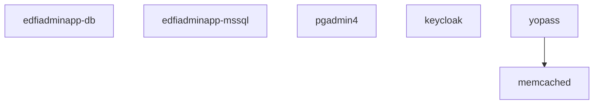
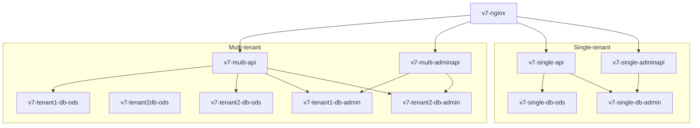
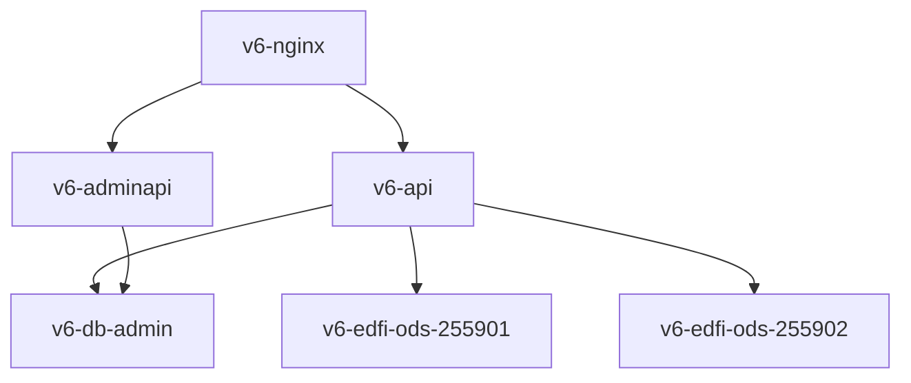
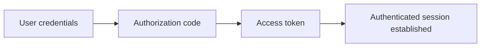

# Docker Compose Usage

## About

This directory includes a Docker Compose file for starting a collection of services needed for running and testing Ed-Fi Admin App. It includes a deployment of ODS/API 7.3 and Admin API 2.2 in multi-tenant mode, and a deployment of ODS/API 6.2 and Admin API 1.4 in district-specific mode.

### Containers for Supporting Ed-Fi Admin App



- **edfiadminapp-db**: PostgreSQL database instance for the SBAA API (default).
- **edfiadminapp-mssql**: SQL Server database instance for the SBAA API (alternative to PostgreSQL).
- **pgadmin4**: Standard PGAdmin4 deploy, preconfigured with links to the various PostgreSQL databases.
- **keycloak**: For user authentication.
- **yopass**: A web application for sharing one-time encrypted secrets, such as a ODS/API `client_secret`.
- **memcached**: Database supporting Yopass.

### Containers for ODS/API 7.3



- Two ODS/API instances, supporting single and multi-tenant configurations.
- The multi-tenant configuration includes two tenancies, each with own combination of "ODS" and "Admin" databases.
- **NGiNX** serves as a reverse proxy.

### Containers for ODS/API 6.2



Because this is district-specific mode, and not a multi-tenant application, both districts' setups and client credentials are in the same "Admin" database instance, even though the two districts have distinct "ODS" databases.

## Database Configuration

The Ed-Fi Admin App supports both PostgreSQL (default) and Microsoft SQL Server for its backend database.

### PostgreSQL (Default)

PostgreSQL is used by default and requires no additional configuration beyond the standard `.env` file settings.

### SQL Server (MSSQL)

To use SQL Server instead of PostgreSQL:

1. **Configure Environment Variables**: In your `.env` file, uncomment and configure:

   ```bash
   MSSQL_PORT_EXPOSED=1433
   MSSQL_ACCEPT_EULA=Y
   MSSQL_SA_PASSWORD=YourStrong!Passw0rd
   MSSQL_IMAGE_TAG=2022-latest
   DB_ENGINE=mssql
   ```

2. **Password Requirements**: The `MSSQL_SA_PASSWORD` must meet SQL Server requirements:

   - At least 8 characters
   - Contains characters from at least 3 of these categories:
     - Uppercase letters (A-Z)
     - Lowercase letters (a-z)
     - Numbers (0-9)
     - Special characters (!@#$%^&\*()\_+-=[]{}|;:,.<>?)

3. **Start Services**: Use the `-MSSQL` flag:

   ```powershell
   .\up.ps1 -MSSQL
   .\up.ps1 -AdminApp -MSSQL
   ```

### Database Management

- **PostgreSQL**: Access via PGAdmin4 at [https://localhost/pgadmin](https://localhost/pgadmin)
- **SQL Server**: Connect using SQL Server Management Studio or Azure Data Studio to `localhost,1433` with SA credentials

## Getting Started

> [!WARNING]
> For local usage, best to rely on Docker Desktop. Podman might work, but there are sufficient differences between the two that it is difficult to test and verify.

### Start Containers

There are two main PowerShell scripts for starting services:

- **`start-local-dev.ps1`**: Starts Docker Compose services for local development, including Ed-Fi ODS/API and ODS Admin API supporting services. It uses the following compose files:

  - `edfi-services.yml`
  - `nginx-compose.yml`
  - `adminapp-local-dev.yml`
    If the `edfiadminapp-network` does not exist, it will be created automatically.

- **`start-services.ps1`**: Starts the Docker Compose services for the Ed-Fi ODS/API, ODS Admin API, _and_ runs Ed-Fi Admin App, along with supporting services. It uses:
  - `edfi-services.yml`
  - `nginx-compose.yml`
  - `adminapp-services.yml`
    If the `edfiadminapp-network` does not exist, it will be created automatically.
  - You can pass the `-Rebuild` switch to rebuild the AdminApp images before starting them.

#### Steps to Start Containers

1. Duplicate `.env.example` as `.env`; review and customize settings as needed.
2. Create a self-signed certificate using `ssl/generate-certificate.sh` (Windows users can use WSL or Git-bash).
3. Run the desired script:

   - For local development: `./start-local-dev.ps1`; use `./start-local-dev.ps1 -MSSQL` for using SQL Server to store the Admin App tables
   - For main services: `./start-services.ps1 [-Rebuild]`

4. To stop services, use the `stop.ps1` script with the following options:

   - Stop local development services: `./stop.ps1 -LocalDev`
   - Stop main services: `./stop.ps1 -MainServices`
   - Stop all services: `./stop.ps1`
   - To remove volumes, add `-V` (and optionally `-KeepKeycloakVolume` to preserve Keycloak data)

> [!NOTE]
> The scripts will automatically create the `edfiadminapp-network` if it does not exist.
> Make sure the `logs` directory exists before starting services.

### Choosing a Database Template

The ODS database can use the "sandbox" or "minimal" container. When using the sandbox image, you must login to the server (e.g. using PgAdmin) and create a new `EdFi_Ods_??` database, choosing either the populated or minimal template.

### Setup Ods Instances

The ODS/API in multi-instance mode reads connection strings and routing information from the EdFi_Admin database. Currently the Admin App does not support configuring this information, so it needs to be handled manually.

Direct database insert in the single tenant `EdFi_Admin` database (be sure to replace the string "YOUR_PASSWORD")

```sql
INSERT INTO dbo.odsinstances ("name", instancetype, connectionstring)
VALUES
  ('EdFi_Ods_255901', 'DistrictSpecific', 'host=v7-db-ods-1;port=5432;username=postgres;password=YOUR_PASSWORD;database=EdFi_Ods_255901'),
  ('EdFi_Ods_255902', 'DistrictSpecific', 'host=v7-db-ods-2;port=5432;username=postgres;password=YOUR_PASSWORD;database=EdFi_Ods_255902');

select * from dbo.odsinstances;


INSERT INTO dbo.odsinstancecontexts (odsinstance_odsinstanceid, contextkey, contextvalue)
SELECT odsinstanceid, 'instanceid', '255901' FROM dbo.odsinstances WHERE "name" = 'EdFi_Ods_255901'
UNION
SELECT odsinstanceid, 'instanceid', '255902' FROM dbo.odsinstances WHERE "name" = 'EdFi_Ods_255902';
```

Or alternatively use Admin API: [adminapi-odsinstance.http](./http/adminapi-odsinstance.http)

### Setup Keycloak

1. Open [Keycloak](https://localhost/auth).
2. Sign-in with the credentials from your `.env` file.
3. Create a new realm called `edfi`.
   1. Configure realm session timeouts:
      - Go to "Realm Settings" in the left sidebar
      - Click on the "Sessions" tab
      - Set "SSO Session Idle" to 2 hours
      - Set "SSO Session Max" to 2 hours (or longer as needed)
      - Click "Save" at the bottom of the page
4. Keycloak clients are now provisioned automatically by Docker Compose using the `realm-config.json` file. After setup, you should see both `edfiadminapp` and `edfiadminapp-dev` clients in the `edfi` realm.
5. Create a new user in Keycloak.
   1. Default email address: `admin@example.com`

> [!TIP]
> You can sign-in as the new user without generating a password: on the user page, click the `Action` drop down (upper right corner) and choose `Impersonate`.

> [!IMPORTANT]
> The session timeout settings in Keycloak (configured in step 3.1) determine how long a user can remain authenticated without needing to re-login. Configuring these settings to align with your application's express session timeout (set in `main.ts`) ensures consistent authentication behavior.

## Developer Guide

See [Ed-Fi Developer's Guide](../docs/ed-fi-development.md) for troubleshooting
tips, and running the application for local development.

### Global Setup

If all went well, you can open
[https://localhost/adminapp](https://localhost/adminapp/) with your bootstrapped
initial user. This will start you in "Global scope" mode for initial
configuration.

In Global Scope, complete the following setup:

- **Environments** - support AWS and on-premises
- **Teams** - create a Team, name it whatever you like. More detail to come.
- **Users** - ignore for now
- **Team Memberships** - try adding yourself to the new Team, with "Tenant Admin" access.
- **Roles** - assign all `team.sb-environment.edfi-tenant.profile` privileges to the "Tenant admin" and "Full ownership" roles
- **Ownerships** - won't be able to do anything until we figure out how to create an Environment outside of AWS.
- **Sync Queue** - ignore

### URLs

These are the default URLs. The last path segment must match your environment variable settings.

| App                                    | URL                                                                          |
| -------------------------------------- | ---------------------------------------------------------------------------- |
| Multi-Tenant ODS/API 7.x               | [https://localhost/v7-multi-api](https://localhost/v7-multi-api)             |
| Multi-tenant Admin API 2.x in v2 mode  | [https://localhost/v7-multi-adminapi](https://localhost/v7-multi-adminapi)   |
| Single-Tenant ODS/API 7.x              | [https://localhost/v7-single-api](https://localhost/v7-single-api)           |
| Single-Tenant Admin API 2.x in v2 mode | [https://localhost/v7-single-adminapi](https://localhost/v7-single-adminapi) |
| ODS/API 6.x                            | [https://localhost/v6-api](https://localhost/v6-api)                         |
| Admin API 2.x in v1 mode               | [https://localhost/v6-adminapi](https://localhost/v6-adminapi)               |
| Keycloak                               | [https://localhost/auth](https://localhost/auth)                             |
| Yopass                                 | [http://localhost:8082](http://localhost:8082)                               |
| PGAdmin4                               | [https://localhost/pgadmin](https://localhost/pgadmin)                       |
| Admin App API Swagger (container)      | [https://localhost/adminapp-api/api/](https://localhost/adminapp-api/api/)   |
| Admin App UI (container)               | [https://localhost/adminapp](https://localhost/adminapp)                     |
| Admin App API Swagger (local)          | [http://localhost:3333/api/](http://localhost:3333/api)                      |
| Admin App UI (local)                   | [http://localhost:4200](https://localhost:4200)                              |

## Authentication Flows

The Ed-Fi Admin App supports two authentication methods:

### 1. Human User Authentication (Browser-based)

The Keycloak client `edfiadminapp` is created automatically as part of the Keycloak setup process.



### 2. Machine-to-Machine Authentication (API-based)

- **Config File**: `keycloak_edfiadminapp_machine_client.json`
- **Flow**: Client credentials flow for automated API access
- **Requirements**:
  - Token must include `login:app` scope
  - Audience must be `edfiadminapp-api`
  - Token verification using `jose.jwtVerify`
- **Use Case**: Automated scripts, system integrations, and service-to-service
  communication

### Testing Machine Authentication

Use the [machine-user-jwt-testing.http](./http/machine-user-jwt-testing.http) file to test the machine-to-machine
authentication flow:

#### Setup Steps

1. **Create Client Scope**: In Keycloak Admin Console:
   - Select the `edfi` realm
   - Navigate to **Client Scopes** (in the left sidebar)
   - Click **"Create client scope"**
   - Set **Name**: `login:app`
   - Set **Description**: `Access to Ed-Fi Admin App API`
   - Set **Type**: `Default`
   - Set **Protocol**: `openid-connect`
   - Enable **Include In Token Scope**: `ON`
   - Save
2. **Import Keycloak Client**: Import `keycloak_edfiadminapp_machine_client.json` into Keycloak
3. **Update Application Configuration**: Please update the
   `AUTH0_CONFIG_SECRET_VALUE` section in the `local.js` file as shown below. If
   any configuration values are changed in
   `keycloak_edfiadminapp_machine_client.json`, make sure they match
   accordingly.

   ```js
   AUTH0_CONFIG_SECRET_VALUE: {
     ISSUER: 'https://localhost/auth/realms/edfi',
     CLIENT_ID: 'edfiadminapp',
     CLIENT_SECRET: 'big-secret-123',
     MACHINE_AUDIENCE: 'edfiadminapp-api',
     MANAGEMENT_DOMAIN: 'localhost',
     MANAGEMENT_CLIENT_ID: 'edfiadminapp-machine',
     MANAGEMENT_CLIENT_SECRET: 'edfi-machine-secret-456',
   }
   ```

4. **Create Machine User In Admin App frontend**:
   1. Open AdminApp frontend (http://localhost:4200)
   2. Navigate to Home page → Users
   3. Click "Create New" user
   4. Fill in the form:
      - Username: edfiadminapp-machine (must be unique)
      - User Type: Select "Machine" from dropdown
      - Description: "Machine-to-Machine Authentication User" (or your preferred description)
      - Client ID: edfiadminapp-machine (CRITICAL: must match Keycloak client ID)
      - Is Active: ✓ Check this box
      - Role: Select appropriate role (e.g., GlobalAdmin, GlobalViewer, etc.)
      - Add to Team: Select "Yes" if you want to assign to a team
      - If yes: Select team and role for team membership
   5. Click "Save"

> [!NOTE]
>
> 1. The Client ID MUST exactly match the Keycloak client ID:
>    edfiadminapp-machine
> 2. The Username should be descriptive and unique
> 3. Machine users don't need Given Name or Family Name
> 4. Ensure "Is Active" is checked or authentication will fail
> 5. Role assignment determines what API endpoints the machine user can
>    access

## Troubleshooting

### Error registering OIDC provider

If the `edfiadminapp-api` container is displaying the following error in the log:

```shell
[Nest] 185  - 09/15/2025, 6:20:40 PM   ERROR Error registering OIDC provider https://localhost/auth/realms/edfi: OPError: Realm does not exist
```

- Ensure you have completed the steps in [Setup Keycloak](./readme.md#setup-keycloak)
  and verified that the edfi realm exists in Keycloak. Restart
  the edfiadminapp-api service container to apply changes.

> [!NOTE]
> If the error persist see the topic [Unable to connect to OpenID Connect Provider](./readme.md#unable-to-connect-to-openid-connect-provider).

### Unable to connect to OpenID Connect Provider

This error usually means the required OIDC record is missing from the
`public.oidc` table in your database. The API startup process copies OIDC
configuration from the config file into the database, but if the record is
missing or incorrect, authentication will fail.

1. How to Fix:
   Check that the correct OIDC record exists in the `public.oidc` table.

   - For local-dev (`edfiadminapp-dev` client):

   ```shell
    id |               issuer               |     clientId     |  clientSecret  | scope
   ----+------------------------------------+------------------+----------------+-------
     1 | https://localhost/auth/realms/edfi | edfiadminapp-dev | big-secret-123 |
   ```

   - For main services (`edfiadminapp` client):

   ```shell

    id |               issuer               |     clientId     |  clientSecret  | scope
   ----+------------------------------------+------------------+----------------+-------
     1 | https://localhost/auth/realms/edfi | edfiadminapp     | big-secret-123 |
   ```

2. If the required OIDC record is missing, you can manually insert it, or run the helper script:

   - Run `./settings/populate-oidc.ps1` with parameters to add a oidc:

     ```powershell
     ./settings/populate-oidc.ps1 -ClientId "edfiadminapp" -ClientSecret "big-secret-123" -Issuer "https://localhost/auth/realms/edfi"

     OR

     ./settings/populate-oidc.ps1 -ClientId "edfiadminapp-dev" -ClientSecret "big-secret-123" -Issuer "https://localhost/auth/realms/edfi"

     ```

3. Make sure the `VITE_OIDC_ID` variable in your `.env` file matches the correct
   OIDC record id for your client. For example, set `VITE_OIDC_ID=1` for
   `edfiadminapp` or `edfiadminapp-dev`.

4. In Keycloak, confirm that the client configuration matches your OIDC settings:

   1. Open [Keycloak](https://localhost/auth).
   2. Sign-in with the credentials from your `.env` file.
   3. Select the realm called `edfi`.
   4. Go the clients and select `edfiadminapp` or `edfiadminapp-dev`, make sure the `Valid redirect
URIs` has the correct url included
      `https://localhost/adminapp-api/api/auth/callback/{your_oidc_id}`, in
      this case should be `https://localhost/adminapp-api/api/auth/callback/1`

- Restart the service container.
