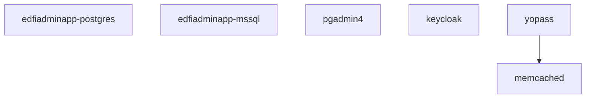
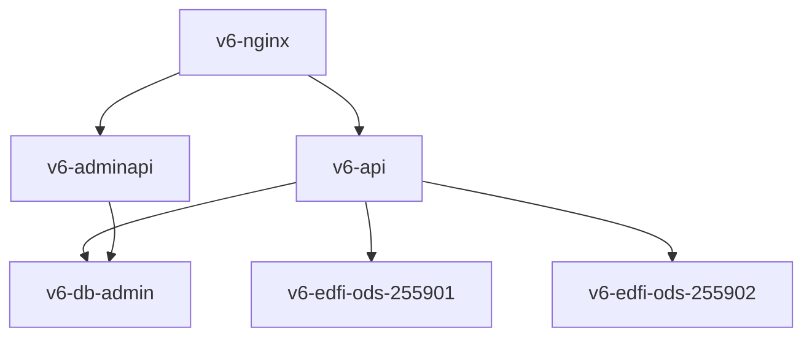
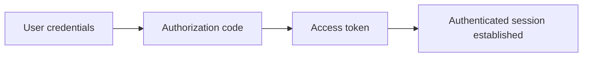

# Docker Compose Operator Manual

## About

Use this manual to configure, start, monitor, and troubleshoot the local Ed-Fi Admin App
Compose stack. It includes deployments of ODS/API 7.3 with Admin API v2 and Admin API v3
topologies, and a deployment of ODS/API 6.2 and Admin API 1.4 in district-specific mode.

### Containers for Supporting Ed-Fi Admin App


```mermaid
graph TD
  edfiadminapp-postgres
  edfiadminapp-mssql
  pgadmin4
  keycloak
  memcached
  yopass --> memcached
```

- **edfiadminapp-postgres**: PostgreSQL database instance for the SBAA API (default).
- **edfiadminapp-mssql**: SQL Server database instance for the SBAA API (alternative to PostgreSQL).
- **pgadmin4**: Standard PGAdmin4 deploy, preconfigured with links to the various PostgreSQL databases.
- **keycloak**: For user authentication.
- **yopass**: A web application for sharing one-time encrypted secrets, such as a ODS/API `client_secret`.
- **memcached**: Database supporting Yopass.

### Containers for ODS/API 7.3


```mermaid
graph TD
   subgraph Multi-tenant Admin API v2
        odsV7-adminV2-tenant1-db-ods
      odsV7-adminV2-tenant2-db-ods
        odsV7-adminV2-tenant1-db-admin
        odsV7-adminV2-tenant2-db-admin
        odsV7-adminV2-multi-api --> odsV7-adminV2-tenant1-db-ods
        odsV7-adminV2-multi-api --> odsV7-adminV2-tenant2-db-ods
        odsV7-adminV2-multi-api --> odsV7-adminV2-tenant1-db-admin
        odsV7-adminV2-multi-api --> odsV7-adminV2-tenant2-db-admin
        odsV7-adminV2-multi-adminapi --> odsV7-adminV2-tenant1-db-admin
        odsV7-adminV2-multi-adminapi --> odsV7-adminV2-tenant2-db-admin
    end

   subgraph Single-tenant Admin API v2
        odsV7-adminV2-single-db-ods
        odsV7-adminV2-single-db-admin
        odsV7-adminV2-single-api
        odsV7-adminV2-single-api --> odsV7-adminV2-single-db-ods
        odsV7-adminV2-single-api --> odsV7-adminV2-single-db-admin
        odsV7-adminV2-single-adminapi --> odsV7-adminV2-single-db-admin
    end

  v7-nginx --> odsV7-adminV2-multi-api
  v7-nginx --> odsV7-adminV2-multi-adminapi

  v7-nginx --> odsV7-adminV2-single-api
  v7-nginx --> odsV7-adminV2-single-adminapi

      subgraph Multi-tenant Admin API v3
            odsV7-adminV3-tenant1-db-ods
            odsV7-adminV3-tenant2-db-ods
            odsV7-adminV3-tenant1-db-admin
            odsV7-adminV3-tenant2-db-admin
            odsV7-adminV3-multi-api --> odsV7-adminV3-tenant1-db-ods
            odsV7-adminV3-multi-api --> odsV7-adminV3-tenant2-db-ods
            odsV7-adminV3-multi-api --> odsV7-adminV3-tenant1-db-admin
            odsV7-adminV3-multi-api --> odsV7-adminV3-tenant2-db-admin
            odsV7-adminV3-multi-adminapi --> odsV7-adminV3-tenant1-db-admin
            odsV7-adminV3-multi-adminapi --> odsV7-adminV3-tenant2-db-admin
      end

      subgraph Single-tenant Admin API v3
            odsV7-adminV3-single-db-ods
            odsV7-adminV3-single-db-admin
            odsV7-adminV3-single-api
            odsV7-adminV3-single-api --> odsV7-adminV3-single-db-ods
            odsV7-adminV3-single-api --> odsV7-adminV3-single-db-admin
            odsV7-adminV3-single-adminapi --> odsV7-adminV3-single-db-admin
      end

   v7-nginx --> odsV7-adminV3-multi-api
   v7-nginx --> odsV7-adminV3-multi-adminapi

   v7-nginx --> odsV7-adminV3-single-api
   v7-nginx --> odsV7-adminV3-single-adminapi
```

- Four ODS/API 7.3 instances are available: v2 and v3, each with single and multi-tenant configurations.
- The multi-tenant configuration includes two tenancies, each with own combination of "ODS" and "Admin" databases.
- **NGiNX** serves as a reverse proxy.

For v3 route configuration, see the `ODS_V7_ADMIN_V3_*` entries in `.env.example`.

### Containers for ODS/API 6.2


```mermaid
graph TD
  v6-db-admin
  v6-edfi-ods-255901
  v6-edfi-ods-255902
  v6-api --> v6-db-admin
  v6-api --> v6-edfi-ods-255901
  v6-api --> v6-edfi-ods-255902
  v6-adminapi --> v6-db-admin
  v6-nginx --> v6-api
  v6-nginx --> v6-adminapi
```

Because this is district-specific mode, and not a multi-tenant application, both districts' setups and client credentials are in the same "Admin" database instance, even though the two districts have distinct "ODS" databases.

### Healthchecks

#### Admin App healthcheck

**`GET /api/healthcheck` returns HTTP 200 when healthy and HTTP 503 when unhealthy.**
The endpoint is public and requires no authentication:

- From inside the API container or a locally running API: `http://localhost:3333/api/healthcheck`.
- Through the Compose reverse proxy: `https://localhost/adminapp-api/api/healthcheck`.

The reverse proxy also accepts `/api/healthcheck`. Both routes preserve the API's
health JSON for HTTP 200 and 503. If the proxy cannot reach the API at all, it can
return a generic service-unavailable response instead of health JSON.

The API uses `DB_ENGINE` and `DB_SECRET_VALUE` from its application configuration
to select PostgreSQL or SQL Server. See [Database Configuration](#database-configuration).
There are no separate healthcheck credentials or database-engine settings.

The probe executes `SELECT 1` through the application's configured TypeORM connection
pool, then releases its query runner. It checks access to the application database,
including pool availability. It does **not** check every application table, business
operation, ODS/API instance, Admin API instance, or identity provider.

##### Reading the response

A healthy response has HTTP 200:

```json
{
  "status": "healthy",
  "timestamp": "2026-09-24T12:00:00.000Z",
  "checks": {
    "api": { "status": "healthy", "message": "API is responding" },
    "database": { "status": "healthy", "message": "Database connection successful" }
  }
}
```

A database connection failure, query failure, or response timeout produces HTTP 503:

```json
{
  "status": "unhealthy",
  "timestamp": "2026-09-24T12:00:03.000Z",
  "checks": {
    "api": { "status": "healthy", "message": "API is responding" },
    "database": { "status": "unhealthy", "message": "Database connection failed" }
  }
}
```

`checks.api.status` remains `healthy` when the API can respond, even when the overall
response is HTTP 503 because the database is unavailable. Use the HTTP status and
overall `status` for readiness, not the API sub-check alone. An unexpected healthcheck
error also returns HTTP 503 with the same JSON structure; its database message starts
with `Health check failed:` and includes only an allowlisted error description
(for example, `Database login failed`) or `Unknown error`, never the raw driver message.

To inspect status and body in PowerShell 7 through the local reverse proxy:

```powershell
$response = Invoke-WebRequest -Uri 'https://localhost/adminapp-api/api/healthcheck' -SkipCertificateCheck -SkipHttpErrorCheck -TimeoutSec 10
$response.StatusCode
$response.Content | ConvertFrom-Json | ConvertTo-Json -Depth 4
```

`-SkipHttpErrorCheck` lets you inspect a 503 response instead of raising an HTTP error.
Use `-SkipCertificateCheck` only with the local development certificate; use normal
certificate validation for deployed environments.

##### Deadlines and recovery

Each response waits at most three seconds for the database operation, subject to
normal event-loop scheduling. Set a monitoring client's timeout above this deadline
to allow for HTTP overhead; the container healthcheck uses a ten-second timeout.

A response timeout does not cancel a query or close the shared pool. The query runner
is released after its work finishes. Concurrent checks reuse one pending operation,
including after a response timeout, to avoid accumulating connections. A stalled
operation can therefore keep subsequent checks unhealthy until it settles; there is
no driver-independent cancellation or guaranteed recovery time.

After the pending work and cleanup settle, a subsequent request starts a new probe.
Recovery does not require an API restart when the database/pool becomes usable again
and the pending work settles. A cleanup rejection is logged separately and does not
replace a completed query result; cleanup that remains pending is still subject to
the response deadline.

##### Monitoring and startup behavior

The API image and Compose healthcheck use `curl -f`, so HTTP 503 now makes the probe
fail for either database engine. They poll every 30 seconds and require three consecutive
failed checks before marking the container unhealthy, subject to the configured startup grace
period. The Docker label can therefore lag behind the endpoint's current status.

The frontend's `depends_on: service_healthy` waits for the API's healthy label during
Compose startup. It does not stop an already-running frontend during a later database
outage. Docker's unhealthy label alone does not restart the API; `restart:
unless-stopped` reacts to process exits, not failed healthchecks. Do not use a
database-readiness failure as an automatic restart trigger without considering the
effect of restarting every API instance during a database outage.

The UI E2E readiness runner requires consecutive HTTP 200 responses. The API E2E
workflow also waits for HTTP 200 and fails if its bounded retry loop is exhausted.
The Bruno healthcheck asserts both HTTP 200 and healthy API/database body fields.

**Compatibility:** older API images returned HTTP 200 even for an unhealthy body.
When upgrading, update monitors that assume every response is 200 to accept 503 as
an expected not-ready result. During mixed-version operation, also inspect the body;
HTTP-only checks against older images can still report false readiness. The JSON
field structure and normal success/failure messages are unchanged.

##### Logs

Routine requests log at debug. Database connection, query, and cleanup failures log
at warn with a phase and a sanitized diagnostic. Recognized driver codes include a
fixed description; the description is a category, not proof of the root cause:

```text
Database health check connection failed: {"kind":"Error","code":"ELOGIN","description":"Database login failed"}
Database health check response timeout after 3000 ms
```

Unknown codes and descriptions are omitted. Aggregate diagnostics include an
`errorCount`, but not inner messages or nested codes. Unexpected controller errors log
at error level using the same sanitized format. If inspecting an exception fails,
the diagnostic is `{"kind":"UninspectableError"}`.

Each timed-out HTTP request logs its own warning. Several warnings can refer to the
same pending database operation, not separate incidents. For next steps, see
[Admin App healthcheck failures](#admin-app-healthcheck-failures).

#### ODS/API healthchecks

The services in `edfi-services.yml` share four healthcheck definitions, declared once at
the top of that file as YAML anchors (the `x-healthcheck-*` keys, which Compose ignores)
and referenced per service as `healthcheck: *healthcheck-api`. Editing an anchor changes
every service that references it.

**These anchors are scoped to `edfi-services.yml`.** YAML anchors do not cross files, so
services in `adminapp-services.yml` and `nginx-compose.yml` cannot reference them and keep
their own inline healthchecks. Referencing one from another file fails with
`unknown anchor ... referenced`.

When adding a service, pick by what the container is, not by what the neighbouring service
happens to use:

| Anchor                     | Use it for                                                                            | Probe                                         |
| -------------------------- | ------------------------------------------------------------------------------------- | --------------------------------------------- |
| `*healthcheck-api`         | ODS/API and Admin API containers                                                      | `wget --spider http://localhost/health`       |
| `*healthcheck-api-tenant1` | Multi-tenant Admin API containers only — the probe carries a `tenant: tenant1` header | as above, plus the header                     |
| `*healthcheck-db-socket`   | **Default for PostgreSQL containers.** Every Admin database, and the v6 ODS databases | `pg_isready` over the local socket            |
| `*healthcheck-db-tcp`      | The six v7 ODS databases (`odsV7-*-db-ods`) only                                      | `pg_isready -h localhost -p ${POSTGRES_PORT}` |

Socket probes check PostgreSQL locally without a TCP host/port; TCP probes check the
configured listener. Prefer `*healthcheck-db-socket` for new PostgreSQL containers
unless the deployment specifically requires a TCP listener check. These probes and
the ODS/Admin API `/health` endpoints are separate from the Admin App `/api/healthcheck`.

Changes to these anchors are covered by `npm run compose:check`, which fails if a service's
rendered healthcheck command stops matching `compose-healthchecks.golden` in this directory. After
deliberately changing a probe, re-record that file with `npm run compose:check:update` and review
the diff.

See [COMPOSE-VALIDATION.md](../eng/testing/COMPOSE-VALIDATION.md) for what that check does and does
not catch, when the golden file needs regenerating, and which files a new environment variable
touches.

## Database Configuration

The Ed-Fi Admin App supports both PostgreSQL (default) and Microsoft SQL Server for its backend database.

### PostgreSQL (Default)

PostgreSQL is used by default and requires no additional configuration beyond the standard `.env` file settings.

### SQL Server (MSSQL)

To use SQL Server instead of PostgreSQL:

1. **Configure Environment Variables**: In your `.env` file, uncomment and configure:

   ```bash
   MSSQL_PORT_EXPOSED=1433
   MSSQL_ACCEPT_EULA=Y
   MSSQL_SA_PASSWORD=YourStrong!Passw0rd
   MSSQL_IMAGE_TAG=2022-latest
   DB_ENGINE=mssql
   ```

   Also switch `DB_SECRET_VALUE` from the PostgreSQL default to the SQL Server variant so the API connects to the SQL Server container:

   ```bash
   DB_SECRET_VALUE={"MSSQL_DB_HOST":"edfiadminapp-mssql","MSSQL_DB_PORT":1433,"MSSQL_DB_USERNAME":"sa","MSSQL_DB_PASSWORD":"YourStrong!Passw0rd","MSSQL_DB_DATABASE":"sbaa"}
   ```

2. **Password Requirements**: The `MSSQL_SA_PASSWORD` must meet SQL Server requirements:

   - At least 8 characters
   - Contains characters from at least 3 of these categories:
     - Uppercase letters (A-Z)
     - Lowercase letters (a-z)
     - Numbers (0-9)
     - Special characters (!@#$%^&\*()\_+-=[]{}|;:,.<>?)

3. **Start Services**: Use the `-MSSQL` flag:

   ```powershell
   ./start-services.ps1 -Rebuild -MSSQL
   ```

4. **Switching an existing environment**: the SQL Server container creates the Admin App
   database only on its **first** start, while its data directory is still empty. If
   `vol-edfiadminapp-mssql` already exists from an earlier run, the container logs
   `Creation of db sbaa was requested, but the data directory is not empty, ignoring.`,
   creates nothing, and the API aborts at startup — see
   [Admin App database does not exist on SQL Server](#admin-app-database-does-not-exist-on-sql-server).

   Also note `MSSQL_IMAGE_TAG` must be recent enough for the image to honour `MSSQL_DB`;
   this was verified against `2022-latest` (SQL Server 2022 CU26).

### Database Management

- **PostgreSQL**: Access via PGAdmin4 at [https://localhost/pgadmin](https://localhost/pgadmin)
- **SQL Server**: Connect using SQL Server Management Studio or Azure Data Studio to `localhost,1433` with SA credentials

## Getting Started

> [!WARNING]
> For local usage, best to rely on Docker Desktop. Podman might work, but there are sufficient differences between the two that it is difficult to test and verify.

### Start Containers

There are two main PowerShell scripts for starting services:

**`start-local-dev.ps1`**: Starts Docker Compose services for local development, including support services for Ed‑Fi ODS/API and Admin API.

> [!NOTE]
> This does not start the AdminApp API or Frontend containers; these are excluded via Docker profiles.

It uses the following compose files:

- `edfi-services.yml`
- `nginx-compose.yml`
- `adminapp-services.yml`

If the `edfiadminapp-network` does not exist, it will be created automatically.

**`start-services.ps1`**: Starts the Docker Compose services for the Ed-Fi ODS/API, ODS Admin API, _and_ runs Ed-Fi Admin App, along with supporting services. It uses:

- `edfi-services.yml`
- `nginx-compose.yml`
- `adminapp-services.yml`

If the `edfiadminapp-network` does not exist, it will be created automatically.

- You can pass the `-Rebuild` switch to rebuild the AdminApp images before starting them.

#### Steps to Start Containers

1. Duplicate `.env.example` as `.env`; review and customize settings as needed.
2. Create a self-signed certificate using `ssl/generate-certificate.sh` (Windows users can use WSL or Git-bash).
3. Place your own `EdFi.Ods.Minimal.Template.sql` and
   `EdFi.Ods.Populated.Template.sql` backup files in the folder referenced by
   `SQL_BACKUPS_FOLDER` in your `.env` (defaults to `compose/db-backup`). See
   [ODS Database Image (compose/DB-Ods)](#ods-database-image-composedb-ods)
   below.
4. Run the desired script:

   - For local development: `./start-local-dev.ps1`; use `./start-local-dev.ps1 -MSSQL` for using SQL Server to store the Admin App tables
   - For main services: `./start-services.ps1 [-Rebuild]`

5. To stop services, use the `stop.ps1` script with the following options:

   - Stop local development services: `./stop.ps1 -LocalDev`
   - Stop main services: `./stop.ps1 -MainServices`
   - Stop all services: `./stop.ps1`
   - To remove volumes, add `-V` (and optionally `-KeepKeycloakVolume` to preserve Keycloak data)

> [!NOTE]
> The scripts will automatically create the `edfiadminapp-network` if it does not exist.
> Make sure the `logs` directory exists before starting services.

### ODS Database Image (compose/DB-Ods)

Every `odsV7-*-db-ods` container (single-tenant and multi-tenant, Admin API v2
and v3) is built locally from `compose/DB-Ods` instead of pulling an image
from Docker Hub. On first run, the container's `init.sh` entrypoint:

1. Restores your own `.sql` backup files into two Postgres template
   databases, `Ods_Minimal_Template` and `Ods_Populated_Template`.
2. Creates the real `EdFi_Ods` database as a fast filesystem-level clone
   (`CREATE DATABASE ... TEMPLATE ...`) of one of those templates.

You must provide your own backup files — they are **not** included in this
repo. Configure the following in your `.env` file:

Typical source: Azure Artifacts (NuGet packages for Ed-Fi ODS templates). For
example:

- [Minimal template for ODS/API 7.3.2, Data Standard 4](https://dev.azure.com/ed-fi-alliance/Ed-Fi-Alliance-OSS/_artifacts/feed/EdFi/NuGet/EdFi.Suite3.Ods.Minimal.Template.PostgreSQL.Standard.4.0.0/overview/7.3.20068)
- [Populated template for ODS/API 7.3.2, Data Standard 4](https://dev.azure.com/ed-fi-alliance/Ed-Fi-Alliance-OSS/_artifacts/feed/EdFi/NuGet/EdFi.Suite3.Ods.Populated.Template.PostgreSQL.Standard.4.0.0/overview/7.3.20068)
- [Minimal template for ODS/API 7.3.2, Data Standard 5.2](https://dev.azure.com/ed-fi-alliance/Ed-Fi-Alliance-OSS/_artifacts/feed/EdFi/NuGet/EdFi.Suite3.Ods.Minimal.Template.PostgreSQL.Standard.5.2.0/overview/7.3.20057)
- [Populated template for ODS/API 7.3.2, Data Standard 5.2](https://dev.azure.com/ed-fi-alliance/Ed-Fi-Alliance-OSS/_artifacts/feed/EdFi/NuGet/EdFi.Suite3.Ods.Populated.Template.PostgreSQL.Standard.5.2.0/overview/7.3.20057)

> [!NOTE]
> Data Standard and package version may vary by environment/release. Download
> the matching Minimal and Populated template versions for your target stack,
> open the downloaded file as a Zip file, then place both `.sql` files in your
> `SQL_BACKUPS_FOLDER`.

Set the following environment variables:

- **`SQL_BACKUPS_FOLDER`**: host path to a folder containing
  `EdFi.Ods.Minimal.Template.sql` and `EdFi.Ods.Populated.Template.sql`. This
  folder is bind-mounted read-only into every ODS DB container.
- **`MINIMAL_SQL_PATH`** / **`POPULATED_SQL_PATH`**: in-container paths to
  those two files (defaults match the bind-mount location; you normally do
  not need to change these).
- **`EDFI_ODS_DATASET`**: `minimal` (default) or `populated` — selects which
  template `EdFi_Ods` is cloned from.

These four variables are shared by all six `odsV7-*-db-ods` containers, so
every topology restores from the same backup files and dataset choice.

> [!NOTE]
> To rebuild the custom image after changing `compose/DB-Ods/Dockerfile` or
> `init.sh`, pass `-Rebuild` to `start-services.ps1`/`start-local-dev.ps1`, or
> run `docker compose -f edfi-services.yml build <service-name>` directly.
> To restore from scratch (e.g. after changing `EDFI_ODS_DATASET`), remove the
> container's data volume first (see `stop.ps1 -V`), since `init.sh` only
> restores data on first run.

### Setup Ods Instances

> [!NOTE]
> This section applies to **SBAA (Starting Blocks Admin App) environments only**. For non-SBAA environments, ODS instance configuration is managed differently.

The ODS/API in multi-instance mode reads connection strings and routing information from the EdFi_Admin database. Currently the Admin App does not support configuring this information, so it needs to be handled manually.

Direct database insert in the single tenant `EdFi_Admin` database (be sure to replace the string "YOUR_PASSWORD")

```sql
INSERT INTO dbo.odsinstances ("name", instancetype, connectionstring)
VALUES
  ('EdFi_Ods_255901', 'DistrictSpecific', 'host=v7-db-ods-1;port=5432;username=postgres;password=YOUR_PASSWORD;database=EdFi_Ods_255901'),
  ('EdFi_Ods_255902', 'DistrictSpecific', 'host=v7-db-ods-2;port=5432;username=postgres;password=YOUR_PASSWORD;database=EdFi_Ods_255902');

select * from dbo.odsinstances;


INSERT INTO dbo.odsinstancecontexts (odsinstance_odsinstanceid, contextkey, contextvalue)
SELECT odsinstanceid, 'instanceid', '255901' FROM dbo.odsinstances WHERE "name" = 'EdFi_Ods_255901'
UNION
SELECT odsinstanceid, 'instanceid', '255902' FROM dbo.odsinstances WHERE "name" = 'EdFi_Ods_255902';
```

Or alternatively use Admin API: [adminapi-odsinstance.http](./http/adminapi-odsinstance.http)

### Setup Keycloak

1. Open [Keycloak](https://localhost/auth).
2. Sign-in with the credentials from your `.env` file.
3. Create a new realm called `edfi`.
   1. Configure realm session timeouts:
      - Go to "Realm Settings" in the left sidebar
      - Click on the "Sessions" tab
      - Set "SSO Session Idle" to 2 hours
      - Set "SSO Session Max" to 2 hours (or longer as needed)
      - Click "Save" at the bottom of the page
4. Keycloak clients are now provisioned automatically by Docker Compose using the `realm-config.json` file. After setup, you should see both `edfiadminapp` and `edfiadminapp-dev` clients in the `edfi` realm.
5. Create a new user in Keycloak.
   1. Default email address: `admin@example.com`

> [!TIP]
> You can sign-in as the new user without generating a password: on the user page, click the `Action` drop down (upper right corner) and choose `Impersonate`.

> [!IMPORTANT]
> The session timeout settings in Keycloak (configured in step 3.1) determine how long a user can remain authenticated without needing to re-login. Configuring these settings to align with your application's express session timeout (set in `main.ts`) ensures consistent authentication behavior.

## Application Access and Setup

For running the application outside containers, see the
[Ed-Fi Developer's Guide](../docs/ed-fi-development.md).

### Global Setup

If all went well, you can open
[https://localhost/adminapp](https://localhost/adminapp/) with your bootstrapped
initial user. This will start you in "Global scope" mode for initial
configuration.

Use Global Scope to configure environments, teams, users, memberships, and role
assignments. Follow the [Admin App system administrator guide](https://docs.ed-fi.org/reference/admin-app-v4/system-administrators/global-administration-tasks)
for the setup appropriate to your deployment.

### URLs

These are the default URLs. The last path segment must match your environment variable settings.

| App                                   | URL                                                                                                |
| ------------------------------------- | -------------------------------------------------------------------------------------------------- |
| Multi-Tenant ODS/API 7.x (v2)         | [https://localhost/odsv7-adminv2-multi-api](https://localhost/odsv7-adminv2-multi-api)             |
| Multi-tenant Admin API 2.x (v2 mode)  | [https://localhost/odsv7-adminv2-multi-adminapi](https://localhost/odsv7-adminv2-multi-adminapi)   |
| Single-Tenant ODS/API 7.x (v2)        | [https://localhost/odsv7-adminv2-single-api](https://localhost/odsv7-adminv2-single-api)           |
| Single-Tenant Admin API 2.x (v2 mode) | [https://localhost/odsv7-adminv2-single-adminapi](https://localhost/odsv7-adminv2-single-adminapi) |
| Multi-Tenant ODS/API 7.x (v3)         | [https://localhost/odsv7-adminv3-multi-api](https://localhost/odsv7-adminv3-multi-api)             |
| Multi-tenant Admin API 2.x (v3 mode)  | [https://localhost/odsv7-adminv3-multi-adminapi](https://localhost/odsv7-adminv3-multi-adminapi)   |
| Single-Tenant ODS/API 7.x (v3)        | [https://localhost/odsv7-adminv3-single-api](https://localhost/odsv7-adminv3-single-api)           |
| Single-Tenant Admin API 2.x (v3 mode) | [https://localhost/odsv7-adminv3-single-adminapi](https://localhost/odsv7-adminv3-single-adminapi) |
| ODS/API 6.x                           | [https://localhost/v6-api](https://localhost/v6-api)                                               |
| Admin API 2.x in v1 mode              | [https://localhost/v6-adminapi](https://localhost/v6-adminapi)                                     |
| Keycloak                              | [https://localhost/auth](https://localhost/auth)                                                   |
| Yopass                                | [http://localhost:8082](http://localhost:8082)                                                     |
| PGAdmin4                              | [https://localhost/pgadmin](https://localhost/pgadmin)                                             |
| Admin App API Swagger (container)     | [https://localhost/adminapp-api/api/](https://localhost/adminapp-api/api/)                         |
| Admin App UI (container)              | [https://localhost/adminapp](https://localhost/adminapp)                                           |
| Admin App API Swagger (local)         | [http://localhost:3333/api/](http://localhost:3333/api)                                            |
| Admin App UI (local)                  | [http://localhost:4200](https://localhost:4200)                                                    |

## Authentication Flows

The Ed-Fi Admin App supports two authentication methods:

### 1. Human User Authentication (Browser-based)

The Keycloak client `edfiadminapp` is created automatically as part of the Keycloak setup process.


```mermaid

graph LR
  A[User credentials] --> B[Authorization code]
  B --> C[Access token]
  C --> D[Authenticated session established]
```

### 2. Machine-to-Machine Authentication (API-based)

- **Config File**: `keycloak_edfiadminapp_machine_client.json`
- **Flow**: Client credentials flow for automated API access
- **Requirements**:
  - Token must include `login:app` scope
  - Audience must be `edfiadminapp-api`
  - Token verification using `jose.jwtVerify`
- **Use Case**: Automated scripts, system integrations, and service-to-service
  communication

### Testing Machine Authentication

Use the [machine-user-jwt-testing.http](./http/machine-user-jwt-testing.http) file to test the machine-to-machine
authentication flow:

#### Setup Steps

1. **Create Client Scope**: In Keycloak Admin Console:
   - Select the `edfi` realm
   - Navigate to **Client Scopes** (in the left sidebar)
   - Click **"Create client scope"**
   - Set **Name**: `login:app`
   - Set **Description**: `Access to Ed-Fi Admin App API`
   - Set **Type**: `Default`
   - Set **Protocol**: `openid-connect`
   - Enable **Include In Token Scope**: `ON`
   - Save
2. **Import Keycloak Client**: Import `keycloak_edfiadminapp_machine_client.json` into Keycloak
3. **Update Application Configuration**: Please update the
   `AUTH0_CONFIG_SECRET_VALUE` section in the `local.js` file as shown below. If
   any configuration values are changed in
   `keycloak_edfiadminapp_machine_client.json`, make sure they match
   accordingly.

   ```js
   AUTH0_CONFIG_SECRET_VALUE: {
     ISSUER: 'https://localhost/auth/realms/edfi',
     CLIENT_ID: 'edfiadminapp',
     CLIENT_SECRET: 'big-secret-123',
     MACHINE_AUDIENCE: 'edfiadminapp-api',
   }
   ```

4. **Create Machine User In Admin App frontend**:
   1. Open AdminApp frontend (http://localhost:4200)
   2. Navigate to Home page → Users
   3. Click "Create New" user
   4. Fill in the form:
      - Username: edfiadminapp-machine (must be unique)
      - User Type: Select "Machine" from dropdown
      - Description: "Machine-to-Machine Authentication User" (or your preferred description)
      - Client ID: edfiadminapp-machine (CRITICAL: must match Keycloak client ID)
      - Is Active: ✓ Check this box
      - Role: Select appropriate role (e.g., GlobalAdmin, GlobalViewer, etc.)
      - Add to Team: Select "Yes" if you want to assign to a team
      - If yes: Select team and role for team membership
   5. Click "Save"

> [!NOTE]
>
> 1. The Client ID MUST exactly match the Keycloak client ID:
>    edfiadminapp-machine
> 2. The Username should be descriptive and unique
> 3. Machine users don't need Given Name or Family Name
> 4. Ensure "Is Active" is checked or authentication will fail
> 5. Role assignment determines what API endpoints the machine user can
>    access

### Machine-to-Machine Authentication with Microsoft Entra ID

The Admin App's machine-token validation (`AuthenticatedGuard`) is IdP-agnostic:
it accepts any OIDC access token as long as the `aud` claim matches the
configured `MACHINE_AUDIENCE` and the token carries a `login:app` grant. For
Keycloak/Auth0 that grant arrives as a space-delimited `scope` claim; for an
Entra **app-only** (client credentials) token it arrives as a `roles` array,
and the calling client id arrives as `azp` (v2.0 tokens) or `appid` (v1.0
tokens) instead of Keycloak's `client_id`. There is no local/dockerized Entra
equivalent to the Keycloak container above, so this setup targets a real Entra
tenant.

> [!NOTE]
> This is a manual, documentation-only setup for now. Unlike the Keycloak
> flow, it isn't wired into an automated bootstrap or E2E script (see
> [`eng/testing/README.md`](../eng/testing/README.md) for the Keycloak-based
> Bruno E2E tooling) because doing so would require a dedicated Entra test
> tenant with stored credentials rather than an ephemeral local container. The
> [`idp-entra-setup.ps1`](https://github.com/Ed-Fi-Exchange-OSS/Admin-App-Installation-Scripts/blob/main/windows-install/idp-entra-setup.ps1)
> script in the Admin-App-Installation-Scripts repo automates the _human
> login_ (delegated OIDC) app registration, but not this app-only/M2M flow —
> it's referenced below only for the general shape of scripting an app
> registration via Microsoft Graph, not as a drop-in.

#### Setup Steps

1. **Register the resource app** (representing the Admin App API) in the
   Entra tenant, or reuse an existing single-tenant App Registration:
   - **Entra admin center** → **App registrations** → **New registration**
   - Supported account types: **Accounts in this organizational directory
     only** (single tenant)
   - No redirect URI is needed for this app-only flow

2. **Expose an app role** on the resource app so `client_credentials` tokens
   can carry `login:app` in their `roles` claim:
   - Open the resource app → **App roles** → **Create app role**
   - Display name: `Admin App Machine Access` (or similar)
   - **Allowed member types**: `Applications`
   - Value: `login:app` (this is the exact string `AuthenticatedGuard` checks
     for)
   - Description: "Access to Ed-Fi Admin App API"

3. **Register (or reuse) a client app** representing the machine caller:
   - **App registrations** → **New registration** (single tenant, no redirect
     URI needed)
   - Under **Certificates & secrets**, create a new client secret and record
     its value — it is only shown once
   - Record the client app's **Application (client) ID**; this is the value
     that will show up as `azp`/`appid` in issued tokens

4. **Grant the client app the `login:app` app role** on the resource app:
   - On the client app → **API permissions** → **Add a permission** → **APIs
     my organization uses** → select the resource app from step 1
   - Choose **Application permissions** (not Delegated) → select the
     `login:app` role from step 2
   - Click **Grant admin consent** for the tenant (requires an Entra role
     such as Cloud Application Administrator or Global Administrator)

5. **Update the application configuration**. Update the `AUTH0_CONFIG_SECRET`
   section in the `local.js` file:

   ```js
   AUTH0_CONFIG_SECRET_VALUE: {
     ISSUER: 'https://login.microsoftonline.com/<tenant-id>/v2.0',
     CLIENT_ID: '<resource-app-application-id>',
     CLIENT_SECRET: '<not used for token validation; kept for parity with other IdPs>',
     MACHINE_AUDIENCE: '<resource-app-application-id-or-app-id-uri>',
   }
   ```

   `MACHINE_AUDIENCE` must exactly match the `aud` claim Entra puts on the
   issued token — decode a test token (e.g. at <https://jwt.ms>) against the
   resource app's Application ID URI (**Expose an API** blade) to confirm
   which value it uses before setting this.

6. **Create the Machine User in the Admin App frontend**, same as the
   Keycloak flow above, except:
   - **Client ID**: the client app's **Application (client) ID** from step 3
     (CRITICAL: must match the `azp`/`appid` claim on issued tokens)

#### Acquiring a token for manual testing

```http
POST https://login.microsoftonline.com/<tenant-id>/oauth2/v2.0/token
Content-Type: application/x-www-form-urlencoded

grant_type=client_credentials
&client_id=<client-app-application-id>
&client_secret=<client-app-secret>
&scope=<resource-app-application-id-or-app-id-uri>/.default
```

The `roles` claim on the resulting `access_token` should contain `login:app`;
use it the same way as the Keycloak machine token in
[machine-user-jwt-testing.http](./http/machine-user-jwt-testing.http).

## Troubleshooting

### Admin App healthcheck failures

Start by inspecting the response body and the recent API logs:

```powershell
docker logs --since 10m edfiadminapp-api
docker inspect --format '{{.State.Health.Status}}' edfiadminapp-api
```

The inspection command displays only the health label, not container configuration
or credentials. Review logs locally and redact sensitive information before sharing.
If the API is running outside Docker, use its process logs instead.

| Symptom                                                                        | Checks and action                                                                                                                                                                                                                                                                     |
| ------------------------------------------------------------------------------ | ------------------------------------------------------------------------------------------------------------------------------------------------------------------------------------------------------------------------------------------------------------------------------------- |
| HTTP 503 with `ECONNREFUSED` or `ESOCKET`                                      | Check that the selected database is running and reachable from the API network. Verify the configured host, port, and engine; a database container being healthy does not prove the API can connect to it.                                                                            |
| HTTP 503 with `ELOGIN` or `28P01`                                              | Verify the application's database login and access to the configured database. Check secret configuration locally; do not paste passwords or connection strings into incident reports.                                                                                                |
| HTTP 503 with a response-timeout warning                                       | Check database load, locks, network latency, and application pool availability. Repeated polls can share one stalled operation. Allow pending work to settle after restoring the database; escalate persistent stalls rather than repeatedly restarting the API.                      |
| HTTP 503 while Docker still says healthy                                       | Allow for the probe interval and failure threshold. If it persists, verify the deployed image and active healthcheck command.                                                                                                                                                         |
| HTTP 200 with an unhealthy body                                                | Verify the deployed API version. Older images retained HTTP 200 on failure; inspect the body until all instances are upgraded.                                                                                                                                                        |
| SQL Server logs structurally invalid login packets at the healthcheck interval | Verify the API image and `DB_ENGINE`/database host configuration. A PostgreSQL client contacting SQL Server can cause this; the current probe uses the configured TypeORM driver. Other clients can also send invalid packets, so correlate timestamps before attributing the source. |
| No HTTP response or proxy error                                                | Inspect API startup and proxy routing first. A failure before the API starts listening cannot produce a healthcheck JSON response.                                                                                                                                                    |

If SQL Server is reachable but the application database does not exist, follow
[Admin App database does not exist on SQL Server](#admin-app-database-does-not-exist-on-sql-server).
Do not delete database volumes merely to clear an unhealthy healthcheck.

### `relation "pgboss.job_common" does not exist`

If the `edfiadminapp-api` container fails to start and restart-loops with:

```shell
[Nest] ERROR [ExceptionHandler] error: relation "pgboss.job_common" does not exist
    at Contractor.migrate (pg-boss/dist/contractor.js)
    at PgBossInstance.start (pg-boss/dist/index.js)
```

this means your persistent Admin App database volume (`vol-edfiadminapp-db`) still
holds an **old pg-boss v9 schema** (schema `version = 20`), which the current
pg-boss v12 cannot migrate in place — the v12 migration store no longer includes
the steps needed to upgrade a pre-v10 (pre-partition) schema.

This only affects environments whose volume predates the pg-boss upgrade. To fix,
reset the Admin App database volume so pg-boss (and the TypeORM migrations) rebuild
a fresh, consistent schema. **This destroys the local `sbaa` database**, so only do
this in local/dev environments:

```powershell
docker rm -f edfiadminapp-api edfiadminapp-postgres
docker volume rm vol-edfiadminapp-db
./start-services.ps1
```

After startup, `select version from pgboss.version;` in the `sbaa` database should
report `31` (or the current pg-boss schema version).

### Admin App database does not exist on SQL Server

If `edfiadminapp-mssql` reports `Up (healthy)` and `sa` logins work, but `edfiadminapp-api`
aborts at startup with:

```shell
[Nest] ERROR SQL Server at "edfiadminapp-mssql" is reachable and the credentials are valid,
             but the database "sbaa" is not available to login "sa".
[Nest] ERROR Database is not available - API startup aborted
```

the SQL Server container did not create the database. It only does so on **first** boot,
while `/var/opt/mssql/data` is still empty — on a volume left over from an earlier run it
logs `Creation of db sbaa was requested, but the data directory is not empty, ignoring.`
and creates nothing. Check with:

```powershell
docker logs edfiadminapp-mssql | Select-String 'Creating database|not empty, ignoring'
```

Pick one of two fixes. The first keeps your data:

```powershell
docker exec edfiadminapp-mssql /bin/bash -c '/opt/mssql-tools18/bin/sqlcmd -C -S localhost -U sa -P "$MSSQL_SA_PASSWORD" -Q "CREATE DATABASE [sbaa]"'
docker restart edfiadminapp-api
```

The `/bin/bash -c '...'` wrapper matters: `docker exec` runs the binary directly with no
shell in the container, so without it `$MSSQL_SA_PASSWORD` would be expanded by _your_ shell
(where it is not set) and you would get a misleading `Login failed for user 'sa'.`

The second re-initializes SQL Server from scratch. **This destroys the local `sbaa`
database**, so only do this in local/dev environments:

```powershell
./stop.ps1
docker volume rm vol-edfiadminapp-mssql
./start-services.ps1 -MSSQL
```

The API runs its migrations automatically on the next successful start, either way.

### Error registering OIDC provider

If the `edfiadminapp-api` container is displaying the following error in the log:

```shell
[Nest] 185  - 09/15/2025, 6:20:40 PM   ERROR Error registering OIDC provider https://localhost/auth/realms/edfi: OPError: Realm does not exist
```

- Ensure you have completed the steps in [Setup Keycloak](./readme.md#setup-keycloak)
  and verified that the edfi realm exists in Keycloak. Restart
  the edfiadminapp-api service container to apply changes.

> [!NOTE]
> If the error persist see the topic [Unable to connect to OpenID Connect Provider](./readme.md#unable-to-connect-to-openid-connect-provider).

### Unable to connect to OpenID Connect Provider

This error usually means the required OIDC record is missing from the
`public.oidc` table in your database. The API startup process copies OIDC
configuration from the config file into the database, but if the record is
missing or incorrect, authentication will fail.

1. How to Fix:
   Check that the correct OIDC record exists in the `public.oidc` table.

   - For local-dev (`edfiadminapp-dev` client):

   ```shell
    id |               issuer               |     clientId     |  clientSecret  | scope
   ----+------------------------------------+------------------+----------------+-------
     1 | https://localhost/auth/realms/edfi | edfiadminapp-dev | big-secret-123 |
   ```

   - For main services (`edfiadminapp` client):

   ```shell

    id |               issuer               |     clientId     |  clientSecret  | scope
   ----+------------------------------------+------------------+----------------+-------
     1 | https://localhost/auth/realms/edfi | edfiadminapp     | big-secret-123 |
   ```

2. If the required OIDC record is missing, you can manually insert it, or run the helper script:

   - Run `./settings/populate-oidc.ps1` with parameters to add a oidc:

     ```powershell
     ./settings/populate-oidc.ps1 -ClientId "edfiadminapp" -ClientSecret "big-secret-123" -Issuer "https://localhost/auth/realms/edfi"

     OR

     ./settings/populate-oidc.ps1 -ClientId "edfiadminapp-dev" -ClientSecret "big-secret-123" -Issuer "https://localhost/auth/realms/edfi"

     ```

3. Make sure the `VITE_OIDC_ID` variable in your `.env` file matches the correct
   OIDC record id for your client. For example, set `VITE_OIDC_ID=1` for
   `edfiadminapp` or `edfiadminapp-dev`.

4. In Keycloak, confirm that the client configuration matches your OIDC settings:

   1. Open [Keycloak](https://localhost/auth).
   2. Sign-in with the credentials from your `.env` file.
   3. Select the realm called `edfi`.
   4. Go the clients and select `edfiadminapp` or `edfiadminapp-dev`, make sure the `Valid redirect
URIs` has the correct url included
      `https://localhost/adminapp-api/api/auth/callback/{your_oidc_id}`, in
      this case should be `https://localhost/adminapp-api/api/auth/callback/1`

- Restart the service container.
