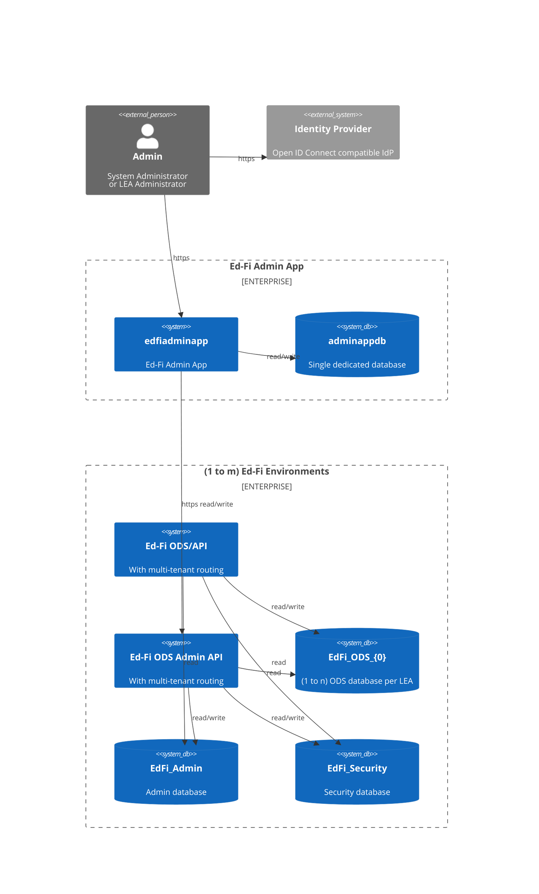

# Admin App Product Requirements Document for Version 4.0

> **Status:** complete \
> **Owner:** Stephen Fuqua, Ed-Fi Alliance \
> **Jira Project:** AC \
> **Repository:** `Ed-Fi-Alliance-OSS/Ed-Fi-AdminApp`

## 1. Product Overview

The Ed-Fi Admin App v4 is a web-based administrative platform designed to manage
Ed-Fi API deployments across multiple environments and tenants. It replaces two
legacy tools — the Ed-Fi ODS Admin App and the Ed-Fi Sandbox Admin UI — with a
unified, scalable interface for managing client credentials, database instances,
and API health across diverse user roles and deployment models.

> [!NOTE]
> The Ed-Fi Admin App shares code with the Starting Blocks Admin App
> from Education Analytics. Product decisions here may also affect Starting
> Blocks.

### Replaces

The application is intended to replace the Ed-Fi Alliance's legacy ODS Admin App
and Sandbox Admin UI applications for management of client credentials and
database instances. The initial release of this codebase is versioned as 4.0,
continuing from the legacy ODS Admin App version 3.x.

### 1.1 Strategic Alignment

The Ed-Fi Alliance's strategic goals in 2025 (year of project initiation)
include growth of Data Hubs and expansion of market-led initiatives aligned with
state education agency (SEA)-driven support. Data Hubs are regional deployments
that leverage state data collection requirements to drive vendor integrations
while providing data services directly to the local education agencies (LEA).

In practice, this requires supporting deployments that store data for multiple
LEAs at the same time, with separate ODS databases per LEA. These separate ODS
databases may be managed through shared administrative databases (single-tenant
mode) or separated administrative databases (multi-tenant mode).

The current Ed-Fi tools (ODS Admin App and Sandbox Admin) were built to satisfy
the LEA market and SEA vendor certification requirements, respectively. Both
applications have heavy tech debt and do not fulfill the requirements (below) to
support multi-tenant Data Hubs.

### 1.2 Target Markets

- **Data Hubs**: The application will support both single-tenant and multi-tenant
  deployment models, with the latter being a key requirement for Data Hubs that
  manage data for multiple LEAs in a single environment.
- **State Education Agencies (SEAs)**: SEAs that are responsible for collecting
  data from multiple LEAs will benefit from the application's ability to manage
  credentials and database instances across multiple tenants, streamlining the
  data collection process and improving operational efficiency.
- **Managed Service Providers**: Organizations that provide hosting and management
  services for Ed-Fi API deployments will find value in the application's
  capabilities for overseeing multiple environments and tenants, enhancing their
  service offerings and operational capabilities.
- **Ed-Fi Alliance**: As the steward of the Ed-Fi data standard and related
  tools, the Ed-Fi Alliance will use the application for managing demonstration
  environments, supporting vendor certification processes, and providing a
  reference implementation for best practices in managing Ed-Fi API deployments.
- **Vendors** (future): Vendors that integrate with Ed-Fi APIs may also find value in the
  application for managing their own API deployments and credentials, as well as
  for testing and certification purposes.

### 1.3 User Personas

#### SEA System Administrator

Consider a system administrator at a state education agency (SEA) whose primary
mission is to collect local education agency (LEA) data for mandatory state
reporting. This system administrator is in a hybrid IT role, serving both as a
programmer and an IT administrator. They are responsible for deployment and
maintenance of the Ed-Fi Technology Suite running on either Windows Server
on-premises or have recently moved to a cloud provider. They may be interested
in Docker but likely have little practical experience with it.

**Primary motivations**

- Create and manage Ed-Fi ODS/API credentials for all applications that need to
  submit data on behalf of an LEA.
- Get into the application quickly and get out again, back to other pressing
  concerns.

**Technical depth**

- Has broad, but not deep, responsibilities covering programming, data
  engineering, deployment, and technical support.
- Technical skills are rooted in support and deployment of .NET applications in
  Windows, using Microsoft SQL Server, and hosting web applications in Microsoft
  IIS.

**Key challenges**

- Lack of time for professional development, learning new skills such as
  development and support of Node.js applications.

#### Managed Service Provider System Administrator

Broadly similar to the SEA System Administrator, but with a wider scope of
responsibility across multiple education organizations, including SEAs, LEAs,
and Data Hubs. _This persona also applies to Ed-Fi Alliance staff responsible
for managing demonstration environments used for certification testing._ They
are responsible for deployment and maintenance of the Ed-Fi Technology Suite
running on a cloud provider, likely using Docker containers.

**Primary motivations**

- See [SEA System Administrator](#sea-system-administrator) above, but for
  multiple LEAs at the same time.
- Handoff responsibilities to other administrators as needed, so the application must be
  easy to learn and use for multiple users.

**Technical depth**

- Deep experience with support and deployment of applications in the Cloud,
  using a variety of technologies and platforms.

**Key challenges**

- Overcommitted to new projects and initiatives, so the application must be easy
  to learn and use for multiple users.

#### Operator

The Operator may be either an IT-oriented employee or a more business-oriented
employee at (a) the hosting organization (MSP, SEA, Ed-Fi Alliance) or (b) the
organization for whom the deployment is being managed (Data Hub, LEA). They are
_delegated users_ who are responsible for managing credentials and monitoring
service uptime.

**Primary motivations**

- Create and manage Ed-Fi ODS/API credentials for all applications that need to
  submit data on behalf of an LEA.
- Get into the application quickly and get out again, back to other pressing
  concerns.

**Technical depth**

- Skill at using web-based applications, but not at deploying them or managing
  infrastructure.

**Key challenges**

- Dependency on others for management of the infrastructure, which may limit
  their ability to directly manage the application and its environment.

#### Ed-Fi Alliance Certification Manager

The Ed-Fi Alliance Certification Manager is responsible for overseeing the
certification process for Ed-Fi API deployments, ensuring that they meet the
standards and requirements set forth by the Ed-Fi Alliance. They work closely
with vendors and SEAs to facilitate the certification process, providing
guidance and support as needed. The Certification Manager is also responsible
for maintaining the demonstration environments used for certification testing,
ensuring that they are up-to-date and properly configured.

**Primary motivations**

- Manage the demonstration environments used for certification testing, ensuring
  that they are up-to-date and properly configured.
- Create and manage Ed-Fi ODS/API credentials for all applications that are
  requesting certification.

**Technical depth**

- Wide range of technical skills, likely not including significant experience
  installing and managing web applications.

**Key challenges**

- Frequent task switching between different environments and tenants, which may
  require more time and attention to manage effectively.
- Depends on Ed-Fi Alliance technical staff for deployment and management of the
  demonstration environments, which may limit their ability to directly manage
  the application and its environment.

#### Vendor Application Administrator

Typically, an LEA has an application operator who manages the LEA's deployment
of the third-party application that needs to integrate with the Ed-Fi API. This
person has the direct responsibility for entering client credentials in to that
application. In some cases, the work might be deferred back to the vendor's IT
delivery team.

**Primary Motivations**

- Receive client credentials for connecting to a given Ed-Fi API deployment.
- Keep those credentials safe, so that malicious actors do not perform illicit actions with them.

**Technical Depth**

- Skill at using web-based applications, but not at deploying them or managing
  infrastructure.

### 1.4 Jobs to Be Done

#### JTBD 1: Issue Credentials

**Personas**: all

**When** supporting a new application integration to an existing Ed-Fi API deployment,
**I want** to perform basic CRUD operations for Vendors, Applications, and Credentials,
**so that** I can distribute OAuth credentials ("key and secret") to the vendor.

**How the Admin App Helps**: Provides intuitive UI screens for managing all three of these layers (Vendor,
  Application, Credentials), an associated metadata.

**Variations**: deleting / rotating keys for enhanced security.

#### JTBD 2: Configure New Environments / Instances

**Personas**: system administrators

**When** launching a school year database ("instance") for an LEA deployment ("tenant") in a given deployment type ("environment"),
**I want** to initialize Admin App with the new environment settings,
**so that** users can manage credentials for the new database instance.

**How the Admin App Helps**: Provides UI screens for managing Tenants (ex:
"Austin ISD"), Environments (ex: "production"), and Instances (ex: "School Year
2026 - 2027").

#### JTBD 3: Manage Users

**Personas**: system administrators

**When** provisioning new Coordinators or System Administrators into Admin App,
**I want** to set them up with narrow access to the right systems and permissions needed for their job,
**so that** system confidentiality and security are maintained on a "need to know" basis.

**How the Admin App Helps**: Provides UI screens for managing users,
permissions, roles, and role assignments.

#### JTBD 4: Distribute Credentials

**Personas**: Operators for sending credentials, Vendor Application Managers for receiving them.

**When** I provision new credentials,
**I want** to send/receive them in the most secure manner available,
**so that** only the intended application has access to them.

**How the Admin App Helps**: credentials can only be displayed one time. It will
include an optional feature for distributing an anonymously-accessed URL (that
is, no sign-in required) with one-time display of credentials. When not used,
the one-time display of credentials will only be accessible to the signed-in
user.

#### JTBD 5: Transfer Claimsets Between Environments

**Personas:** SEA System Administrator, Managed Service Provider System
Administrator

**When** I have a claimset that is configured correctly in one environment, \
**I want** to transfer that claimset to another environment, \
**so that** I can avoid manual claimset configuration and reduce the risk of errors when setting up a new environment.

**How Admin App Helps:** The v4.0 PRD included claimset export and import behavior without providing context for when and why an administrator would use it. Version 4.1 clarifies the user value of this behavior and provides more human-readable claimset details to help users understand what they are transferring.

**Examples**:

1. Configure claimset in the Staging environment, then export and import to Production (all personas).
2. Export claimset used in one Tenant and copy to another tenant (Data Hub Operator persona). 

## 2. Enterprise Architecture

The Ed-Fi Admin App is intended to integrate with one or more deployments of the
set (Ed-Fi ODS/API, Ed-Fi Admin API). These applications can operate in a
multi-tenant mode, where the tenant definitions are in the applications'
respective configuration files. A single tenant has one pair of (`EdFi_Admin`,
`EdFi_Security`) database and one to many `EdFi_Ods_{0}` databases. The Ed-Fi
ODS/API and Ed-Fi Admin API each have mechanisms for routing incoming HTTP
requests to the right databases.

The application will utilize an external OpenID Connect (OIDC) compatible
identity provider (IdP) to issue signed JSON Web Tokens (JWT).

Ed-Fi Admin App will require its own database for storing information such as
OIDC parameters, allowed users, and connection information for the ODS/API and
Admin API applications that it manages.

## 3. Functional Requirements

### Authentication

- **FR-AUTH-1**: The application SHALL authenticate users via an OIDC-compatible
  identity provider (IdP).
- **FR-AUTH-2**: The application SHALL support Keycloak as an IdP.
- **FR-AUTH-3**: The application SHOULD support other OIDC-compatible providers
  (e.g., Auth0, Microsoft Entra ID); full testing and documentation for
  alternative providers is a follow-on priority.
- **FR-AUTH-4**: The application SHALL use a **bootstrap user** mechanism to
  initialize the first administrative account. The bootstrap user's email or
  username is specified in configuration; upon first authentication through the
  IdP, the user is automatically granted global administrative privileges.
- **FR-AUTH-5**: The application SHALL use cookie-based session management for
  user sessions.

### Authorization

- **FR-AUTHZ-1**: The application SHALL maintain its own authorization layer,
  independent of the IdP. The IdP is only responsible for authentication; all
  permission decisions are made within the Admin App.
- **FR-AUTHZ-2**: The application SHALL support three built-in team-level roles:
  **Admin** (full access), **Standard** (limited admin capabilities), and
  **Viewer** (read-only).
- **FR-AUTHZ-3**: Role privileges SHALL be configurable by global administrators.
- **FR-AUTHZ-4**: Role types SHALL include **User team** (within-team context),
  **User global** (system-wide), and **Resource ownership** (resource-specific).

### Environment Management

- **FR-ENV-1**: A global administrator SHALL be able to connect a new environment
  by supplying:
  - A display name
  - Ed-Fi API Discovery URL
  - Management (Admin) API Discovery URL
  - Environment label (e.g., production, staging, development)
- **FR-ENV-2**: On environment creation, the application SHALL auto-detect
  whether the environment is running ODS/API v6 or v7 and configure tenant
  support accordingly.
  - v6: a single default tenant is created automatically.
  - v7: multiple tenants may be created.
- **FR-ENV-3**: The application SHALL validate all URLs provided during
  environment creation and display field-level error messages for invalid or
  inaccessible URLs.
- **FR-ENV-4**: The application SHALL support environments running on both
  ODS/API 6.x and 7.x.

### Team Management

- **FR-TEAM-1**: Global administrators SHALL be able to create named teams.
- **FR-TEAM-2**: Global administrators SHALL be able to add users to teams and
  assign each user a role within that team.
- **FR-TEAM-3**: A user SHALL be able to assume a team context from the UI to
  manage resources on behalf of that team.
- **FR-TEAM-4**: Teams SHALL be grantable ownership of specific resources
  (environments, tenants, ODS instances, Ed-Orgs, integration providers).

### Ownership and Access Control

- **FR-OWN-1**: Resource ownership SHALL define which teams can manage which
  resources.
- **FR-OWN-2**: Ownership SHALL be configurable at the following resource
  granularities: whole environment, tenant, ODS instance, Ed-Org, and
  integration provider.
- **FR-OWN-3**: The ownership assignment form SHALL dynamically filter available
  resources based on the selected resource type.
- **FR-OWN-4**: Global administrators SHALL be able to revoke ownership
  assignments.

### Tenant Management

- **FR-TENANT-1**: For ODS/API v7.x deployments, the application SHALL support
  multi-tenant configuration, with each tenant having its own isolated
  `EdFi_Admin` and `EdFi_Security` database pair.
- **FR-TENANT-2**: Tenant management (create/delete) SHALL respect user
  permission assignments.

### Vendor Management

- **FR-VEND-1**: Users with appropriate permissions SHALL be able to create
  vendors within an Ed-Fi tenant, supplying:
  - Company name
  - Namespace prefix (unique; governs data segmentation in the Ed-Fi API)
  - Contact name and email address
- **FR-VEND-2**: Vendors SHALL be editable and deletable by authorized users.
- **FR-VEND-3**: Deleting a vendor SHALL cascade to delete all applications
  associated with that vendor.

### Claimset Management

- **FR-CS-1**: Users SHALL be able to view claimset definitions within the UI.
- **FR-CS-2**: Users SHALL be able to export and import claimset definitions.
- **FR-CS-3**: _(Roadmap)_ A claimset editor (UI-based, in-app editing of
  claimset permissions) is planned for a future release.

> [!NOTE]
> Pre-built claimsets for common integration scenarios are a key requirement for
> the application, as they will enable users to quickly assign appropriate
> permissions to applications without needing to understand the details of
> claimset configuration.
>
> However, these claimsets are outside the scope of the Admin App, as they are
> managed by the Ed-Fi API application deployments.

### Profile Management

- **FR-PROFILE-1**: Users SHALL be able to view API profile definitions within the UI.
- **FR-PROFILE-2**: Users SHALL be able to export and import API profile definitions.
- **FR-PROFILE-3**: _(Roadmap)_ A profile editor (UI-based, in-app editing of
  API profile permissions) is planned for a future release.

### Application and Credential Management

- **FR-APP-1**: Users SHALL be able to create API client applications within an
  Ed-Fi tenant. inputs:
  - Application name (used in the API URL)
  - Education Organization (Ed-Org)
  - Vendor
  - Claimset
  - Profile (optional)
- **FR-APP-2**: On application creation, the system SHALL generate a `client_id`
  and `client_secret`.
- **FR-APP-3**: The application SHALL support two credential delivery modes
  (configurable):
  - _(Default)_ Display credentials directly on screen for copy/paste.
  - _(Yopass mode)_ Generate a one-time, self-destructing Yopass link to deliver
    credentials. The link expires after 24 hours or upon first access,
    whichever comes first.
- **FR-APP-4**: Users SHALL be able to reset (regenerate) credentials for an
  existing application.
- **FR-APP-5**: Users SHALL be able to delete an application, with a confirmation
  prompt.
- **FR-APP-6**: The application SHALL maintain a 1-to-1 mapping between an
  application and its credentials. (Note: the underlying ODS/API security
  database supports multiple credential sets per application; the Admin App
  treats them as synonymous.)
- **FR-APP-7**: Credential rotation SHALL be achievable via either:
  - Resetting the credentials of the existing application (immediate effect), or
  - Creating a second application and decommissioning the first after the
    integrating system is updated.
- **FR-APP-8**: To disable an application without deleting it, the user SHALL
  reset the application's credentials and withhold the new `client_secret`.

### User Interface and Navigation

- **FR-UI-1**: After login, users SHALL land on the Admin App homepage showing
  all teams their account is associated with.
- **FR-UI-2**: If associated with multiple teams, users SHALL be able to switch
  team context via a dropdown in the top-left navigation.
- **FR-UI-3**: The left navigation SHALL display:
  - **Top section**: Home (environment overview with API version and data
    standard version), Account, Users
  - **Bottom section**: A list of environments in scope for the active team,
    expanding to show Tenants, ODS instances, Ed-Orgs, Vendors, Applications,
    and Claimsets.
- **FR-UI-4**: The application SHALL provide a search box to quickly navigate to
  tenants by name, with direct-action buttons in search results.
- **FR-UI-5**: The UI SHALL be modern and accessible in current versions of
  Chrome, Safari, and Edge.

### Yopass Integration (Optional)

- **FR-YOPASS-1**: When enabled, Yopass SHALL be used to generate one-time
  credential share links instead of displaying credentials directly.
- **FR-YOPASS-2**: Links SHALL expire after 24 hours if not accessed, or
  immediately after a single viewing.
- **FR-YOPASS-3**: Administrators SHALL be able to enable/disable Yopass via
  configuration without redeployment (by toggling `USE_YOPASS`).

## 4. Non-Functional Requirements (NFR)

### Compatibility

- **NFR-COMPAT-1**: The application SHALL support Ed-Fi ODS/API 6.x and 7.x.
- **NFR-COMPAT-2**: The application SHALL support PostgreSQL 16+.
- **NFR-COMPAT-3**: The application SHALL support Microsoft SQL Server 2017+.
- **NFR-COMPAT-4**: Node.js 22.0.0+ is required.

### Operational

- **NFR-DEPLOY-1**: The application SHALL be deployable via Docker Compose using
  official images from Docker Hub (`edfialliance/admin-app-fe`,
  `edfialliance/admin-app-api`).
- **NFR-DEPLOY-2**: The application SHALL be deployable on Windows Server (2019+).
- **NFR-DEPLOY-3**: The application SHALL be deployable on Linux (Ubuntu 20.04+,
  RHEL 8+).
- **NFR-DEPLOY-4**: The application SHALL accept proxy headers (e.g., `X-Forwarded-For`,
  `X-Forwarded-Proto`) for accurate client IP and protocol detection when deployed
  behind a reverse proxy.
- **NFR-DEPLOY-5**: The application SHALL set a correlation ID on incoming
  requests and include it in all logs and outgoing requests to external
  services, to facilitate tracing and debugging across distributed systems.

### Security

- **NFR-SEC-1**: The application SHALL implement rate limiting on API endpoints.
- **NFR-SEC-2**: The application SHALL encrypt sensitive data at rest using a
  configurable 32-character encryption key.

> [!NOTE]
> Many other security requirements are outside the scope of Admin App itself and
> are expected to be implemented at the infrastructure level (e.g., network
> security, host hardening, TLS termination). However, the application will
> follow secure coding practices and provide guidance for secure deployment.
> This includes:
>
> - HTTPS
> - Cookie settings
> - Firewall rules for Yopass
> - Storage of database credentials

### Observability

- **NFR-OBS-1**: Application logs SHALL be written to a configurable directory
  (default: `/opt/edfiadminapp/logs/` on Linux, `logs/` in Docker).
- **NFR-OBS-2**: Log rotation SHALL be configurable (recommended: daily, 30-day
  retention).
- **NFR-OBS-3**: Administrators SHALL be able to monitor application health,
  performance metrics, security events, and database performance.
- **NFR-OBS-4**: The frontend SHALL expose a health probe endpoint
  (`GET /api/healthcheck`) for querying application readiness.
- **NFR-OBS-5**: The application shall use the following log levels, with
  appropriate use of each level for different types of events:
  - **ERROR**: an unexpected _system_ error occurred that impacts user
    functionality, such as a database communication failure. Do not use for
    _user errors_.
  - **WARN**: an unexpected situation occurred that may warrant investigation,
    but there is limited impact on end user functionality.
  - **INFO**: events of interest, such as application startup, connection to
    external resources, or queueing of a job.
  - **DEBUG**: more detailed diagnostic data that may aid in debugging warnings
    and errors at runtime.

### Reliability

> [!TIP]
> Although this application is mission-critical for managing credentials, it is
> not in the critical path of any data submission or API request workflows.
> Therefore, reliability requirements are focused on ensuring that the
> application is resilient and provides a good user experience even when
> external dependencies are experiencing issues, rather than strict uptime
> guarantees.

- **NFR-RELIAB-1**: The application SHALL implement retry logic with exponential
  backoff for transient errors when communicating with external services (e.g.,
  ODS/API, Admin API).
- **NFR-RELIAB-2**: The application SHALL degrade gracefully when external services
  are unavailable, providing informative error messages to users and retry
  options where appropriate.

### Software Development Lifecycle

- **NFR-SDLC-1**: The application SHALL maintain consistent code quality through formatting and linting.
- **NFR-SDLC-2**: The application SHALL achieve 100% unit test coverage of business logic, exclusive of I/O operations at the API and query layers.
- **NFR-SDLC-3**: The application SHALL cover all happy paths and common failure scenarios in integration tests.
- **NFR-SDLC-4**: The application SHALL have automated integration builds and push-button package management.
- **NFR-SDLC-5**: The application SHALL be shipped in native packaging format and as production-ready images (OCI-compliant).

## 5. System Architecture

| Component        | Technology                                                       |
| ---------------- | ---------------------------------------------------------------- |
| Frontend         | React-based single page application                              |
| Runtime          | Node.js (Alpine for containers)                                  |
| Backend Language | TypeScript transpiled to JavaScript                              |
| Database         | PostgreSQL and Microsoft SQL Server (MSSQL)                      |
| Authentication   | OpenID Connect (OIDC) — Keycloak is the reference implementation |
| Secret Sharing   | Yopass (optional) + Memcached                                    |
| Reverse Proxy    | Nginx or IIS (optional)                                          |
| Build Tool       | nx                                                               |
| Linting          | ESLint                                                           |
| Testing          | Jest                                                             |
| Containers       | Docker (node:22-alpine)                                          |
| CI/CD            | GitHub Actions                                                   |

### Deployment Targets

- Docker Compose (primary quick-start path)
- Windows IIS with iisnode
- Unix/Linux with NGiNX and systemd

## Glossary

- **Application**: A named entity associating resource authorizations with an
  API client. Applications belong to vendors and are assigned claimsets.
- **Bootstrap User**: The first administrative user, whose email/username is
  specified in configuration. Automatically granted admin privileges on first
  login.
- **Claimset**: A collection of rules defining which Ed-Fi API resources can be
  accessed, what actions can be performed, and which authorization strategies
  apply.
- **Ed-Org**: Education Organization. A school, district, or other educational
  entity whose data the API client is authorized to access.
- **Environment**: A paired deployment of an Ed-Fi ODS/API and an Ed-Fi Admin
  API. May contain multiple ODS instances and, with ODS/API 7+, multiple
  tenants.
- **Namespace Prefix**: A string that signifies data ownership, used for
  namespace-based authorization (e.g., descriptors, assessments).
- **ODS**: Operational Data Store. The database holding current-year operational
  data for an Ed-Fi API deployment.
- **OIDC**: OpenID Connect. The authentication protocol used by the Admin App.
- **Ownership**: The association between a team and a resource, granting that
  team the ability to manage the resource within the bounds of their assigned
  role.
- **Team**: A group of users organized around shared resource ownership within
  the Admin App.
- **Tenant**: An isolated virtual environment within a single Ed-Fi API
  deployment (ODS/API 7.1+), with its own `EdFi_Admin` and `EdFi_Security`
  databases.
- **Vendor**: A named entity (e.g., an assessment vendor, SIS vendor) that owns
  one or more applications within the system.
- **Yopass**: An optional open-source service for secure one-time sharing of
  secrets.
