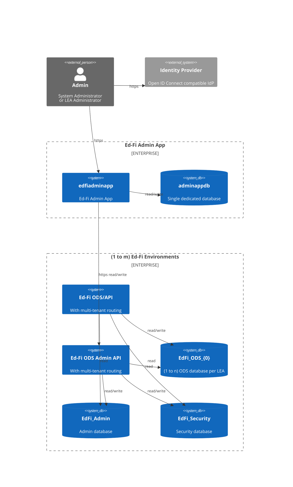

# Admin App Product Requirements Document for Version 4.0

> **Status:** complete \
> **Owner:** Stephen Fuqua, Ed-Fi Alliance \
> **Jira Project:** AC \
> **Repository:** `Ed-Fi-Alliance-OSS/Ed-Fi-AdminApp`

## 1. Product Overview

The Ed-Fi Admin App is a fork of Education Analytics's _Starting Blocks Admin
App_, modified to work in non-AWS environments. It is intended to replace the
Ed-Fi Alliance's legacy ODS Admin App and Sandbox Admin UI applications for
management of client credentials and database instances. The initial release of
this codebase is versioned as 4.0, continuing from the legacy ODS Admin App
version 3.x.

### 1.1 Strategic Alignment

The Ed-Fi Alliance's strategic goals in 2025 (year of project initiation)
include growth of Data Hubs and expansion of market-led initiatives aligned with
state education agency (SEA)-driven support. Data Hubs are regional deployments
that leverage state data collection requirements to drive vendor integrations
while providing data services directly to the local education agencies (LEA).

In practice, this means there is strategic importance to supporting deployments
that store data for multiple LEAs at the same time, with separate ODS databases
per LEA. These separate ODS database may be managed through shared
administrative databases (single-tenant mode) or separated administrative
databases (multi-tenant mode).

The current Ed-Fi tools (ODS Admin App and Sandbox Admin) were built to satisfy
the LEA market and SEA vendor certification requirements, respectively. Both
applications have heavy tech debt and do not fulfill the requirements (below) to
support multi-tenant Data Hubs.

### 1.2 Product Description

> **User Interface for Managing Ed-Fi API Deployments**
>
> The Ed-Fi Admin App is a web-based administrative platform designed to manage
> Ed-Fi API deployments across multiple environments and tenants. It replaces
> legacy tools (Ed-Fi ODS Admin App and Ed-Fi Sandbox Admin UI) and provides a
> unified, scalable interface for managing client credentials, database
> instances, and API health across diverse user roles and deployment models.

### 1.3 Target Users

- **System Administrators**: This applications is designed to support IT staff
  who are managing large-scale deployments of the Ed-Fi API applications:
  managed service providers, state agencies, data hubs.
- **Vendor Support**: The hosting agency can provide configurable access to
  delegate some maintenance tasks to staff who are not system administrator and
  need to perform actions such as managing vendor client credentials.
  - In sandboxed situations, it may be possible to allow Vendor staff to connect
    directly with Admin App for provisioning their own credentials. However,
    this version of the application will not be designed for production-level
    security in such circumstances.

## 2. Functional Requirements

> [!NOTE]
> To be reverse-engineered from the existing documents and functionality.

## 3. Architectural Requirements

The Ed-Fi Admin App application is intended to integrate with one or more
deployments of the set (Ed-Fi ODS/API, Ed-Fi Admin API). These applications can
operate in a multi-tenant mode, where the tenant definitions are in the
applications' respective configuration files. A single tenant has one pair of
(`EdFi_Admin`, `EdFi_Security`) database and one to many `EdFi_Ods_{0}`
databases. The Ed-Fi ODS/API and Ed-Fi Admin API each have mechanisms for
routing incoming HTTP requests to the right databases.

The application will utilize an external Open ID Connect (OIDC) compatible
identity provider (IdP) for provision of signed JSON Web Tokens (JWT).

Ed-Fi Admin App will require its own database for storing information such as
OIDC parameters, allowed users, and connection information for the ODS/API and
Admin API applications that it manages.

## 4. Non-Functional Requirements (NFR)

### 4.1 Security NFRs

### 4.1 Operational NFRs

| Category                | Requirement                                                                                         |
| ----------------------- | --------------------------------------------------------------------------------------------------- |
| **Availability**        | App must be operational independent of ODS/API and AdminAPI uptimes                                 |
| **Retries**             | Retry failed I/O operations _n_ (config) times, with delay and exponential backoff                  |
| **Authentication**      | Accept JWT from configured OIDC provider; must have matching user in local data store               |
| **Authorization**       | Users will be assigned granular permissions to access UI functionality                              |
| **Secrets**             | Encrypt sensitive information at rest                                                               |
| **Observability**       | Create log entries for all interactions using an appropriate level (see below for details)          |
| **Logging**             | Write logs to terminal based on configured verbosity                                                |
| **Proxying**            | Must accept and use headers forwarded from a reverse proxy                                          |

### 4.2 SDLC NFRs

| Category                | Requirement                                                                                         |
| ----------------------- | --------------------------------------------------------------------------------------------------- |
| **Code Quality**        | Consistent formatting and linting                                                                   |
| **Unit Testing**        | Goal 100% unit test coverage of business logic                                                      |
| **Integration Testing** | Cover all happy paths and common failure scenarios                                                  |
| **CI/CD**               | Automated integration builds and push-button package management                                     |
| **Packaging**           | Ship compiled application in native packaging format and as production-ready images (OCI-compliant) |

> [!NOTE]
> Log level guidance:
>
> - **ERROR**: an unexpected _system_ error occurred that impacts user
>   functionality, such as a database communication failure. Do not use for
>   _user errors_.
> - **WARN**: an unexpected situation occurred that may warrant investigation,
>   but there is limited impact on end user functionality.
> - **INFO**: events of interest, such as application startup, connection to
>   external resources, or queueing of a job.
> - **DEBUG**: more detailed diagnostic data that may aid in debugging warnings
>   and errors at runtime.

> [!WARNING]
> TODO: check on these NFRs
>
> - IP Allow-listing
> - Rate limiting
> - Performance targets (none set?)
> - Correlation ID headers

## 5. Technology Stack

| Component        | Technology                                  |
| ---------------- | ------------------------------------------- |
| Frontend         | React-based single page application         |
| Runtime          | Node.js (Alpine for containers)             |
| Backend Language | TypeScript transpiled to JavaScript         |
| Database         | PostgreSQL and Microsoft SQL Server (MSSQL) |
| Build Tool       | nx                                          |
| Linting          | ESLint                                      |
| Testing          | Jest                                        |
| Containers       | Docker (node:22-alpine)                     |
| CI/CD            | GitHub Actions                              |

> [!WARNING]
> TODO: understand the role of Storybook in the inherited tech stack.
