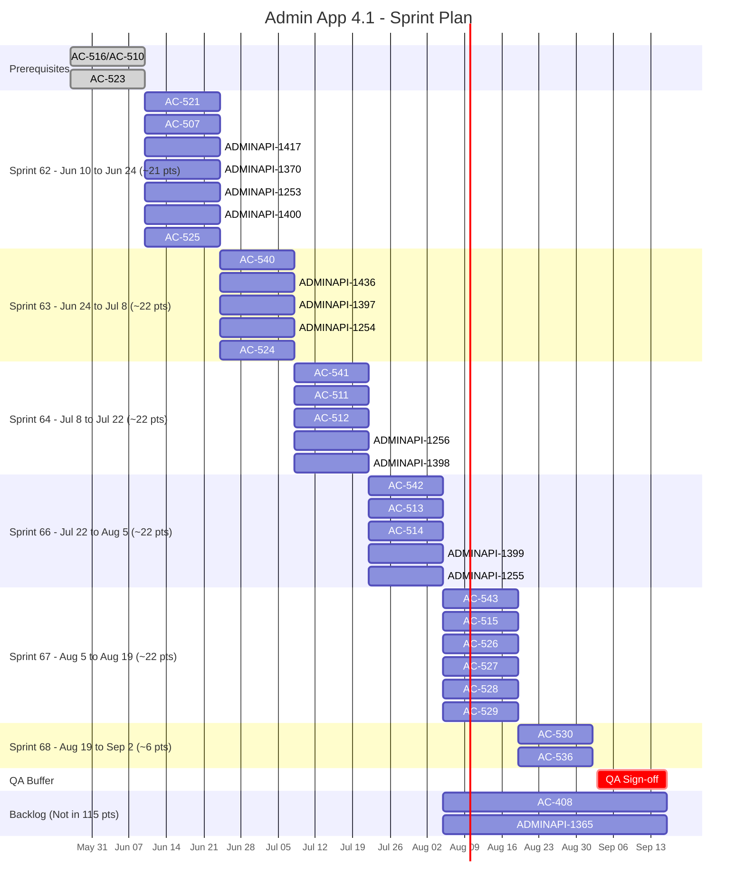

# Roadmap for Admin App 4.1

**Team size:** 3 developers, 1 tester, 1 product owner
**Team capacity:** 60% (due to many running projects in parallel)
**Sprint length:** 2 weeks · **Full-capacity velocity:** ~35 pts/sprint · **Effective velocity at 60%:** ~21 pts/sprint
**Roadmap start date:** Jun 10, 2026

## References

[PRD-AdminApp-v4.1.md document](https://github.com/Ed-Fi-Alliance-OSS/Ed-Fi-AdminApp/tree/main/docs)

## Summary

| Metric | Value |
| -- | -- |
| Total dev story points | 115 |
| Completed (tracked in this roadmap) | 0 pts |
| **Remaining dev points** | **115 pts** |
| Effective velocity (60% capacity) | 21 pts/sprint |
| Sprints needed | 6 |
| **Projected dev ETA** | **September 2, 2026** |
| With QA buffer sprint | September 16, 2026 |
| Development tickets in scope | 31 |

## Jobs to Be Done

| Area | Associated Epics |
| -- | -- |
| JTBD: Issue Credentials | [AC-456](https://edfi.atlassian.net/browse/AC-456) |
| JTBD: Synchronize with Running Ed-Fi Deployments | [AC-363](https://edfi.atlassian.net/browse/AC-363), [ADMINAPI-1331](https://edfi.atlassian.net/browse/ADMINAPI-1331) |
| JTBD: Instance Management | [AC-506](https://edfi.atlassian.net/browse/AC-506), [ADMINAPI-1344](https://edfi.atlassian.net/browse/ADMINAPI-1344) |
| JTBD: Evaluate Claimsets and Profiles | TBD |
| Others: V3 specification integration on Admin App | [AC-522](https://edfi.atlassian.net/browse/AC-522) |
| Others: Implement E2E and unit test in Admin App | [AC-509](https://edfi.atlassian.net/browse/AC-509) |
| Others: Improve AdminAPI-2 Test Coverage | [ADMINAPI-1251](https://edfi.atlassian.net/browse/ADMINAPI-1251) |

## Epics

| Id | Title | Pending Story Points |
| -- | -- | -- |
| AC-363 | Non-Starting Blocks Synchronization Process | 3 |
| AC-509 | Implement E2E and unit test in Admin App | 32 |
| AC-522 | Admin App supports Admin Api with V3 specification | 26 |
| AC-506 | Instance Management Integration | 17 |
| AC-408 | Enhanced User Interface Functionality | TBD |
| ADMINAPI-1344 | Managing Ed-Fi ODS database instances using the Admin API | 6 |
| ADMINAPI-1251 | Improve AdminAPI-2 Test Coverage | 31 |

## Sprints

| Sprint | Starts | Ends |
| -- | -- | -- |
| Sprint 61 | May 27th | Jun 10th |
| Sprint 62 | Jun 10th | Jun 24th |
| Sprint 63 | Jun 24th | Jul 8th |
| Sprint 64 | Jul 8th | Jul 22th |
| Sprint 66 | Jul 22th | Aug 5th |
| Sprint 67 | Aug 5th | Aug 19th |
| Sprint 68 | Aug 19th | Set 2nd |

## Pending tickets per epic

### AC-363 Non-Starting Blocks Synchronization Process

| Link | Dependencies | Status | Story Points |
| -- | -- | -- | -- |
| https://edfi.atlassian.net/browse/AC-521 | None | Open | 3 |

### AC-509 Implement E2E and unit test in Admin App

| Link | Dependencies | Status | Story Points |
| -- | -- | -- | -- |
| https://edfi.atlassian.net/browse/AC-516 | None | Completed | 0 |
| https://edfi.atlassian.net/browse/AC-510 | None | Completed | 0 |
| https://edfi.atlassian.net/browse/AC-511 | AC-516 | Open | 8 |
| https://edfi.atlassian.net/browse/AC-512 | AC-516 | Open | 5 |
| https://edfi.atlassian.net/browse/AC-513 | AC-516 | Open | 8 |
| https://edfi.atlassian.net/browse/AC-514 | AC-516 | Open | 5 |
| https://edfi.atlassian.net/browse/AC-515 | AC-516 | Open | 3 |
| https://edfi.atlassian.net/browse/AC-536 | AC-516/AC-511 | Open | 3 |

### AC-522 Admin App supports Admin Api with V3 specification

| Link | Dependencies | Status | Story Points |
| -- | -- | -- | -- |
| https://edfi.atlassian.net/browse/AC-523 | None | Completed | 0 |
| https://edfi.atlassian.net/browse/AC-524 | AC-523/AC-525 | Open | 5 |
| https://edfi.atlassian.net/browse/AC-525 | None | Open | 2 |
| https://edfi.atlassian.net/browse/AC-526 | AC-524/AC-523 | Open | 3 |
| https://edfi.atlassian.net/browse/AC-527 | AC-526 | Open | 3 |
| https://edfi.atlassian.net/browse/AC-528 | AC-526/AC-527 | Open | 5 |
| https://edfi.atlassian.net/browse/AC-529 | AC-526/AC-527 | Open | 3 |
| https://edfi.atlassian.net/browse/AC-530 | AC-526/AC-527 | Open | 3 |

### AC-506 Instance Management Integration

| Link | Dependencies | Status | Story Points |
| -- | -- | -- | -- |
| https://edfi.atlassian.net/browse/AC-507 | None | Open | 5 |
| https://edfi.atlassian.net/browse/AC-540 | AC-507 | Open | 3 |
| https://edfi.atlassian.net/browse/AC-541 | AC-507/AC-540 | Open | 3 |
| https://edfi.atlassian.net/browse/AC-542 | AC-507/AC-541 | Open | 3 |
| https://edfi.atlassian.net/browse/AC-543 | AC-507/AC-542 | Open | 3 |

### AC-408 Enhanced User Interface Functionality

| Link | Dependencies | Status | Story Points |
| -- | -- | -- | -- |
| https://edfi.atlassian.net/browse/AC-439 | TBD | TBD | TBD |
| https://edfi.atlassian.net/browse/AC-409 | TBD | TBD | TBD |
| https://edfi.atlassian.net/browse/AC-410 | TBD | TBD | TBD |
| https://edfi.atlassian.net/browse/AC-412 | TBD | TBD | TBD |
| https://edfi.atlassian.net/browse/AC-413 | TBD | TBD | TBD |

### ADMINAPI-1365 Sync Up Admin API 2.3 and CMS

| Link | Dependencies | Status | Story Points |
| -- | -- | -- | -- |
| https://edfi.atlassian.net/browse/ADMINAPI-1380 | None | Open | 5 |
| https://edfi.atlassian.net/browse/ADMINAPI-1383 | None | Open | 3 |
| https://edfi.atlassian.net/browse/ADMINAPI-1382 | None | Open | 5 |
| https://edfi.atlassian.net/browse/AC-503 | None | Open | 2 |
| https://edfi.atlassian.net/browse/AC-504 | None | Open | 2 |

### ADMINAPI-1344 Managing Ed-Fi ODS database instances using the Admin API

| Link | Dependencies | Status | Story Points |
| -- | -- | -- | -- |
| https://edfi.atlassian.net/browse/ADMINAPI-1417 | None | Open | 3 |
| https://edfi.atlassian.net/browse/ADMINAPI-1436 | ADMINAPI-1417 | Open | 3 |

### ADMINAPI-1251 Improve AdminAPI-2 Test Coverage

| Link | Dependencies | Status | Story Points |
| -- | -- | -- | -- |
| https://edfi.atlassian.net/browse/ADMINAPI-1370 | None | Open | 3 |
| https://edfi.atlassian.net/browse/ADMINAPI-1253 | None | Open | 3 |
| https://edfi.atlassian.net/browse/ADMINAPI-1397 | None | Open | 3 |
| https://edfi.atlassian.net/browse/ADMINAPI-1254 | None | Open | 5 |
| https://edfi.atlassian.net/browse/ADMINAPI-1256 | None | Open | 3 |
| https://edfi.atlassian.net/browse/ADMINAPI-1257 | None | Open | 3 |
| https://edfi.atlassian.net/browse/ADMINAPI-1398 | None | Open | 3 |
| https://edfi.atlassian.net/browse/ADMINAPI-1399 | None | Open | 3 |
| https://edfi.atlassian.net/browse/ADMINAPI-1400 | None | Open | 2 |
| https://edfi.atlassian.net/browse/ADMINAPI-1255 | None | Open | 3 |

---

## Sprint Gantt Chart

