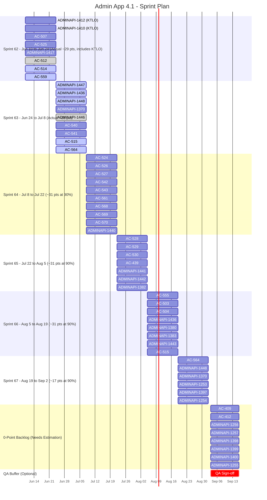
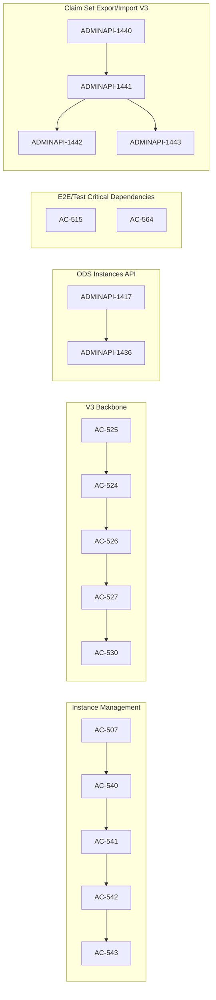

# Roadmap for Admin App 4.1

**Team size:** 3 developers, 1 tester, 1 product owner
**Team capacity:** 60% (due to many running projects in parallel). Starting with sprint 63 assume a 90% capacity.
**Sprint length:** 2 weeks · **Full-capacity velocity:** ~35 pts/sprint · **Effective velocity at 60%:** ~21 pts/sprint
**Roadmap start date:** Jun 10, 2026

<mark> This document has been updated on June 30th

## References

[PRD-AdminApp-v4.1.md document](https://github.com/Ed-Fi-Alliance-OSS/Ed-Fi-AdminApp/tree/main/docs)

## Summary

| Metric | Value |
| -- | -- |
| Total dev story points from assigned tickets (estimated) | 153 |
| Completed estimated points (tickets) | 43 pts |
| **Remaining dev points (estimated)** | **110 pts** |
| Effective velocity | 21 pts/sprint (Sprint 62), ~31 pts/sprint (90% from Sprint 63) |
| Sprints needed (estimated scope) | 4 (at ~31 pts/sprint) |
| **Projected dev ETA (estimated scope)** | **September 2, 2026** |
| With QA buffer sprint | September 16, 2026 |
| Development tickets in scope | 56 |
| Estimated open/in-progress tickets (>0 pts) | 30 |
| Tickets currently at 0 pts (needs re-estimation) | 12 |

## Jobs to Be Done

| Area | Associated Epics |
| -- | -- |
| JTBD: Issue Credentials | [AC-445](https://edfi.atlassian.net/browse/AC-445) |
| JTBD: Synchronize with Running Ed-Fi Deployments | [AC-363](https://edfi.atlassian.net/browse/AC-363), [ADMINAPI-1331](https://edfi.atlassian.net/browse/ADMINAPI-1331) |
| JTBD: Instance Management | [AC-506](https://edfi.atlassian.net/browse/AC-506), [ADMINAPI-1344](https://edfi.atlassian.net/browse/ADMINAPI-1344) |
| JTBD: Evaluate Claimsets and Profiles | [AC-408](https://edfi.atlassian.net/browse/AC-408) |
| JTBD: Authentication Provider Compatibility | [AC-247](https://edfi.atlassian.net/browse/AC-247) |
| Others: V3 specification integration on Admin App | [AC-522](https://edfi.atlassian.net/browse/AC-522) [ADMINAPI-1365](https://edfi.atlassian.net/browse/ADMINAPI-1365) |
| Others: Claim Set Export - Import API Design - V3 | [ADMINAPI-1439](https://edfi.atlassian.net/browse/ADMINAPI-1439) |
| Others: Implement E2E and unit test in Admin App | [AC-509](https://edfi.atlassian.net/browse/AC-509) |
| Others: Improve AdminAPI-2 Test Coverage | [ADMINAPI-1251](https://edfi.atlassian.net/browse/ADMINAPI-1251) |

## Epics

| Id | Title | Status | Pending Story Points |
| -- | -- | -- | -- |
| AC-445 | Support Multiple Client Credentials for Applications | Completed | 0 |
| AC-363 | Non-Starting Blocks Synchronization Process | Completed | 0 |
| AC-506 | Instance Management Integration | In Progress | 18 |
| AC-509 | Implement E2E and unit test in Admin App | In Progress | 8 |
| AC-408 | Enhanced User Interface Functionality | Open | 5 |
| AC-522 | Admin App supports Admin Api with V3 specification | Open | 35 |
| AC-247 | Alternative Identity Providers for Admin App v4 | Completed | 0 |
| ADMINAPI-1365 | Sync Up Admin API 2.3 and CMS | In progress | 22 |
| ADMINAPI-1331 | Implement Ed-Org endpoints | Completed | 0 |
| ADMINAPI-1344 | Managing Ed-Fi ODS database instances using the Admin API | In Progress | 8 |
| ADMINAPI-1439 | Claim Set Export - Import API Design - V3 | Open | 12 |
| ADMINAPI-1251 | Improve AdminAPI-2 Test Coverage | In Progress | 31 |

## Sprints

| Sprint | Starts | Ends |
| -- | -- | -- |
| Sprint 61 | May 27th | Jun 10th |
| Sprint 62 | Jun 10th | Jun 24th |
| Sprint 63 | Jun 24th | Jul 8th |
| Sprint 64 | Jul 8th | Jul 22nd |
| Sprint 65 | Jul 22nd | Aug 5th |
| Sprint 66 | Aug 5th | Aug 19th |
| Sprint 67 | Aug 19th | Sep 2nd |
| Sprint 68 | Sep 2nd | Sep 16th |
| Sprint 69 | Sep 16th | Sep 30th |
| Sprint 70 | Sep 30th | Oct 14th |
| Sprint 71 | Oct 14th | Oct 28th |
| Sprint 72 | Oct 28th | Nov 11th |
| Sprint 73 | Nov 11th | Nov 25th |
| Sprint 74 | Nov 25th | Dec 9th |

## Tickets per epic

### AC-509 Implement E2E and unit test in Admin App

Right now the test coverage on Admin App is super low. With this epic we want to make a very significant improvment to this coverage.
This includes preparing an environment on GitHub Action where the tests can run on. The tickets include aspects like: Admin App Api, Admin App front end, end to end tests and unit tests.

| Link | Dependencies | Status | Story Points |
| -- | -- | -- | -- |
| https://edfi.atlassian.net/browse/AC-516 | None | Completed | 5 |
| https://edfi.atlassian.net/browse/AC-510 | None | Completed | 5 |
| https://edfi.atlassian.net/browse/AC-512 | None | Completed | 2 |
| https://edfi.atlassian.net/browse/AC-514 | None | Completed | 5 |
| https://edfi.atlassian.net/browse/AC-515 | AC-514/AC-513/AC-547 | In Progress | 3 |
| https://edfi.atlassian.net/browse/AC-559 | None | Completed | 5 |
| https://edfi.atlassian.net/browse/AC-564 | None | In Progress | 5 |

### AC-522 Admin App supports Admin Api with V3 specification

Adding the new V3 specification on Admin App is not straight forward. There are areas where we need to duplicate some code, specially in the Api: Controllers, DTOs, etc. Then on the Front end most pages can be reusable from v2, but some of them we require changes. Changes here include routing, pages customization, etc.

| Link | Dependencies | Status | Story Points |
| -- | -- | -- | -- |
| https://edfi.atlassian.net/browse/AC-523 | None | Completed | 3 |
| https://edfi.atlassian.net/browse/AC-524 | AC-525 | Open | 5 |
| https://edfi.atlassian.net/browse/AC-525 | None | Completed | 2 |
| https://edfi.atlassian.net/browse/AC-526 | AC-524 | Open | 3 |
| https://edfi.atlassian.net/browse/AC-527 | AC-526 | Open | 3 |
| https://edfi.atlassian.net/browse/AC-528 | AC-526 / AC-527 | Open | 5 |
| https://edfi.atlassian.net/browse/AC-529 | AC-526 / AC-527 | Open | 5 |
| https://edfi.atlassian.net/browse/AC-530 | AC-526 / AC-527 / ADMINAPI-1439 | Open | 5 |
| https://edfi.atlassian.net/browse/AC-568 | AC-526 / AC-527 | Open | 3 |
| https://edfi.atlassian.net/browse/AC-569 | AC-526 / AC-527 | Open | 3 |
| https://edfi.atlassian.net/browse/AC-570 | AC-526 / AC-527 | Open | 3 |

### AC-506 Instance Management Integration

Instance Management is about 90% complete on the Admin Api. But we have't started the implementation on Admin App.
We will need new CRUD pages, similar to other pages on the App.

| Link | Dependencies | Status | Story Points |
| -- | -- | -- | -- |
| https://edfi.atlassian.net/browse/ADMINAPI-1447 | None | In Progress | 3 |
| https://edfi.atlassian.net/browse/AC-561 | None | Open | 3 |
| https://edfi.atlassian.net/browse/AC-507 | None | Completed | 5 |
| https://edfi.atlassian.net/browse/AC-540 | ADMINAPI-1447 / AC-561 / AC-507 | Open | 3 |
| https://edfi.atlassian.net/browse/AC-541 | ADMINAPI-1447 / AC-561 / AC-507 / AC-540 | Open | 3 |
| https://edfi.atlassian.net/browse/AC-542 | ADMINAPI-1447 / AC-561 / AC-507 / AC-541 | Open | 3 |
| https://edfi.atlassian.net/browse/AC-543 | ADMINAPI-1447 / AC-561 / AC-507 / AC-542 | Open | 3 |

### AC-408 Enhanced User Interface Functionality

This mostly include making improvements to the user experience on the Claimsets page, and Profiles page.

| Link | Dependencies | Status | Story Points |
| -- | -- | -- | -- |
| https://edfi.atlassian.net/browse/AC-439 | None | Open | 5 |
| https://edfi.atlassian.net/browse/AC-409 | TBD | TBD | 0 |
| https://edfi.atlassian.net/browse/AC-412 | TBD | TBD | 0 |

### AC-247 Alternative Identity Providers for Admin App v4

This epic is related to Admin App's capability to work with other IDPs like Google, AWS and MS Entra Id.
Given the comments on AC-247 and the description on the PRD this is something already completed.

| Link | Dependencies | Status | Story Points |
| -- | -- | -- | -- |
| https://edfi.atlassian.net/browse/AC-351 | None | Completed | 0 |
| https://edfi.atlassian.net/browse/AC-352 | None | Completed | 0 |
| https://edfi.atlassian.net/browse/AC-353 | None | Completed | 0 |
| https://edfi.atlassian.net/browse/AC-247 | None | Completed | 5 |

### ADMINAPI-1365 Sync Up Admin API 2.3 and CMS

The synchronization with CMS is almost done from the Admin Api perspective, but on Admin App several changes are required.
These tickets may potentially overlap with tickets in AC-522.

| Link | Dependencies | Status | Story Points |
| -- | -- | -- | -- |
| https://edfi.atlassian.net/browse/ADMINAPI-1380 | None | Open | 5 |
| https://edfi.atlassian.net/browse/ADMINAPI-1383 | None | Open | 3 |
| https://edfi.atlassian.net/browse/ADMINAPI-1382 | None | Open | 5 |
| https://edfi.atlassian.net/browse/AC-503 | None | Open | 2 |
| https://edfi.atlassian.net/browse/AC-504 | None | Open | 2 |
| https://edfi.atlassian.net/browse/AC-555 | AC-522 | Open | 5 |
| https://edfi.atlassian.net/browse/ADMINAPI-1446 | None | Completed | 3 |

### ADMINAPI-1344 Managing Ed-Fi ODS database instances using the Admin API

The Instance Management is almost done on Admin Api, there are some things we need to figure out like how to handle versions and sandboxes.

| Link | Dependencies | Status | Story Points |
| -- | -- | -- | -- |
| https://edfi.atlassian.net/browse/ADMINAPI-1417 | None | Completed | 3 |
| https://edfi.atlassian.net/browse/ADMINAPI-1436 | ADMINAPI-1417 | In progress | 5 |

### ADMINAPI-1439 Claim Set Export - Import API Design - V3

Based on the recent design changes on the Claimsets export and import, we need to adapt V3 to those changes on Admin Api.

| Link | Dependencies | Status | Story Points |
| -- | -- | -- | -- |
| https://edfi.atlassian.net/browse/ADMINAPI-1440 | None | Open | 3 |
| https://edfi.atlassian.net/browse/ADMINAPI-1441 | ADMINAPI-1440 | Open | 3 |
| https://edfi.atlassian.net/browse/ADMINAPI-1442 | ADMINAPI-1440/ADMINAPI-1441 | Open | 3 |
| https://edfi.atlassian.net/browse/ADMINAPI-1443 | ADMINAPI-1440/ADMINAPI-1441 | Open | 3 |

### ADMINAPI-1251 Improve AdminAPI-2 Test Coverage

Test coverage is still low on unit and integration tests in Admin Api. It is very good on end to end tests.

| Link | Dependencies | Status | Story Points |
| -- | -- | -- | -- |
| https://edfi.atlassian.net/browse/ADMINAPI-1370 | None | Open | 0 |
| https://edfi.atlassian.net/browse/ADMINAPI-1253 | None | Open | 0 |
| https://edfi.atlassian.net/browse/ADMINAPI-1397 | None | Open | 0 |
| https://edfi.atlassian.net/browse/ADMINAPI-1254 | None | Open | 0 |
| https://edfi.atlassian.net/browse/ADMINAPI-1256 | None | Open | 0 |
| https://edfi.atlassian.net/browse/ADMINAPI-1257 | None | Open | 0 |
| https://edfi.atlassian.net/browse/ADMINAPI-1398 | None | Open | 0 |
| https://edfi.atlassian.net/browse/ADMINAPI-1399 | None | Open | 0 |
| https://edfi.atlassian.net/browse/ADMINAPI-1400 | None | Open | 0 |
| https://edfi.atlassian.net/browse/ADMINAPI-1255 | None | Open | 0 |
| https://edfi.atlassian.net/browse/ADMINAPI-1448 | None | In Progress | 5 |

## Actual tickets added to the sprints

### Sprint 62

| Ticket | Story points |
| -- | -- |
| ADMINAPI-1417 | 3 |
| ADMINAPI-1412 (KTLO) | 5 |
| ADMINAPI-1410 (KTLO) | 2 |
| AC-507 | 5 |
| AC-512 | 2 |
| AC-514 | 5 |
| AC-559 | 5 |
| AC-525 | 2 |

### Sprint 63

| Ticket | Story points |
| -- | -- |
| ADMINAPI-1447 | 3 |
| ADMINAPI-1436 | 3 |
| ADMINAPI-1448 | 5 |
| ADMINAPI-1370 | 3 |
| ADMINAPI-1446 | 3 |
| AC-540 | 3 |
| AC-541 | 3 |
| AC-515 | 3 |
| AC-564 | 5 |

---

## Sprint Gantt Chart

## Critical Path to August 31, 2026

### Feasibility Check

Assuming roadmap execution starts on Jun 10 and the hard deadline is Aug 31:

- Available delivery window: Sprint 62 plus Sprint 63-67 (with Sprint 67 partially available before Aug 31)
- Effective capacity to deadline: ~172 pts (21 pts in Sprint 62 + ~31 pts per sprint from Sprint 63, prorated through Aug 31)
- Estimated remaining scope (estimated tickets only): 110 pts
- **Estimated capacity margin by Aug 31: ~62 pts**

Conclusion: delivering the currently estimated scope by Aug 31 is feasible at the updated 90% capacity assumption. Main risk is not throughput, but execution risk and unresolved 0-point tickets that still require estimation.

### Dependency Critical Path (highest sequencing pressure)

The following chains have the strongest dependency constraints and should be prioritized first:

1. AC-506 chain (Instance Management):
AC-507 -> AC-540 -> AC-541 -> AC-542 -> AC-543

2. AC-522 chain (V3 backbone):
AC-525 -> AC-524 -> AC-526 -> AC-527 -> AC-530

3. ADMINAPI-1344 chain:
ADMINAPI-1417 -> ADMINAPI-1436

4. AC-509 residual path (reduced scope):
AC-515 (in progress) and AC-564 (in progress)

5. ADMINAPI-1439 chain:
ADMINAPI-1440 -> ADMINAPI-1441 -> (ADMINAPI-1442, ADMINAPI-1443)

### Critical Path Graph

### Recommendation for an Aug 31 Target

- Lock the commitment baseline to currently estimated tickets (110 pts) and keep dependency-critical items on the path above.
- Defer lower-priority leaves and non-critical branches first (for example, optional test expansions and non-blocking feature slices).
- Keep 0-point tickets out of the commitment baseline until estimates are defined.
- Treat AC-408 as out of critical path until estimates are finalized.
