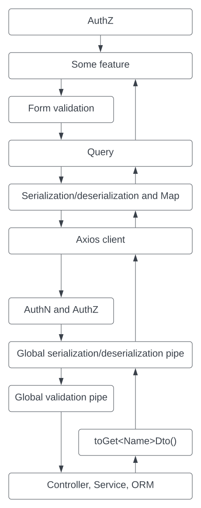

# Application Architecture

- [Application Architecture](#application-architecture)
  - [About the architecture — a vertical slice](#about-the-architecture--a-vertical-slice)
    - [1. Model definitions](#1-model-definitions)
    - [2. Server](#2-server)
    - [3. Client](#3-client)
    - [4. Plumbing](#4-plumbing)
  - [Monorepo structure](#monorepo-structure)
  - [Testing](#testing)

## About the architecture &mdash; a vertical slice

You will follow a single database entity through all the layers of the app's architecture.

### 1. Model definitions

The entity is defined by a shared library. It consists of an interface, a set of DTOs which implement derived versions of the interface, and an ORM class which also implements a version of the interface. Having so many separate interfaces, classes, and DTOs is a pain. It _looks_ like a lot of duplicated code. However, (a) there are differences, and (b) there are some issues in the way of deriving related classes or interfaces as opposed to writing (mostly) duplicated versions separately.

- [Interface](../packages/models/src/interfaces/edfi-tenant.interface.ts#L6)
- [ORM class](../packages/models-server/src/entities/edfi-tenant.entity.ts#L5)
- [DTOs](../packages/models/src/dtos/edfi-tenant.dto.ts#L9)

### 2. Server

The parts you care most about are the controller and service, where the business operations happen. Other than those, there are several places where you just have to import the entity or its module to actually hook things up and configure routing.

- Initialization
  - [ORM config](../packages/api/src/database/typeorm.config.ts#L48)
  - [Routing](../packages/api/src/app/routes.ts#L82)
  - [Module import](../packages/api/src/app/app.module.ts#L61)
  - [Module](../packages/api/src/edfi-tenants-global/edfi-tenants-global.module.ts#L7)
- Authorization
  - Caching
    - [Resource privilege caching](../packages/api/src/auth/auth.service.ts#L360)
    - [ABAC ability creation](../packages/api/src/auth/authorization/authorized.guard.ts#L37)
  - [Auth request](../packages/api/src/edfi-tenants-global/edfi-tenants-global.controller.ts#L69)
  - [Auth evaluation](../packages/api/src/auth/authorization/authorized.guard.ts#L115)
- Business logic
  - [Controller](../packages/api/src/edfi-tenants-global/edfi-tenants-global.controller.ts#L80)
  - [Service](../packages/api/src/teams/edfi-tenants/edfi-tenants.service.ts#L24)

### 3. Client

- [Queries](../packages/fe/src/app/api/queries/queries.ts#L298)
- Routing
  - [Add to app](../packages/fe/src/app/routes/index.tsx#L215)
  - [Route definition](../packages/fe/src/app/routes/edfi-tenant-global.routes.tsx#L23)
- Page
  - [Create](../packages/fe/src/app/Pages/EdfiTenantGlobal/CreateEdfiTenantGlobalPage.tsx#L24)
    - [Form validation](../packages/fe/src/app/Pages/EdfiTenantGlobal/CreateEdfiTenantGlobalPage.tsx#L22)

### 4. Plumbing

Buried in and around the obvious things like files named `edfi-tenants.controller.ts` are a bunch of non-obvious things that make the app work:

- The `toGet<Entity Name>Dto()` helpers used throughout the controllers. These transform the TypeORM classes into the GET DTO classes that the front-end expects (or, more immediately, that the global pipe expects).
- Global DTO transformation and validation. The `main.ts` file in the back-end sets up a global pipe that operates both on requests and responses:
  - On requests, it looks for the Body decorator in the route handler. If this has a class type annotation (e.g. `@Body() edfiTenant: PostEdfiTenantDto`), it runs deserialization with `class-transformer` and validation with `class-validator` using that class.
  - On responses, it looks for whether the value returned from the handler is a DTO class. If so, it uses it to serialize the value with `class-transformer`.
- Authentication handlers and global guard, which are described by [their own README](../packages/api/src/auth/login/README.md).
- Authorization, which is also its own big topic.
- Reusable API client that supports serialization and deserialization, reduces arrays to objects, and standardizes failure modes.
- The `react-query` factory used to configure standard CRUD for each entity.
- Front-end error boundary that catches query failures, among other things.
- Form validation powered by `react-hook-form` and DTOs with `class-validator` annotations.

**Don't scrutinize this too much, but here's basically what that looks like:**

## Monorepo structure

Nx makes it easy to share code between different apps. We're taking advantage of that in one big way right now, which is the shared data models. But outside of that use case we've been very sloppy about putting code into application packages vs library packages. We currently only have one back end and one front end, so "shared" code is mostly just YAGNI. Eventually we might have a separate claimset library app. When/if we do, we'll move all that code around as necessary.

## Testing

There's a bunch of end-to-end test infrastructure configured in the [./e2e](./e2e) directory for the test script in [../packages/api/src/app/app.e2e.spec.txt](../packages/api/src/app/app.e2e.spec.txt). The file ends in `.txt` instead of `.ts` because that was a stupidly easy way of exempting it from GitHub CI where it would eat up too many minutes. We run the e2e tests by temporarily renaming the file and running them ad-hoc.
