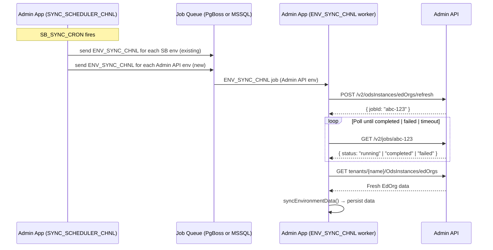

# Design: Admin API EdOrg Refresh with Job Status Polling

**Date:** 2026-05-25
**Feature:** Integrate `POST /v2/odsInstances/edOrgs/refresh` into the scheduled Admin API sync
**Supersedes:** Portions of `adminapi-auto-sync-with-edorg-refresh.md` (Option 3 replaced by simpler single-cron approach below)

---

## Overview

The Admin API exposes `POST /v2/odsInstances/edOrgs/refresh`, which queues an async job that
rebuilds EdOrg data before it is served by `GET /v2/tenants/{name}/OdsInstances/edOrgs`. This
endpoint is not yet called by Admin App.

This document describes how to integrate the refresh call using the simplest possible approach:
extend the existing `SYNC_SCHEDULER_CHNL` cron to include Admin API environments and add an
in-process polling step before the data fetch — no new crons, no tracking table, no MSSQL-specific
changes.

---

## Acceptance Criteria

- `POST /v2/odsInstances/edOrgs/refresh` is called before each scheduled Admin API sync.
- Admin App polls `GET /v2/jobs/{jobId}` until the job is `completed`, `failed`, or times out.
- After the job completes (or if the refresh is unavailable), Admin App proceeds to fetch data.
- Polling attempts and interval are configurable via environment variables.

---

## Architecture

### High-Level Flow

```
SYNC_SCHEDULER_CHNL (existing SB_SYNC_CRON)
  ├─ Existing: query SB environments → enqueue ENV_SYNC_CHNL (unchanged)
  └─ NEW: query Admin API environments → enqueue ENV_SYNC_CHNL (same channel)

ENV_SYNC_CHNL worker → refreshSbEnvironment(id)
  ├─ SB env branch: unchanged
  └─ Admin API env branch:
       1. [NEW] triggerEdOrgRefresh(env)   ← POST /v2/odsInstances/edOrgs/refresh
       2. [NEW] pollJobStatus(env, jobId)  ← GET /v2/jobs/{jobId} polling loop
       3. [EXISTING] syncEnvironmentData(env)
```

No new job channels. No new database table. No MSSQL-specific changes required.

The `IJobQueueService` abstraction handles both PgBoss (PostgreSQL) and the custom
`MssqlJobQueueService` transparently. Polling is pure HTTP — no DB involvement.

### Sequence Diagram



---

## Components & File Changes

### 1. `packages/api/src/sb-sync/sb-sync.consumer.ts`

**Change:** Extend the `SYNC_SCHEDULER_CHNL` worker to also discover and enqueue Admin API
environments (environments with `adminApiUrl` not null and no `sbEnvironmentMetaArn`).

```typescript
// Add after the existing SB environments enqueue block:
const adminApiEnvironments = await this.sbEnvironmentsRepository
  .createQueryBuilder()
  .select()
  .where(`${jsonValue('configPublic', 'adminApiUrl', config.DB_ENGINE)} is not null`)
  .andWhere(`${jsonValue('configPublic', 'sbEnvironmentMetaArn', config.DB_ENGINE)} is null`)
  .getMany();

Logger.log(`Starting refresh for ${adminApiEnvironments.length} Admin API environments.`);
await Promise.all(
  adminApiEnvironments.map((env) =>
    this.jobQueue.send(
      ENV_SYNC_CHNL,
      { sbEnvironmentId: env.id },
      { singletonKey: String(env.id), expireInHours: 1 }
    )
  )
);
```

### 2. `packages/api/src/sb-sync/edfi/adminapi-sync.service.ts`

**Change:** Add two new private methods and call `triggerEdOrgRefresh()` at the start of
`syncEnvironmentData()` (before the `GET tenants/{name}/OdsInstances/edOrgs` call).

#### `triggerEdOrgRefresh(env: SbEnvironment): Promise<string | null>`

Calls `POST /v2/odsInstances/edOrgs/refresh`. Returns the `jobId` on success, `null` if the
endpoint is unavailable or returns an error (non-blocking).

#### `pollJobStatus(env: SbEnvironment, jobId: string): Promise<'completed' | 'failed' | 'timeout'>`

Polls `GET /v2/jobs/{jobId}` up to `ADMINAPI_REFRESH_POLL_ATTEMPTS` times, waiting
`ADMINAPI_REFRESH_POLL_INTERVAL_MS` ms between attempts. Returns the final status.

#### Integration point in `syncEnvironmentData()` (v2 branch only)

The refresh is triggered once per environment inside `syncEnvironmentData()`, after credentials
are bootstrapped but before the per-tenant `syncTenantData()` loop. It only applies to v2
environments (the refresh endpoint is a v2 feature).

```typescript
// After bootstrapEnvironmentCredentials() and reload, before syncTenantData() loop:
if (version === 'v2') {
  const jobId = await this.triggerEdOrgRefresh(sbEnvironment);
  if (jobId) {
    const jobStatus = await this.pollJobStatus(sbEnvironment, jobId);
    if (jobStatus === 'failed') {
      this.logger.error(`EdOrg refresh job ${jobId} failed — proceeding with potentially stale data`);
    } else if (jobStatus === 'timeout') {
      this.logger.warn(`EdOrg refresh job ${jobId} timed out — proceeding with sync`);
    }
  }
}
// Existing: per-tenant syncTenantData() loop
```

### 3. `packages/api/config/default.js`

Add two new config values:

```js
ADMINAPI_REFRESH_POLL_ATTEMPTS: 10,
ADMINAPI_REFRESH_POLL_INTERVAL_MS: 5000,
```

### 4. `packages/api/config/custom-environment-variables.js`

Map the new config values to environment variables:

```js
ADMINAPI_REFRESH_POLL_ATTEMPTS: 'ADMINAPI_REFRESH_POLL_ATTEMPTS',
ADMINAPI_REFRESH_POLL_INTERVAL_MS: 'ADMINAPI_REFRESH_POLL_INTERVAL_MS',
```

### 5. `packages/api/typings/config.d.ts`

Add type declarations for the new config properties:

```typescript
ADMINAPI_REFRESH_POLL_ATTEMPTS: number;
ADMINAPI_REFRESH_POLL_INTERVAL_MS: number;
```

---

## Admin API Changes Required

This design requires two changes to the Admin API (outside this repository):

### 1. `POST /v2/odsInstances/edOrgs/refresh` — must return a jobId

```json
{ "jobId": "abc-123-def" }
```

### 2. `GET /v2/jobs/{jobId}` — new lightweight status endpoint

```json
{
  "jobId": "abc-123-def",
  "status": "pending" | "running" | "completed" | "failed",
  "completedAt": "2025-05-06T14:30:00Z",
  "error": "..."
}
```

> **Note:** The correct endpoint path is `GET /v2/jobs/{jobId}` (not `/v2/jobs/{jobId}/status`
> as stated in the earlier design doc).

---

## Error Handling

| Scenario | Behavior |
|----------|----------|
| `POST /v2/odsInstances/edOrgs/refresh` returns non-200 | Log warning, skip refresh, proceed with sync |
| Endpoint not supported (older Admin API version) | Same — log warning, proceed |
| `GET /v2/jobs/{jobId}` returns `failed` | Log error, proceed with sync (data may be stale) |
| Polling exceeds `ADMINAPI_REFRESH_POLL_ATTEMPTS` | Log warning, proceed with sync |
| Admin API unreachable during polling | Log error, short-circuit polling, proceed with sync |
| Multiple environments — one refresh fails | Others are unaffected (`Promise.all` isolation) |
| Cron fires again before prior job completes | `singletonKey` on `ENV_SYNC_CHNL` deduplicates the job |

---

## Configuration

| Variable | Default | Description |
|----------|---------|-------------|
| `SB_SYNC_CRON` | `0 2 * * *` | Existing cron — now also triggers Admin API refresh |
| `ADMINAPI_REFRESH_POLL_ATTEMPTS` | `10` | Max poll retries before timeout |
| `ADMINAPI_REFRESH_POLL_INTERVAL_MS` | `5000` | Delay between poll retries (ms) |

---

## Testing Plan

All tests live in `packages/api/src/sb-sync/edfi/adminapi-sync.service.spec.ts`.

| Test | Scenario |
|------|----------|
| `triggerEdOrgRefresh()` — success | Returns jobId from POST response |
| `triggerEdOrgRefresh()` — API error | Returns null, logs warning |
| `pollJobStatus()` — completes 1st attempt | Returns `'completed'` |
| `pollJobStatus()` — completes after N retries | Returns `'completed'` after multiple polls |
| `pollJobStatus()` — job fails | Returns `'failed'` |
| `pollJobStatus()` — timeout | Returns `'timeout'` after max attempts |
| `syncEnvironmentData()` calls refresh before fetch | Refresh triggered before `GET edOrgs` |
| Scheduler enqueues Admin API envs | Both SB and Admin API envs are enqueued in `SYNC_SCHEDULER_CHNL` handler |

---

## Related Files

- `packages/api/src/sb-sync/sb-sync.consumer.ts` — Scheduler extension
- `packages/api/src/sb-sync/edfi/adminapi-sync.service.ts` — New methods
- `packages/api/src/sb-sync/sb-sync.module.ts` — No changes needed
- `packages/api/config/default.js` — New config defaults
- `packages/api/config/custom-environment-variables.js` — New env var mappings
- `packages/api/typings/config.d.ts` — New config type declarations
