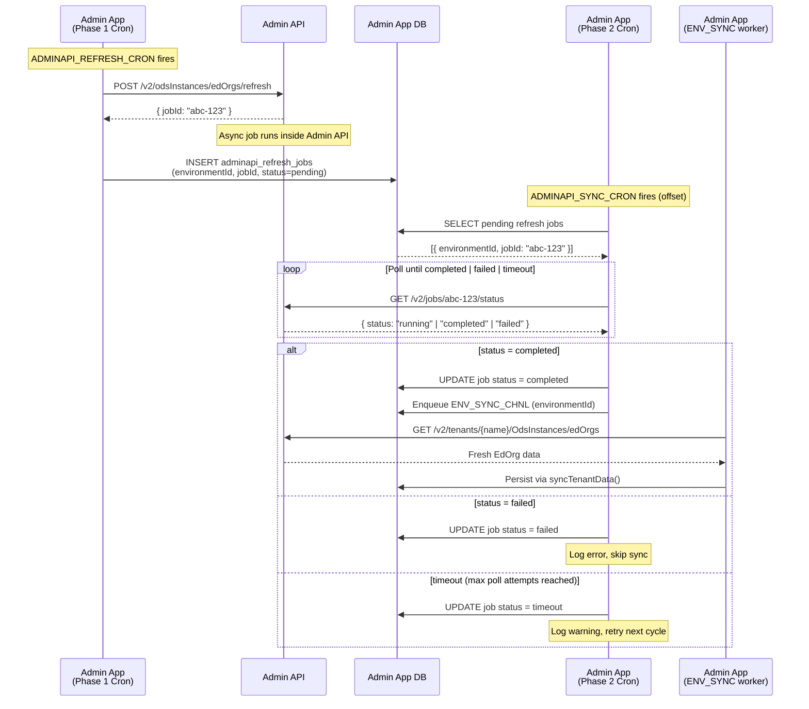

# Design: Admin API Auto-Sync with EdOrg Refresh (Option 3 — Job Status Polling)

## Feature

Context: Ed-Fi Admin App running against an Admin API environment (non-Starting Blocks).

User Story: _As a system administrator, I want the Admin App to automatically and reliably
synchronize tenant, ODS instance, and education organization data from Admin API environments
on a scheduled basis — including triggering the Admin API's own EdOrg refresh job and waiting
for it to complete before pulling data — so that the Admin App always reflects the most
up-to-date state without requiring manual intervention._

Feature Name: Admin API scheduled auto-sync with EdOrg refresh coordination.

---

## Overview

Currently, the cron-based auto-sync (`SYNC_SCHEDULER_CHNL`) only discovers and enqueues
Starting Blocks environments (those with `sbEnvironmentMetaArn`). Admin API environments
are only synced on-demand (at environment creation or by a manual trigger).

Additionally, the Admin API exposes `POST /v2/odsInstances/edOrgs/refresh`, which queues
an async job inside Admin API to rebuild the EdOrg data that is later served by
`GET /v2/tenants/{tenantName}/OdsInstances/edOrgs`. This refresh endpoint is not yet called
by Admin App.

This document describes a two-phase approach to close both gaps:

1. **Phase 1 cron** — Trigger `POST /v2/odsInstances/edOrgs/refresh` per Admin API environment.
2. **Phase 2 cron** — After Admin API confirms the job is complete (via a `GET /v2/jobs/{jobId}/status`
   polling loop), execute the existing `syncEnvironmentData()` to pull fresh data.

---

## Current Architecture (Relevant Parts)

### Sync channels

| Channel | Constant | Purpose |
|---------|----------|---------|
| `sbe-sync-scheduler` | `SYNC_SCHEDULER_CHNL` | CRON-triggered; discovers SB environments only |
| `sbe-sync` | `ENV_SYNC_CHNL` | Environment-level sync job |
| `edfi-tenant-sync` | `TENANT_SYNC_CHNL` | Tenant-level sync job |

### Current cron handler gap

```typescript
// sb-sync.consumer.ts — SYNC_SCHEDULER_CHNL worker
// Only selects environments with sbEnvironmentMetaArn — Admin API envs are never picked up
const sbEnvironments = await this.sbEnvironmentsRepository
  .createQueryBuilder()
  .select()
  .where(`${jsonValue('configPublic', 'sbEnvironmentMetaArn', config.DB_ENGINE)} is not null`)
  .getMany();
```

### Current sync entry point (no refresh call)

```typescript
// adminapi-sync.service.ts — syncTenantData()
// Calls GET tenants/{name}/OdsInstances/edOrgs directly,
// without first triggering POST /v2/odsInstances/edOrgs/refresh
const endpoint = `tenants/${edfiTenant.name}/OdsInstances/edOrgs`;
tenantDetails = await this.adminApiServiceV2.getAdminApiClient(tenantWithEnvironment).get(endpoint);
```

---

## Proposed Architecture

### High-Level Flow

```
Phase 1 Cron (ADMINAPI_REFRESH_CRON)
  └─► For each Admin API environment:
        POST /v2/odsInstances/edOrgs/refresh  →  returns { jobId }
        Store { environmentId, jobId } in DB table: adminapi_refresh_jobs

Phase 2 Cron (ADMINAPI_SYNC_CRON — offset after Phase 1)
  └─► For each pending refresh job:
        Poll GET /v2/jobs/{jobId}/status
          ├─ status = "completed" → trigger ENV_SYNC_CHNL for that environment
          ├─ status = "failed"    → log error, mark job as failed, skip
          └─ still running        → retry up to MAX_POLL_ATTEMPTS, then timeout
```

### New Job Channels

| Channel | Constant | Purpose |
|---------|----------|---------|
| `adminapi-refresh-scheduler` | `ADMINAPI_REFRESH_CHNL` | Phase 1: triggers EdOrg refresh per environment |
| `adminapi-sync-scheduler` | `ADMINAPI_SYNC_CHNL` | Phase 2: polls job status and triggers ENV_SYNC_CHNL |

---

## Admin API Changes Required

### 1. `POST /v2/odsInstances/edOrgs/refresh` — response body

The endpoint must return a `jobId` that Admin App can use to poll for completion:

```json
{ "jobId": "abc-123-def" }
```

### 2. `GET /v2/jobs/{jobId}/status` — new endpoint

Admin API must expose a lightweight job status endpoint:

```json
{
  "jobId": "abc-123-def",
  "status": "pending" | "running" | "completed" | "failed",
  "completedAt": "2025-05-06T14:30:00Z",   // present when completed/failed
  "error": "..."                             // present when failed
}
```

> **Note:** These are the only two Admin API changes required for this option.
> No Admin App schema changes are needed beyond the tracking table below.

---

## Admin App Changes

### 1. Database — New Tracking Table: `adminapi_refresh_jobs`

Tracks the `jobId` returned by Phase 1 so Phase 2 can poll for completion.

| Column | Type | Notes |
|--------|------|-------|
| `id` | integer PK | auto-increment |
| `sbEnvironmentId` | integer FK → `SbEnvironment` | environment that owns the job |
| `jobId` | varchar | jobId returned by Admin API refresh endpoint |
| `status` | varchar | `pending`, `completed`, `failed`, `timeout` |
| `createdAt` | timestamp | when the refresh was triggered |
| `updatedAt` | timestamp | last status change |

A TypeORM migration must be generated for this table.

### 2. Config — New Environment Variables

Add to `config/default.js`, `config/custom-environment-variables.js`, and `typings/config.d.ts`:

| Variable | Default | Description |
|----------|---------|-------------|
| `ADMINAPI_REFRESH_CRON` | `0 2 * * *` | Phase 1 cron: when to trigger EdOrg refresh |
| `ADMINAPI_SYNC_CRON` | `30 2 * * *` | Phase 2 cron: when to poll and sync (offset from Phase 1) |
| `ADMINAPI_REFRESH_POLL_ATTEMPTS` | `10` | Max poll retries before timeout |
| `ADMINAPI_REFRESH_POLL_INTERVAL_MS` | `5000` | Delay between poll retries (ms) |

### 3. New Entity — `AdminApiRefreshJob`

TypeORM entity in `packages/models-server/src/entities/adminapi-refresh-job.entity.ts`
mapping the `adminapi_refresh_jobs` table.

### 4. `SbSyncConsumer` — New Scheduled Workers

#### Phase 1 worker (`ADMINAPI_REFRESH_CHNL`)

```typescript
// On ADMINAPI_REFRESH_CRON schedule:
// 1. Query all Admin API environments (adminApiUrl is not null, sbEnvironmentMetaArn is null)
// 2. For each environment: POST /v2/odsInstances/edOrgs/refresh
// 3. Persist returned jobId into adminapi_refresh_jobs with status='pending'
```

#### Phase 2 worker (`ADMINAPI_SYNC_CHNL`)

```typescript
// On ADMINAPI_SYNC_CRON schedule:
// 1. Query adminapi_refresh_jobs WHERE status='pending'
// 2. For each job:
//    a. Poll GET /v2/jobs/{jobId}/status up to ADMINAPI_REFRESH_POLL_ATTEMPTS times
//    b. If 'completed': update job status='completed', enqueue ENV_SYNC_CHNL
//    c. If 'failed': update job status='failed', log error
//    d. If still running after max attempts: update status='timeout', log warning
```

### 5. `AdminApiSyncService` — `triggerEdOrgRefresh()` method

New private method responsible for calling the refresh endpoint and persisting the job record:

```typescript
private async triggerEdOrgRefresh(sbEnvironment: SbEnvironment): Promise<string | null> {
  // POST /v2/odsInstances/edOrgs/refresh
  // Returns jobId on success, null on failure
  // Saves AdminApiRefreshJob record
}
```

### 6. `AdminApiSyncService` — `pollRefreshJobStatus()` method

New private method used by the Phase 2 worker to check Admin API job completion:

```typescript
private async pollRefreshJobStatus(
  sbEnvironment: SbEnvironment,
  jobId: string
): Promise<'completed' | 'failed' | 'running'> {
  // GET /v2/jobs/{jobId}/status
  // Returns normalized status
}
```

---

## Sequence Diagram



---

## Implementation Phases

### Phase 1 — Admin API changes

- Add `jobId` to the `POST /v2/odsInstances/edOrgs/refresh` response.
- Implement `GET /v2/jobs/{jobId}/status` endpoint.

### Phase 2 — Admin App database

- Create `AdminApiRefreshJob` TypeORM entity.
- Generate and run database migration.

### Phase 3 — Admin App backend

- Add config variables (`ADMINAPI_REFRESH_CRON`, `ADMINAPI_SYNC_CRON`, etc.).
- Implement `triggerEdOrgRefresh()` and `pollRefreshJobStatus()` in `AdminApiSyncService`.
- Register `ADMINAPI_REFRESH_CHNL` and `ADMINAPI_SYNC_CHNL` workers in `SbSyncConsumer`.
- Schedule both crons in `onModuleInit()`.

### Phase 4 — Testing

- Unit tests for `triggerEdOrgRefresh()` and `pollRefreshJobStatus()`.
- Unit tests for the two new cron workers in `SbSyncConsumer`.
- Integration test: full two-phase cycle with a mock Admin API.

---

## Error Handling & Edge Cases

| Scenario | Behavior |
|----------|----------|
| Admin API refresh endpoint unreachable | Log error, skip environment for this cycle |
| Admin API job fails (`status=failed`) | Mark job as `failed`, log, do not trigger ENV_SYNC |
| Poll timeout (job still running after max attempts) | Mark job as `timeout`, log warning; next cycle will re-trigger Phase 1 |
| ENV_SYNC fails after successful refresh | Existing error handling in `refreshSbEnvironment()` applies |
| Duplicate Phase 1 run before Phase 2 cleans up | `adminapi_refresh_jobs` insert can upsert on `(sbEnvironmentId)` — replace pending entry with new jobId |

---

## Related Files

- `packages/api/src/sb-sync/sb-sync.consumer.ts` — Cron registration and worker logic
- `packages/api/src/sb-sync/edfi/adminapi-sync.service.ts` — Sync service (new methods here)
- `packages/api/src/sb-sync/sb-sync.module.ts` — Channel constant declarations
- `packages/models-server/src/entities/` — New entity: `AdminApiRefreshJob`
- `packages/api/config/default.js` — New config defaults
- `packages/api/config/custom-environment-variables.js` — New env var mappings
- `packages/api/typings/config.d.ts` — New config type declarations
