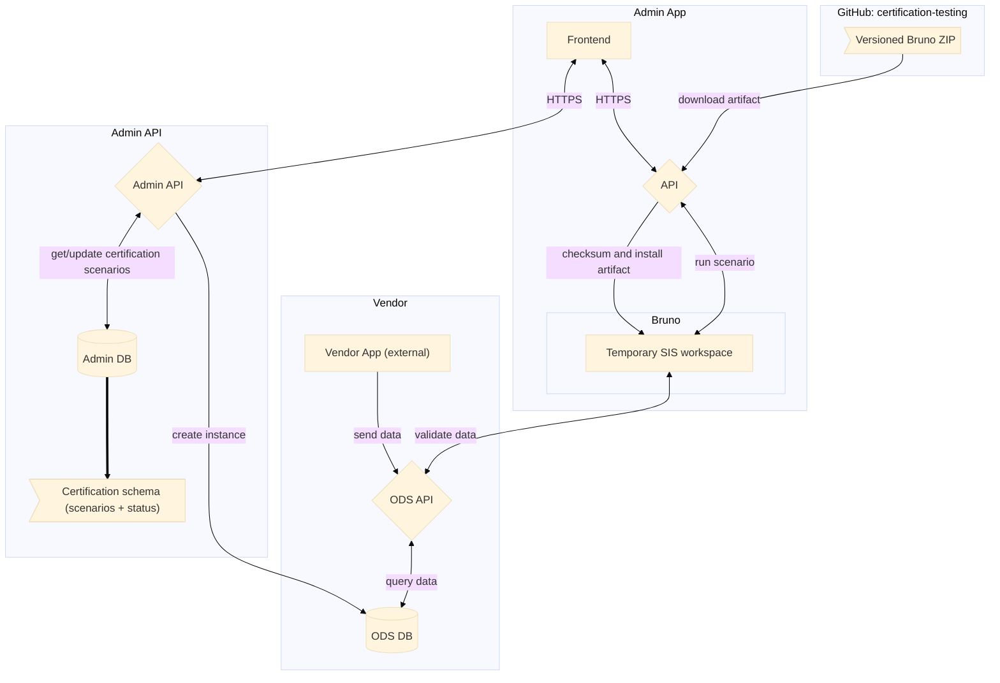
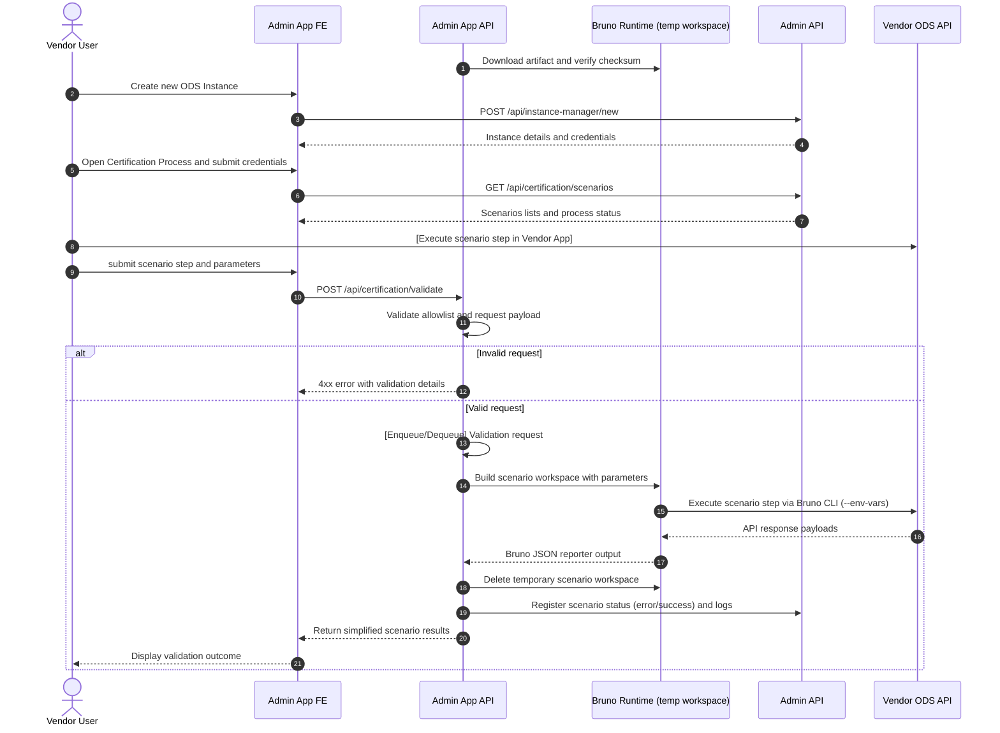
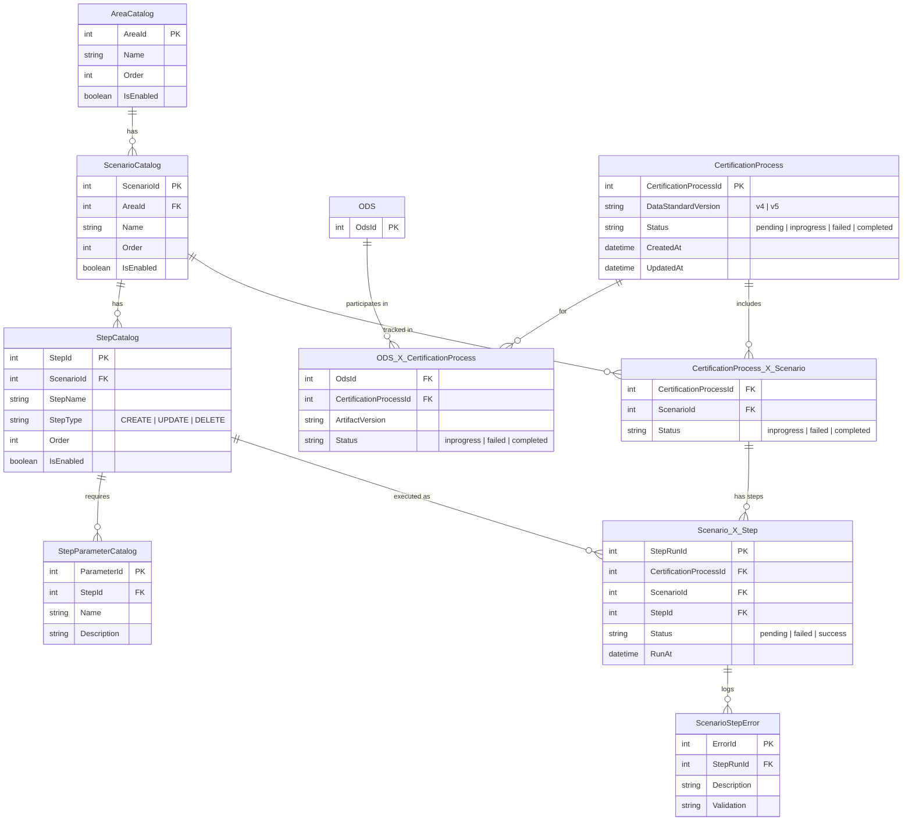
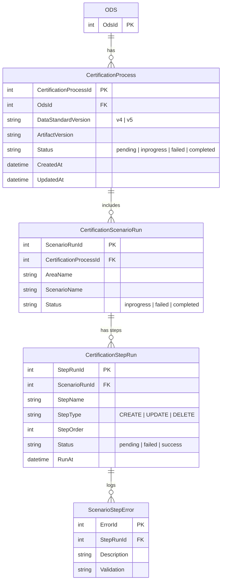
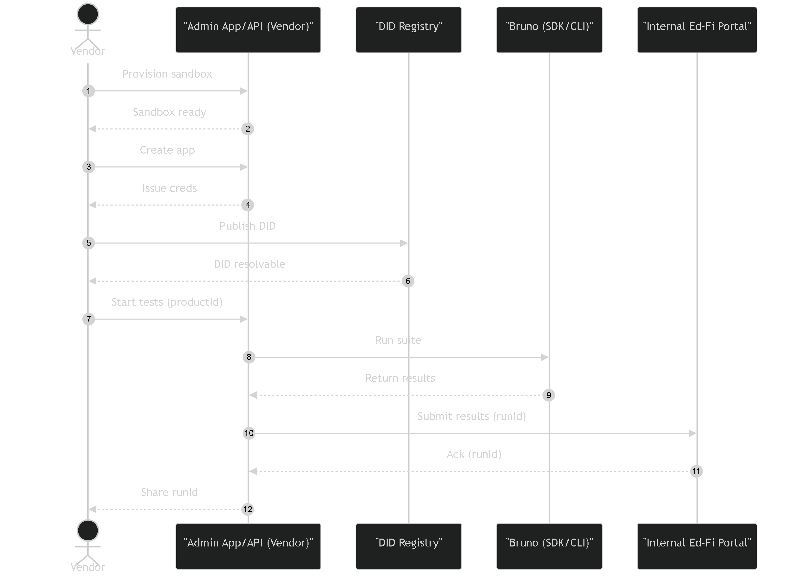
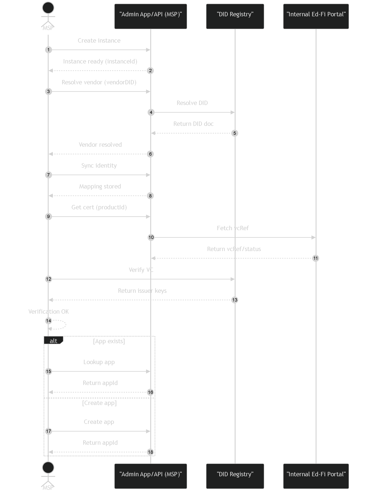
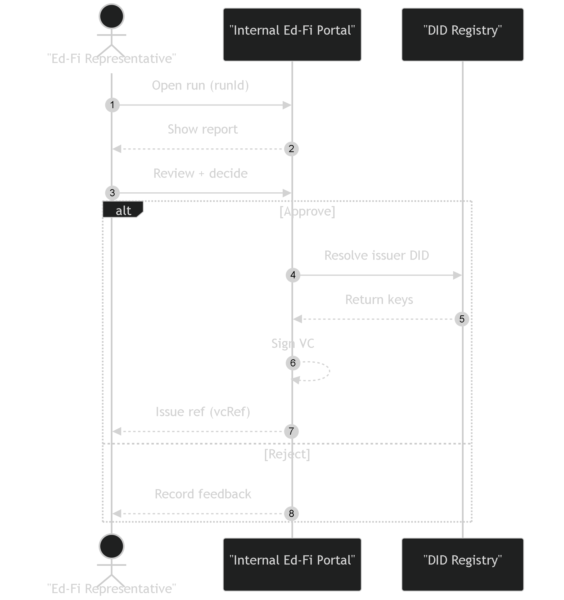
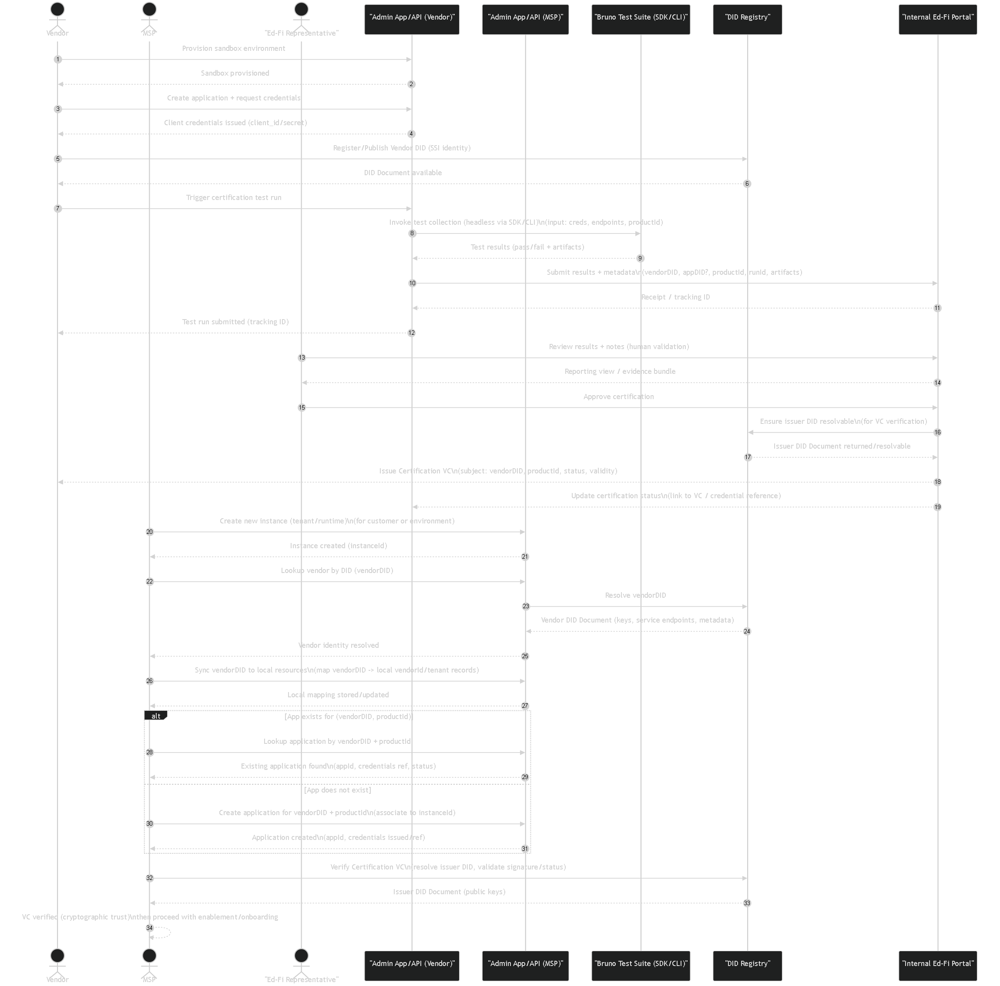

# AC-479 - Technical Brief for Certification Release 2.2 (Phase 2)

- [1. Purpose](#1-purpose)
- [2. Executive Summary](#2-executive-summary)
- [3. Certification 2.1 Recap](#3-certification-21-recap)
- [4. Certification 2.2 Scope Boundaries](#4-certification-22-scope-boundaries)
- [5. Architecture Overview](#5-architecture-overview)
- [6. Phase 2 Certification Workflow](#6-phase-2-certification-workflow)
- [7. Certification Database Schema](#7-certification-database-schema)
- [8. Security Gaps and Recommendations](#8-security-gaps-and-recommendations)
- [9. Additional or Future Nice-to-Have Features](#9-additional-or-future-nice-to-have-features)
- [10. Delivery Constraints, Risks, and Mitigations](#10-delivery-constraints-risks-and-mitigations)
- [11. Proposed Requirements, Timeline and Milestones](#11-proposed-requirements-timeline-and-milestones)
- [12. Open Questions](#12-open-questions)
- [Appendix A - Retained Story Details](#appendix-a---retained-story-details)
- [Appendix B - POCs and Feasibility Notes](#appendix-b---pocs-and-feasibility-notes)
- [Appendix C - Certification 2026 Sequence Workflows](#appendix-c---certification-2026-sequence-workflows)

## 1. Purpose

This document defines the technical scope and delivery plan for Certification Release 2.2 (Phase 2) in Admin App.

The goal is to deliver the main funtionalities of the certification experience that allows vendors to run certification checks withing the Admin APP, aligned with the 2026 project direction to move toward same-day certification.

References used:

- [Certification Project 2026](https://edfi.atlassian.net/wiki/spaces/OTD/pages/1894154241/Certifications+Project+2026) overview (Atlassian summary provided by stakeholder).
- [Certification 2.1](../CERT-220/certification-2.1.md) (Techical Brief).

## 2. Executive Summary

Phase 2 modernizes this by integrating Bruno execution into Admin App with a simple user flow:

1. User Creates an Application and Credentials (Sandbox).
2. User selects the environment, and then opens the Certification module.
3. User inputs custom credentials (or use cached credentials).
4. User selects a Data Standard version (4 or 5).
5. User selects a certification scenario.
6. User selects a scenario step.
7. User provides required parameters and submits for validation.
8. Admin App validates inputs and allowlisted scenario path.
9. Admin App runs `Bruno CLI` for that scenario step.
10. Admin App returns structured validation results to the UI.

This phase's deadline is planned for July 15th, 2026.

## 3. Certification 2.1 Recap

- In Certification 2.1, we established the foundation for Bruno integration with Admin App through a proof of concept (POC) that demonstrated the feasibility of running Bruno CLI commands from the API and returning results to the frontend.
- We also defined a contract for publishing Bruno artifacts from the `certification-testing` repository and consuming them in Admin App.
- To demonstrate the end-to-end flow, we implemented mockups for the frontend certification module and scenario execution pages, with static data and no real API integration.

> There was a change in scope from the original Certification 2.1 brief, it was changed from a basic implementation of the certification workflow with real API integration, to a more limited POC approach focused on validating the technical feasibility of Bruno integration, artifact consumption, and limited frontend mockups without real API integration. This change was made to mitigate risks and focus on validating the core technical challenges before investing in a full implementation. All remaining implementation work and API integration was deferred to Certification 2.2 (Phase 2) to ensure a more focused and achievable scope for the next phase.

## 4. Certification 2.2 Scope Boundaries

### In Scope

- Expose and integrate a scenarios catalog API.
  - The Backend will defined the required database schema and configuration for the scenarios catalog and status managment.
  - The API will return the list of (allowlisted) scenarios that can be executed.
  - The API will return the required parameters for each scenario to the frontend.
  - The API will return the current status of the scenario execution (e.g. pending, failed, completed).
  - The frontend will render the scenario list and details based on the API response.
- Expose and integrate a scenario validation API.
  - The API will validate the scenario path and parameters against the allowlist before execution.
  - The API will execute the `Bruno CLI` command for the selected scenario step.
  - The API will registry certification approval process.
  - The API will return a structured and simplified validation result to the frontend.
  - The frontend will send the required credentials and parameters to the validation API and display the results in a user-friendly format.
- Sandbox provisioning.
  - Admin App will provide the functionality for the `App` (sandbox) and `Credentials` creation.
  - Admin App will cache the created credentials for the validation process.
- Support for Data Standard 5.
  - The certification scenarios and Bruno scripts will be updated to support Data Standard 5 in addition to Data Standard 4, allowing vendors to choose which version they want to validate against.
- Explore AI guided remediation and support for Certification 2.3.
  - In Phase 2, we will explore the feasibility and potential approaches for integrating AI-guided remediation and support into the certification experience. This could include features like AI-generated suggestions for fixing validation errors, interactive troubleshooting guides, or AI-powered documentation search. However, the actual implementation of AI features will be deferred to Phase 3 to ensure we can focus on delivering the core certification execution experience in Phase 2.
- Investigate how to implement DID validation in the certification workflow and explore potential approaches for integrating it into the Admin App. This will be an important step towards supporting decentralized identity in the certification process, but the actual implementation will be deferred to Phase 3 to allow for more research and planning.

### Out of Scope (Deferred to Certification 2.3)

- Decentralized ID (DID) validation ([1EdTech Uniform Id](https://www.1edtech.org/standards/uniform-id-framework)).
  - Admin App will validate the DID provided by the user and extract the required credentials for the validation process.
  - Verifiable Credential (VC) issuance.
- Artificial Intelligence (AI) guided remediation and support.

### Comparison: Total Scope vs Phase 2 Scope

| Certification 2026 - Capability / Step            | Current Status | Phase 1       | Phase 2 (This Brief)           | Phase 3      |
| ---                                               | ---            | ---           | ---                            | ---          |
| Verify Integration feasibility                    | Done           | In Scope      |                                |              |
| List Certification scenarios                      | In progress    | Reduced scope | In scope                       |              |
| Trigger certification tests                       | In progress    | Reduced scope | In scope                       |              |
| Execute test suite (`Bruno CLI`)                  | Pending        | Out of scope  | In Scope                       |              |
| Registry certification statuses                   | Pending        | Out of scope  | In scope                       |              |
| Data Standard 5 support                           | Pending        | Out of scope  | In scope                       |              |
| Sandbox and App creation                          | Pending        | Out of scope  | In scope                       |              |
| DID validation                                    | Pending        | Out of scope  | Reduced scope (investigation)  | In scope     |
| AI guided remediation and support                 | Pending        | Out of scope  | Reduced scope (investigation)  | In scope     |

> The scope could change based on the team capacity and priorities, but the current plan is to focus on the core certification execution workflow in Phase 2, while deferring the more complex and integrated features (like DID validation and AI support) to Phase 3 to ensure a successful delivery of the main certification experience in Phase 2.

__Summary:__

- Phase 2 focuses on delivering the core certification execution experience with real API integration, while deferring the more complex features to Phase 3.
- The main goal is to enable vendors to run certification checks within Admin App with a user-friendly interface and structured results, while ensuring a secure and maintainable integration with Bruno CLI.

## 5. Architecture Overview



__Description:__

- Artifact: Admin App consumes a versioned Bruno ZIP (release tag or commit). The API fetches artifact metadata and verifies SHA‑256 both against published metadata and `CERT_BRUNO_SRC_CHECKSUM` before use.
- Runtime: The Bruno runtime is initialized inside the API container (extract ZIP and run `npm ci` on import). A persisted reference (`.ref`) lets the API skip re-import when the ref matches.
- Scenarios catalog: The `Certification` schema is the source of truth for allowlisted scenarios, scenario metadata (parameters, descriptions, enabled flag) and execution status; the API reads scenarios for `/api/certification/scenarios` and writes run status after execution.
- Execution: For each validation request the API creates a temporary working copy, injects parameters and per‑run credentials (via Bruno `--env-var`), runs a single scenario step, parses the Bruno JSON reporter, and removes the temporary copy.
- Credentials & concurrency: Users may opt to cache encrypted sandbox credentials or provide custom credentials per run; the API passes credentials via `--env-var` to support concurrent runs. Validation requests are queued and executed with a configurable concurrency limit.
- Logs: The API records run metadata (`artifactVersion`, `commitSha`, `scenarioPath`, `parameters`, timestamps, duration, exitCode)
- Only allowlisted scenarios and validated payloads are executed and checksum/config mismatches block (or warn per `CERT_BRUNO_ON_DOWNLOAD_ERROR`).

## 6. Phase 2 Certification Workflow



__Description:__

- The API is the control point for validation and safety; all scenario paths are validated against the allowlist before any process is spawned.
- At startup, the API downloads the pinned Bruno artifact, verifies SHA‑256, extracts it, and installs runtime dependencies. Certification execution is blocked if the runtime is not ready.
- When a request is submitted, the API creates a run record, enqueues it, and the worker builds a per‑run temporary workspace where credentials are passed to Bruno via environment variables — never as CLI arguments.
- After Bruno completes, the API parses the JSON reporter, updates the run record with traceability metadata (`artifactVersion`, `commitSha`, `scenarioPath`, timestamps, duration, `exitCode`), and stores operator-only logs; the frontend receives only the sanitized `ValidationResult` DTO.
- Temporary workspaces are deleted after each run; retained run metadata and logs follow a configurable retention policy and are accessible to operators only.

## 7. Certification Database Schema

In order to keep track of the certification scenarios, their parameters, and the execution status, we will define a new database schema in the Admin API database. There are two proposed designs for the database schema: a catalog-backed design that includes tables for the scenarios catalog and parameters, and a catalog-free design that focuses on runtime tracking of certification processes, scenarios, and steps without static catalog tables. The final decision on which design to implement will be based on factors such as complexity, maintainability, and how well it supports the required features for the certification process.

### Entity Relationship Diagram



### Entity Relationship Diagram — Catalog-free (runtime tracking only)

Optional simplified schema focused on runtime tracking of certification processes, scenarios, and steps, without the static catalog tables:



### What you gain vs. the catalog-backed design

|                                           | Catalog-backed                | Catalog-free                                    |
| ---                                       | ---                           | ---                                             |
| Tables                                    | 9                             | 5                                               |
| Self-contained audit record               | No (FKs to catalog required)  | Yes — each run row owns its identity            |
| Allowlist enforcement at DB layer         | Yes (IsEnabled)               | No — must be enforced in application layer      |
| Parameter definitions persisted           | Yes (StepParameterCatalog)    | No — parameters live only in the Bruno artifact |
| Renameable scenarios without history loss | No                            | Yes — string snapshots are immutable            |

### Original JSON Schema for `certification-scenarios.json`

The Original design included a JSON schema that was transfered to the database schema design. The API will read the scenarios from the database and expose them to the frontend, instead of reading from a JSON file. The JSON schema is provided here for reference:

```json
{
  [
    {
      "scenariosVersion": "v4",
      "scenariosGroup": "MasterSchedule",
      "scenariosName": "BellSchedules",
      "Status": "inprogress | failed | completed",
      "Steps": [
        {
          "scenarioStep": "01 - Check BellSchedule is valid",
          "scenarioType": "CREATE", // CREATE | UPDATE | DELETE
          "Status": "failed | success",
          "parameters": [
            {
              "name": "schoolId",
              "description": "School id"
            },
            {
              "name": "bellScheduleName",
              "description": "BellSchedule name"
            }
          ]
        },
        {
          "scenarioStep": "02 - Check BellSchedule is deleted",
          "scenarioType": "DELETE", // CREATE | UPDATE | DELETE
          "Status": "failed | success",
          "parameters": [
            {
              "name": "bellScheduleUniqueId",
              "description": "BellSchedule UniqueId"
            }
          ]
        }
      ]
    }
  ]
}
```

## 8. Security Gaps and Recommendations

This section documents security concerns identified during design and early implementation review of Phase 2, mapped against OWASP Top 10 and general secure-systems principles. Each item includes a risk rating, description, and concrete recommendation.

---

### 8.1 OS Command Injection via `scenarioPath` and Shell Execution

__Risk: CRITICAL__ | OWASP A03 – Injection

The POC `runBruno()` method constructs a shell command using a user-supplied `scenarioPath` string and invokes `spawnSync` with `shell: true`:

```ts
// From POC (certification.service.ts)
const cmd = `${localBru} run "${target}" --env ${env}`;
spawnSync(fallback, { shell: true, ... });
```

A `scenarioPath` value such as `v4/Group/Step"; rm -rf /;#` would execute arbitrary OS commands inside the container. The `env` parameter is equally unvalidated.

__Recommendations:__

- Never use `shell: true` when any part of the command includes external input; always use the array-argument form of `spawnSync`/`spawn`.
- Pass credentials exclusively as isolated `--env-var` arguments (one flag per variable), not as an interpolated env-string.
- Enforce a strict, server-side allowlist for `scenarioPath` validated against the DB catalog __before__ any process is spawned. Reject immediately if the path is not in the allowlist.

```ts
// Secure pattern – no shell, no string interpolation
spawnSync(localBru, ['run', scenarioPath, '--env', 'ODS', '--env-var', `edFiClientId=${clientId}`], {
  shell: false, // explicit
  cwd,
  timeout: 60_000,
});
```

---

### 8.2 Path Traversal in Scenario Workspace Preparation

__Risk: HIGH__ | OWASP A01 – Broken Access Control

`prepareScenario()` resolves the scenario source directory by joining user-supplied input directly:

```ts
const scenarioSrc = path.join(this.runtimeRoot, this.collectionRootName, scenarioPath);
```

A value of `../../../../etc/passwd` would escape the collection root entirely.

__Recommendations:__

- After resolving the full path with `path.resolve()`, assert it starts with the expected root prefix before any file I/O:

```ts
const resolved = path.resolve(this.runtimeRoot, this.collectionRootName, scenarioPath);
if (!resolved.startsWith(path.resolve(this.runtimeRoot, this.collectionRootName) + path.sep)) {
  throw new ForbiddenException('Invalid scenario path');
}
```

- This check must also apply to temporary working copy destinations.

---

### 8.3 Zip Slip during Artifact Extraction

__Risk: HIGH__ | OWASP A08 – Software and Data Integrity Failures

`extractArtifact()` calls `zip.extractAllTo(tmpDir, true)`. Older versions of `adm-zip` do not validate ZIP entry paths before extraction, so a crafted ZIP whose entries contain `../../../` segments can write files outside `tmpDir` — including into the application source tree or OS paths.

__Recommendations:__

- After extraction validate every resolved entry path starts with the canonical `tmpDir`:

```ts
const canonicalTmp = fs.realpathSync(tmpDir);
zip.getEntries().forEach(entry => {
  const entryPath = path.resolve(tmpDir, entry.entryName);
  if (!entryPath.startsWith(canonicalTmp + path.sep)) {
    throw new Error(`Zip Slip detected: ${entry.entryName}`);
  }
});
zip.extractAllTo(tmpDir, true);
```

- Pin `adm-zip` to a known-good version and monitor for upstream advisories.

---

### 8.4 Credential Exposure via Process List and Disk

__Risk: HIGH__ | OWASP A02 – Cryptographic Failures

Two exposure vectors exist for ODS API credentials:

1. __Process list__: On Linux, process arguments (including `--env-var clientSecret=…`) are briefly visible in `/proc/<pid>/cmdline` and `ps aux`.
2. __Disk artifacts__: The commented-out POC writes `last-command.txt` and `last-output.txt` to `this.runtimeRoot`. If credentials appear in Bruno's JSON output or in the command string, they are persisted in plaintext.

__Recommendations:__

- Pass credentials through a per-run environment variable map via `spawnSync`'s `env` option (not CLI arguments) so they are not visible in the process list:

```ts
spawnSync(localBru, ['run', scenarioPath, '--env', 'ODS'], {
  shell: false,
  env: { ...minimalEnv, EDFI_CLIENT_ID: clientId, EDFI_CLIENT_SECRET: clientSecret },
});
```

- Remove the `last-command.txt` / `last-output.txt` debug files entirely from production paths; gate debug output behind a `LOG_LEVEL=debug` environment flag.
- Ensure Bruno JSON reporter output is scrubbed of credential values before storing or returning it to the frontend.

---

### 8.5 Bypassing Integrity Enforcement via `onDownloadError: 'warning'`

__Risk: HIGH__ | OWASP A08 – Software and Data Integrity Failures

When `CERT_BRUNO_ON_DOWNLOAD_ERROR=warning`, the service continues execution even when the artifact cannot be downloaded or its checksum cannot be verified. This means Bruno could run against a stale, corrupted, or tampered artifact.

__Recommendations:__

- Treat the `warning` mode as a __development-only__ opt-in.
- Block all certification execution requests (return `503 Service Unavailable`) when `isRuntimeReady` is `false`, regardless of warning mode.
- Document and enforce this constraint via an environment-level guard in the controller before queuing any run.

---

### 8.6 Broken Access Control – Missing Authorization on Certification Endpoints

__Risk: HIGH__ | OWASP A01 – Broken Access Control

The current controller imports `@Public()` (a temporary POC annotation), and the commented-out run endpoint was marked `@Public()`. Phase 2 must use proper role-based authorization:

- Not every authenticated user should be able to trigger a validation run.
- A run initiated by Vendor A must not be accessible to Vendor B (tenant isolation).
- Operator-level logs must be restricted to admin roles only.

__Recommendations:__

- Replace `@Public()` with `@Authorize(Role.VendorUser)` (or equivalent) on all certification endpoints, as documented in user preferences.
- Scope all database queries for `CertificationProcess`, `CertificationScenarioRun`, and `CertificationStepRun` by the caller's tenant/user identity — never by bare integer ID from the request body.
- Apply `@Authorize(Role.Admin)` on any endpoint that returns raw run logs or traceability metadata.

---

### 8.7 Denial of Service – Unbounded Queue and Execution Timeout

__Risk: MEDIUM__ | OWASP A05 – Security Misconfiguration

The design mentions a configurable concurrency limit and queue, but the current code has no enforced queue depth cap or per-run timeout. A malicious or malfunctioning user could:

- Submit hundreds of concurrent validation requests, exhausting container memory.
- Trigger a Bruno run against a slow ODS API with no timeout, tying up a worker indefinitely.

__Recommendations:__

- Enforce a hard queue depth cap (e.g., 50 pending items) and reject new requests with `429 Too Many Requests` when exceeded.
- Set an absolute execution timeout on `spawnSync` (e.g., `timeout: 120_000` ms) and terminate the child process if it is exceeded.
- Expose queue depth and active worker count metrics for operational monitoring.

---

### 8.8 Sensitive Data Leakage in API Responses

__Risk: MEDIUM__ | OWASP A02 – Cryptographic Failures / OWASP A09 – Security Logging

Bruno's JSON reporter output includes raw HTTP request/response bodies from the ODS API. Returning this output verbatim to the frontend could expose:

- Other tenants' data if ODS API returns related records.
- Internal stack traces or error messages from Vendor ODS implementations.
- Credential echo-back if a Bruno script logs its own environment.

__Recommendations:__

- Parse Bruno's JSON report into a defined `ValidationResult` DTO and only return fields explicitly included in the DTO.
- Never forward Bruno's raw stdout or stderr to the frontend; store it server-side under an operator-only log endpoint.
- Sanitize any error descriptions included in `ScenarioStepError` before persisting them; strip HTTP Authorization headers from stored payloads.

---

### 8.9 Insecure Credential Caching

__Risk: MEDIUM__ | OWASP A02 – Cryptographic Failures

Phase 2 allows opt-in caching of sandbox credentials. The encryption mechanism, key derivation, and storage backend are not yet specified.

__Recommendations:__

- Use AES-256-GCM with a unique random IV per record; store IV alongside the ciphertext.
- Derive the encryption key from the application secret using HKDF — do not use the raw secret directly.
- Store cached credentials with a short TTL (e.g., 8 hours) and bind them to the session or user identity — never to a shared store accessible across users.
- Provide a clear UI affordance for the user to revoke cached credentials at any time.

---

### 8.10 Weak Input Validation on Scenario Parameters

__Risk: MEDIUM__ | OWASP A03 – Injection

The `RunDto` defines `params` as `Record<string, any>`. Without schema validation, a caller could inject unexpected types (arrays, objects, deeply nested structures) that break placeholder substitution or cause runtime errors in the Bruno script.

__Recommendations:__

- Replace `any` with a strict value type: `Record<string, string>`.
- Validate the parameter set against the catalog definition stored in `StepParameterCatalog` before processing — reject requests with undeclared parameter keys.
- Apply class-validator decorators and the NestJS `ValidationPipe` on all certification DTOs.

---

### Summary Table

| #    | Gap                                        | Severity | OWASP Category               |
| ---  | ------------------------------------------ | -------- | ---------------------------- |
| 8.1  | OS command injection via shell execution   | Critical | A03 – Injection              |
| 8.2  | Path traversal in scenario workspace       | High     | A01 – Broken Access Control  |
| 8.3  | Zip Slip during artifact extraction        | High     | A08 – Integrity Failures     |
| 8.4  | Credential exposure via process/disk       | High     | A02 – Cryptographic Failures |
| 8.5  | Integrity bypass via warning mode          | High     | A08 – Integrity Failures     |
| 8.6  | Missing authorization / tenant isolation   | High     | A01 – Broken Access Control  |
| 8.7  | Unbounded queue and missing timeout        | Medium   | A05 – Misconfiguration       |
| 8.8  | Sensitive data in API responses            | Medium   | A02/A09 – Data Exposure      |
| 8.9  | Insecure credential caching                | Medium   | A02 – Cryptographic Failures |
| 8.10 | Weak parameter input validation            | Medium   | A03 – Injection              |

## 9. Additional or Future Nice-to-Have Features

- Progress bar
  - The progress bar is based on the number of steps defined in the Bruno script for the selected scenario.
  - As each step is completed, the progress bar is updated accordingly.
  - This provides users with a visual indication of the certification process and its completion status.
- Scenarios order
  - The order of scenarios is determined by the `order` field in the `CertificationScenario` table.
  - Scenarios with lower `order` values are displayed before those with higher values.
  - This allows for flexible ordering of scenarios based on their importance or logical sequence.
- Think about a dedicated Certification API service
  - Responsibilities and interactions with Admin App
  - Deployment and scaling considerations
- Allow the user to select a custom collection for certification testing
  - UI design for collection selection
  - Validation of selected collection

## 10. Delivery Constraints, Risks, and Mitigations

### Constraints

- Team capacity and diluted focus could affect our overall delivery velocity.
- Self-service is a first-order product requirement.
- Bruno scripts are largely static by design.

### Key risks

- High integration complexity across two incompatible repositories (React and Bruno scripts).
- Runtime command execution increases operational and security sensitivity.
- Response normalization from CLI output can be error-prone.
- Bruno scripts are sensitive to version and structural shifts; small modifications can easily lead to breaking changes.
- The `certification-testing` solution only supports DataStandard `v4`. A modernization to `v5` is required to support both versions.

### Mitigations

- Independent runtime workspace inside Admin App for Bruno scripts.
- Certification scenario validations are delegated to Bruno CLI to reduce breaking-changes risks.
- Keep `certification-testing` as source of truth and consume versioned artifacts.
- Enforce allowlist and checksum validation before execution.
- Limit execution to single scenario-step in Phase 1.
- Log traceability metadata for supportability and audits.

## 11. Proposed Requirements, Timeline and Milestones

### Requirements

#### Functional Requirements

__FR-1 – Scenarios Catalog API:__ The system shall expose `GET /api/certification/scenarios` returning the ordered, allowlisted list of scenarios, required parameters, and execution status scoped to the caller's tenant — sourced from the `Certification` DB schema (see §7).

__FR-2 – Scenario Validation API:__ The system shall expose `POST /api/certification/validate`, execute a single Bruno CLI step per request, and return a sanitized `ValidationResult` DTO. Each run shall persist traceability metadata (`artifactVersion`, `commitSha`, `scenarioPath`, timestamps, duration, `statusCode`).

__FR-3 – Bruno Runtime Lifecycle:__ At startup the system shall download the pinned artifact, verify SHA-256, extract it, and install dependencies. All certification execution shall be blocked when `isRuntimeReady` is `false` (see §8.5).

__FR-4 – Sandbox Provisioning:__ The system shall allow users to create a sandbox Application and retrieve Credentials. Opt-in credential caching shall use AES-256-GCM with an HKDF-derived key, per-record random IV, 8-hour TTL, and a user-visible revoke option (see §8.9).

__FR-5 – Data Standard 5 Support:__ Users shall be able to select between Data Standard v4 and v5. The `certification-testing` artifact shall be updated to include DS5 Bruno collections.

__FR-6 – Certification Status Registry:__ The system shall track process, scenario run, and step run statuses (`pending`, `inprogress`, `failed`, `completed`, `success`) per entity defined in §7.

__FR-7 – Investigations: AI Remediation and DID Validation__ _(research only — implementation deferred to 2.3):_ The team shall begin feasibility investigations for AI-guided remediation and DID validation early in the timeline and produce write-ups to inform Certification 2.3 planning.

---

#### Non-Functional Requirements

__NFR-1 – Security:__ All certification endpoints and Bruno execution shall comply with the controls in §8 — injection prevention (`shell: false`, array args), path traversal guards, Zip Slip validation, credential isolation via `spawnSync` `env` option, and role-based authorization (`@Authorize(Role.VendorUser)` / `@Authorize(Role.Admin)`) with tenant-scoped DB queries (see §8.1–8.6).

__NFR-2 – Input Validation:__ `RunDto.params` shall be typed `Record<string, string>`, validated against the catalog, with class-validator decorators and `ValidationPipe` on all certification DTOs (see §8.10).

__NFR-3 – Reliability:__ The execution queue shall enforce a hard depth cap (e.g., 50 items), returning `429 Too Many Requests` when exceeded. Each Bruno run shall have an absolute timeout (e.g., 120 seconds) (see §8.7).

__NFR-4 – Data Privacy:__ Raw Bruno stdout/stderr shall never reach the frontend. Operator logs shall be admin-only. Credential values and Authorization headers shall be scrubbed from all stored payloads (see §8.4, §8.8).

---

### Timeline and Milestones

> Other projects run in parallel throughout Phase 2. Windows are intentionally loose — they represent target ranges, not hard sprint boundaries.

__Overall window:__ April 2026 – July 15, 2026 (~15 weeks)

| Milestone | Description | Target Window |
| --- | --- | --- |
| __M1__ – Foundation & Investigations | DB schema decision and migration, Critical/High security fixes (§8.1–8.6), Bruno startup lifecycle, authorization hardening; begin AI/DID feasibility investigations in parallel | April 2026 |
| __M2__ – Backend Core | Scenarios catalog API, validation API with Bruno CLI execution, bounded queue with timeouts, sanitized response DTOs, run record persistence, Medium security fixes (§8.7–8.10) | May 2026 |
| __M3__ – Frontend Integration | Real API integration replacing mock data, validation results display, sandbox provisioning UI with credential revoke | Late May – June 2026 |
| __M4__ – DS5 & Credential Caching | Data Standard 5 artifact update (coordinate with `certification-testing`), v4/v5 selector, AES-256-GCM credential caching | June 2026 |
| __M5__ – Stabilization | E2E tests, security review pass (§8 gap table), AI/DID research write-ups, documentation | Late June – July 15, 2026 |

## 12. Open Questions

- Should we let the user provide a custom collection for certification testing, or should we enforce using the versioned artifact from `certification-testing`?
  - Allowing custom collections could provide more flexibility but also introduces risks around compatibility and security. We need to weigh the benefits of flexibility against the potential risks and implementation complexity.
- How should we handle caching of recently created credentials for the validation process?
  - Caching credentials could improve user experience by reducing the need to re-enter credentials for each validation run, but it also introduces security considerations around how credentials are stored and protected. We need to explore secure caching mechanisms and determine the appropriate retention policy for cached credentials.
- Should we let the user to discard a certification process and start over?
  - If so, how should this be reflected in the certification status registry and the database schema? Allowing users to discard and restart certification processes could provide a better user experience, but we need to consider how this would impact our tracking of certification statuses and the integrity of our data. We may need to introduce new statuses or flags in our database schema to accommodate this functionality.

## Appendix A - Retained Story Details

### A.1 Context

The [Certification](https://github.com/Ed-Fi-Alliance-OSS/certification-testing) solution uses [Bruno](https://docs.usebruno.com/) collections to validate ODS API behavior.

Admin App will provide UI-guided execution so users can run scenario validations with required credentials and parameters and receive user-friendly result summaries.

### A.2 Certification 2.1 Context

The [Certification 2.1](../phase1/certification-2.1.md) implementation focused on validating the technical feasibility of integrating Bruno CLI execution into Admin App, and consuming artifacts from `certification-testing`. The scope was limited to a proof of concept with mock frontend pages and no real API integration, to mitigate risks and focus on validating the core technical challenges before investing in a full implementation. All remaining implementation work and API integration was deferred to Certification 2.2 (Phase 2) to ensure a more focused and achievable scope for the next phase.

### A.3 Repository Layouts

`certification-testing` (Bruno artifact source):

- `bruno/SIS/environments`
- `bruno/SIS/.env`
- `bruno/SIS/v4/<ScenarioGroups>/<ScenarioNames>/<ScenarioSteps>`

Admin App extension points:

- `packages/api/src/certification` (API implementation)
- `packages/api/certification/bruno` (runtime artifact workspace)
- `packages/fe/src/Pages/Certification` (frontend implementation)

### A.4 Phase 1 Workflow Inputs Already Available

- User logs into Admin App.
- User creates Environment and ODS Instance settings.
- User selects Environment.

## Appendix B - POCs and Feasibility Notes

To overcome the blockers mentioned in the [Delivery Constraints, Risks, and Mitigations](../phase1/certification-2.1.md#9-delivery-constraints-risks-and-mitigations) section, many POCs were conducted to confirm feasibility and integration between `Ed-Fi-AdminApp` and `certification-testing`. It was determined that the connection is viable in two ways: a Bruno Parser and a Bruno Integrator (recommended option).

### B.1 POC 1 (Bruno Parser)

- Converts `.bru` scripts into executable JavaScript.
- Pros: high customization and direct parameterization.
- Cons: tighter coupling to upstream file structure.

### B.2 POC 2 (Bruno Integrator, recommended)

- Uses Bruno CLI with temporary working copies and parameter replacement.
- Pros: lower implementation complexity and better upstream compatibility.
- Cons: less direct execution control, CLI output handling complexity.

### B.3 Related PRs

For implementation details, review:

- [Bruno Parser: Ed-Fi-AdminApp](https://github.com/Ed-Fi-Alliance-OSS/Ed-Fi-AdminApp/pull/66)
- [Bruno Integrator: Ed-Fi-AdminApp](https://github.com/Ed-Fi-Alliance-OSS/Ed-Fi-AdminApp/pull/68)
- [Bruno Integrator: certification-testing](https://github.com/Ed-Fi-Alliance-OSS/certification-testing/pull/111)

## Appendix C - Certification 2026 sequence workflows

### Vendor Sequence diagram



### MSP Sequence diagram



### Representative Sequence diagram



### FULL Certification Sequence diagram


