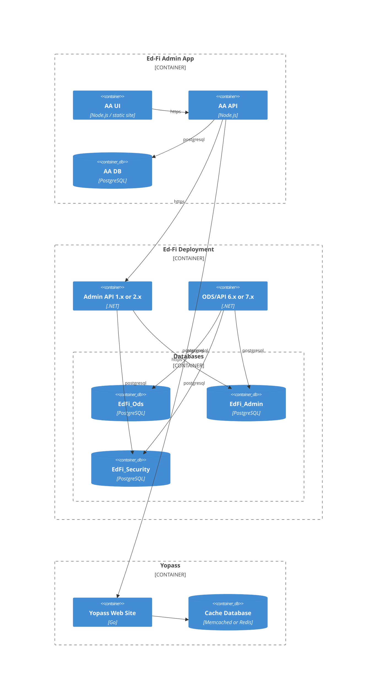
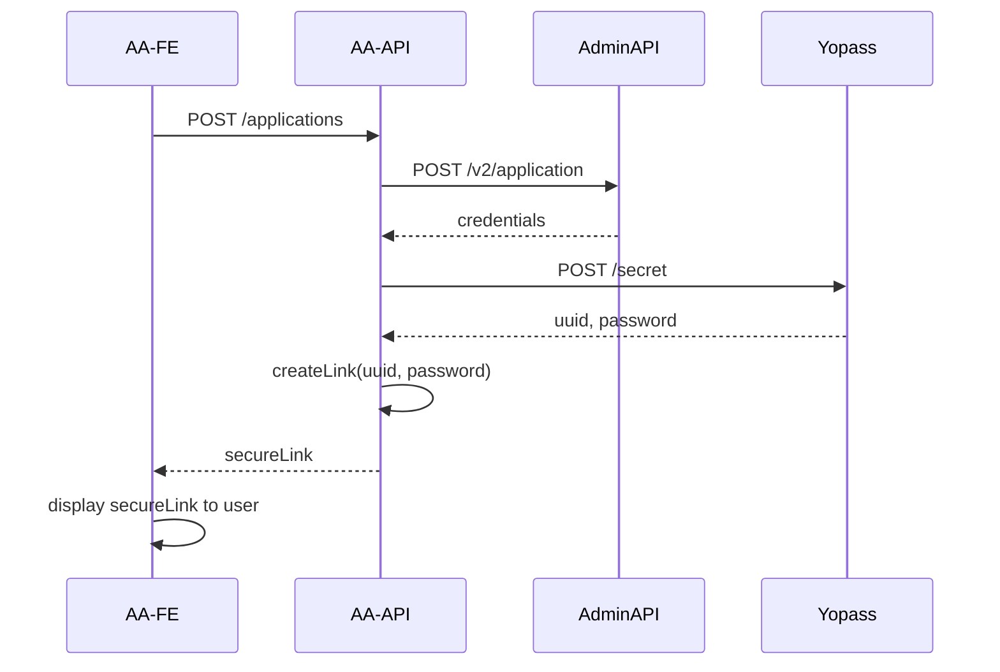

# Reference System Architecture for Ed-Fi Technology Suite Deployments

> [!TIP]
> This document describes the system architecture for using this Ed-Fi Admin App tool to
> manage Ed-Fi deployments _outside_ of a Starting Blocks Environment (SBE). See
> [System Architecture](./system-architecture.md) for more information on the
> application design that supports SBE.

## Terminology

- **Environment**: the group of one instance of the Ed-Fi ODS/API, one Ed-Fi Admin API, and one or more `EdFi_Admin`, `EdFi_Security`, and `EdFi_ODS` databases. An environment can include multiple ODS databases, for example to support different deployment stages and/or different years.
- **Tenant**: a grouping of one or more `EdFi_ODS` databases with a single pairing of `EdFi_Admin` and `EdFi_Security` databases. A single instance of the ODS/API and AdminAPI can support multiple tenants, although this is not the default mode.

  > [!WARNING]
  > Admin App version 4.0 will _not_ be multi-tenant aware. It will assume the ODS/API and Admin API are setup for a single tenancy only. However, it will support multiple instances.

- **Instance**: an individual `EdFi_ODS` database, for whatever purpose.

> [!WARNING]
> To review and confirm that this is consistent with Starting Blocks terminology.

## System Context C4 Diagram

```mermaid
C4Context

    Person_Ext(leaAdmin, "LEA Administrator", "desc...")
    System_Ext(auth, "Identity Provider", "Open ID Connect compatible IdP")

    Enterprise_Boundary(b0, "Starting Blocks Environment (SBE)") {
        Person(sysAdmin, "System Administrator")

        System(edfiadminapp, "edfiadminapp", "Ed-Fi Admin App")

        System(edfi1, "Ed-Fi Env 1", "ODS/API, AdminApi, databases")
        System(edfi2, "Ed-Fi Env 2", "ODS/API, AdminApi, databases")
        System(edfi3, "...", "")
    }

    Rel(leaAdmin, auth, "https")
    Rel(leaAdmin, edfiadminapp, "https")

    Rel(sysAdmin, auth, "https")
    Rel(sysAdmin, edfiadminapp, "https")

    BiRel(edfiadminapp, workers, "https")
    Rel(edfiadminapp, edfi1, "https")
    Rel(edfiadminapp, edfi2, "https")
    Rel(edfiadminapp, edfi3, "https")

    UpdateLayoutConfig($c4ShapeInRow="3", $c4BoundaryInRow="1")
```

The Ed-Fi Admin App (AA) is a centralized management system for managing Ed-Fi deployments. The system serves two primary user types: LEA Administrators who manage local educational data environments, and System Administrators who oversee the entire infrastructure.

The Admin App acts as a control plane that communicates with various Ed-Fi API environments (each containing ODS/API, Admin API, and associated databases). It leverages custom .NET "worker" applications to perform automated operations across these environments, including creation and deletion of database instances.

Authentication is handled through an external OpenID Connect-compatible Identity Provider, ensuring secure access for all users. The system provides a unified interface for managing multiple Ed-Fi instances while maintaining isolation between different educational environments, enabling scalable administration of educational data systems across multiple tenants or organizations.

> [!TIP]
> Key differences compared to Starting Blocks Admin App:
>
> - Replaces AWS Lambda Function calls, which are specific to Starting Blocks, with custom "Worker" processes, which are described in more detail below.

## System Containers C4 Diagram



For simplicity, the Containers diagram only shows a single Ed-Fi API deployment. The Admin App's API application serves as a dedicated backend-for-frontend (BFF) application for the Admin App user interfaces. It handles user authorization logic and various tasks. Creation of new database instances for an environment will be handled by the Ed-Fi Admin API, which will also be responsible for performing a health check with query against the Ed-Fi ODS database(s).

Both the custom frontend user interface and the backend API are fully configurable. Sensitive data such as OpenId Connect provider credentials can be configured through environment variables at runtime.

Optionally, Admin App provides secure password sharing through use of [Yopass](https://github.com/jhaals/yopass), a basic web application for creating one-time use URLs for securely sharing passwords and other secrets. Yopass caches information in either Memcached or Redis; the out-of-the-box stack uses Memcached. The interaction works something like this:



> [!WARNING]
> To be determined:
>
> - Should the health check process adopt SBAA's highly optimized row count query?
>   - Can/should it also perform more like the SBAA tool?
>   - What if someone wanted to write their own health check?
> - Environment variable override of config settings.
> - Which changes to Admin API need to stay there, and which should move into the AA?
> - Database migrations outside of SBE. Try to use a feature flag there? Create a secondary set of migration scripts?
> - Secret store for Admin API
