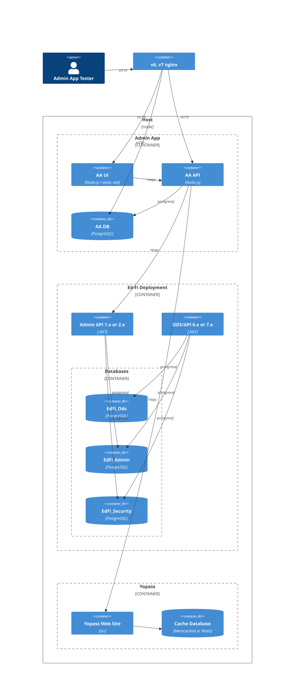

# Testing Environment

For consistency in test execution, functional and performance tests will use
services running as Docker containers. Usability tests can run in Docker.
Ideally the operational usability tests will also run other configurations,
described below.

## Deployment Diagram

The following diagram illustrates the containers and relationships between them
for this test environment.

All services will be run via Docker Compose files in the
[compose/readme.md](../../compose/readme.md) directory.

> [!WARNING]
> The Docker Compose startup scripts must be able to run Ed-Fi 
> ODS/API 6.2 and 7.3.

The Admin App application is ~99.9% static web content; the one piece that
is currently not static is the `config.json` file, which is built by Node.js at
runtime so that it can inject appropriate environment variables into the file.
It should be feasible to do this with an NGiNX container, allowing the web site
to be served through NGiNX without needing to run Node.js. However, this may
need to be a later adjustment.

## Test Run Location

Functional testing can run on any environment: developer desktop, VM, GitHub
runner. Performance testing should run in a cloud environment rather than on a
developer desktop for optimal consistency between test runs.

### Azure Docker Host

Release candidate testing in a cloud environment will be most easily
accomplished using a virtual machine (VM) that has Docker capability.
Eventually, Admin Console will need to run in Azure Container Services with
automated deployment; this will be configured at a future time.

Recommended VM for a machine or cloud selection:

* For Example Cloud: D8s_v4 with 8 vcpus, 32 GiB memory. Very few sizes support nested
  virtualization, which is required for running Docker in a VM. The
  documentation on what does work is out of date and inconsistent. Found this
  size mentioned in [Nested virtualization for Azure
  Labs](https://learn.microsoft.com/en-us/azure/lab-services/concept-nested-virtualization-template-vm);
  seems to be available without needing Azure Labs.
* For Example Machine: Docker Desktop needs Windows 10 or 11; it does not run on Windows Server.
  Instead one needs Docker CE, which is harder to maintain, or Podman. Podman is
  a good tool but not fully stable in Windows in the author's experience.
  * Activate windows using a license key from a Visual Studio subscription.
* Security: standard; do not need trusted launch.
* Disk space: the standard 127 GB is probably sufficient.

### Azure Container Service

Operational usability testing could try to run the platform with serverless
[Container Apps or Web App for
Containers](https://learn.microsoft.com/en-us/azure/architecture/guide/choose-azure-container-service).
This would help determine if there are any unexpected incompatibilities.
Additional orchestration and scripting may be required, but it does not (at this
time) need to be a full-blown deployment orchestration, for example using
Terraform / OpenTofu or similar.
