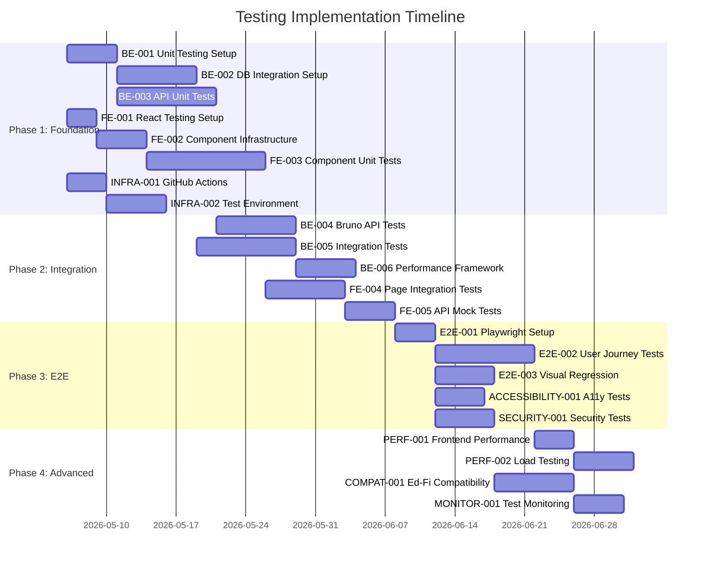

# Testing Plan Gaps Analysis & Follow-up Actions

This document provides a comprehensive analysis of gaps identified in the current testing plan and outlines specific follow-up tickets for both frontend and backend implementation.

## Executive Summary

The existing testing documentation provides a solid foundation but lacks implementation details, modern testing tools integration, and comprehensive automation. This analysis identifies 15 critical gaps and proposes 28 specific tickets to address them.

## Gap Analysis

### 🔍 **Current State Assessment**

| Area | Current State | Maturity Level | Priority |
|------|---------------|----------------|----------|
| **Strategy & Documentation** | ✅ Well-defined | High | ✅ Complete |
| **Unit Testing** | ⚠️ Basic coverage | Medium | 🔴 Critical |
| **Integration Testing** | ❌ Missing | Low | 🔴 Critical |
| **E2E Testing** | ⚠️ Manual scenarios only | Low | 🔴 Critical |
| **API Testing** | ⚠️ Basic Postman tests | Medium | 🟡 High |
| **Performance Testing** | ⚠️ Strategy only | Low | 🟡 High |
| **Security Testing** | ⚠️ Static analysis only | Medium | 🟡 High |
| **CI/CD Integration** | ⚠️ Basic workflows | Medium | 🔴 Critical |
| **Test Data Management** | ❌ Missing | Low | 🟡 High |
| **Accessibility Testing** | ❌ Missing | Low | 🟡 High |

## Detailed Gap Analysis

### 1. **Frontend Testing Gaps**

#### 1.1 Unit Testing Infrastructure
- **Gap**: No React Testing Library setup
- **Impact**: Cannot test component behavior and user interactions
- **Current Coverage**: ~20% estimated
- **Target Coverage**: 85%

#### 1.2 Component Integration Testing
- **Gap**: No page-level testing framework
- **Impact**: Missing validation of component interactions
- **Risk**: UI bugs reach production

#### 1.3 End-to-End Testing Automation
- **Gap**: Manual Gherkin scenarios not automated
- **Impact**: Time-intensive manual testing
- **Risk**: Inconsistent test execution

#### 1.4 Visual Regression Testing
- **Gap**: No visual change detection
- **Impact**: UI changes go unnoticed
- **Risk**: Design inconsistencies

#### 1.5 Accessibility Compliance
- **Gap**: No automated accessibility testing
- **Impact**: ADA compliance not verified
- **Risk**: Legal and usability issues

### 2. **Backend Testing Gaps**

#### 2.1 Unit Testing Coverage
- **Gap**: Insufficient business logic testing
- **Impact**: Bugs in core functionality
- **Current Coverage**: ~40% estimated
- **Target Coverage**: 80%

#### 2.2 Integration Testing
- **Gap**: No database integration testing
- **Impact**: Data layer issues undetected
- **Risk**: Production database failures

#### 2.3 API Testing Automation
- **Gap**: Limited Postman collection
- **Impact**: Manual API validation
- **Risk**: Breaking changes undetected

#### 2.4 Multi-tenant Testing
- **Gap**: No tenant isolation testing
- **Impact**: Data leakage risks
- **Risk**: Security vulnerabilities

#### 2.5 Performance Testing
- **Gap**: No load testing implementation
- **Impact**: Performance regressions unknown
- **Risk**: Production performance issues

### 3. **Infrastructure Testing Gaps**

#### 3.1 CI/CD Test Integration
- **Gap**: Limited automated testing in workflows
- **Impact**: Manual quality gates
- **Risk**: Buggy releases

#### 3.2 Test Environment Management
- **Gap**: Inconsistent test environments
- **Impact**: Unreliable test results
- **Risk**: False positives/negatives

#### 3.3 Test Data Management
- **Gap**: No test data strategy
- **Impact**: Inconsistent test scenarios
- **Risk**: Incomplete test coverage

#### 3.4 Cross-Platform Testing
- **Gap**: Single browser/OS testing
- **Impact**: Platform-specific bugs
- **Risk**: User experience issues

#### 3.5 Security Testing Automation
- **Gap**: Manual security testing only
- **Impact**: Vulnerabilities missed
- **Risk**: Security breaches

## Follow-up Tickets

### Phase 1: Foundation (Immediate - Weeks 1-4)

#### Backend Foundation Tickets

**TICKET BE-001: Enhanced Unit Testing Framework Setup**
- **Priority**: P0 (Critical)
- **Effort**: 5 days
- **Description**: Set up comprehensive Jest testing infrastructure for Node.js backend
- **Acceptance Criteria**:
  - [ ] Jest configuration for TypeScript support
  - [ ] Test utilities and helpers library
  - [ ] Mock factories for database entities
  - [ ] Base test classes for services and controllers
  - [ ] Coverage reporting integration
- **Files to Create/Update**:
  - `jest.config.js` (backend-specific)
  - `packages/api/src/test-utils/`
  - `packages/api/src/test-fixtures/`

**TICKET BE-002: Database Integration Testing Setup**
- **Priority**: P0 (Critical)
- **Effort**: 8 days
- **Description**: Implement TestContainers for PostgreSQL integration testing
- **Acceptance Criteria**:
  - [ ] PostgreSQL TestContainer configuration
  - [ ] Database migration testing
  - [ ] Transaction rollback for test isolation
  - [ ] Seeding utilities for test data
  - [ ] Multi-tenant database testing support
- **Dependencies**: BE-001

**TICKET BE-003: API Endpoint Unit Tests**
- **Priority**: P0 (Critical)
- **Effort**: 10 days
- **Description**: Implement comprehensive unit tests for all API controllers and services
- **Acceptance Criteria**:
  - [ ] Vendor management endpoint tests
  - [ ] Application management endpoint tests
  - [ ] Claimset management endpoint tests
  - [ ] ODS Instance management endpoint tests
  - [ ] Authentication middleware tests
  - [ ] Validation middleware tests
  - [ ] 80% branch coverage achieved
- **Dependencies**: BE-001

#### Frontend Foundation Tickets

**TICKET FE-001: React Testing Library Setup**
- **Priority**: P0 (Critical)
- **Effort**: 3 days
- **Description**: Configure React Testing Library with Jest for component testing
- **Acceptance Criteria**:
  - [ ] React Testing Library configuration
  - [ ] Jest DOM matchers setup
  - [ ] User event testing library
  - [ ] MSW (Mock Service Worker) integration
  - [ ] Custom render utilities with providers
- **Files to Create/Update**:
  - `packages/fe/src/test-utils/`
  - `jest.config.js` (frontend-specific)

**TICKET FE-002: Component Test Infrastructure**
- **Priority**: P0 (Critical)
- **Effort**: 5 days
- **Description**: Create testing infrastructure for React components
- **Acceptance Criteria**:
  - [ ] Component factory patterns
  - [ ] Mock data generators
  - [ ] Chakra UI theme test provider
  - [ ] Router test utilities
  - [ ] State management test helpers (Jotai)
- **Dependencies**: FE-001

**TICKET FE-003: Core Component Unit Tests**
- **Priority**: P0 (Critical)
- **Effort**: 12 days
- **Description**: Implement unit tests for core UI components
- **Acceptance Criteria**:
  - [ ] Environment management components
  - [ ] Vendor management components
  - [ ] Application management components
  - [ ] Navigation components
  - [ ] Form components and validation
  - [ ] 85% branch coverage achieved
- **Dependencies**: FE-002

#### Infrastructure Foundation Tickets

**TICKET INFRA-001: GitHub Actions Testing Workflow**
- **Priority**: P0 (Critical)
- **Effort**: 4 days
- **Description**: Update GitHub Actions with comprehensive testing workflow
- **Acceptance Criteria**:
  - [ ] Parallel test execution
  - [ ] Coverage reporting
  - [ ] Test result artifacts
  - [ ] Failed test notification
  - [ ] Performance regression detection
- **Files to Update**:
  - `.github/workflows/on-pullrequest.yml`

**TICKET INFRA-002: Test Environment Automation**
- **Priority**: P1 (High)
- **Effort**: 6 days
- **Description**: Automate test environment provisioning with Docker
- **Acceptance Criteria**:
  - [ ] Docker Compose test environment
  - [ ] Database seeding automation
  - [ ] Service health checks
  - [ ] Environment cleanup utilities
  - [ ] Multi-version Ed-Fi API support

### Phase 2: API & Integration Testing (Weeks 5-8)

#### Backend Integration Tickets

**TICKET BE-004: Bruno API Test Collection**
- **Priority**: P1 (High)
- **Effort**: 8 days
- **Description**: Create comprehensive Bruno API test collections
- **Acceptance Criteria**:
  - [ ] Environment configurations (local, docker, staging)
  - [ ] Authentication flow automation
  - [ ] CRUD operations for all entities
  - [ ] Error handling scenarios
  - [ ] Data-driven test scenarios
- **Files to Create**:
  - `bruno-collections/` directory structure
  - Environment files for all deployment targets

**TICKET BE-005: Integration Test Suite**
- **Priority**: P1 (High)
- **Effort**: 10 days
- **Description**: Implement comprehensive integration tests
- **Acceptance Criteria**:
  - [ ] Database integration tests
  - [ ] External service integration (Keycloak, ODS/API)
  - [ ] Multi-tenant scenarios
  - [ ] Error condition testing
  - [ ] 75% integration coverage achieved
- **Dependencies**: BE-002

**TICKET BE-006: Performance Testing Framework**
- **Priority**: P1 (High)
- **Effort**: 6 days
- **Description**: Implement load and performance testing for APIs
- **Acceptance Criteria**:
  - [ ] Artillery load testing scripts
  - [ ] Performance baseline establishment
  - [ ] Regression detection
  - [ ] Memory usage profiling
  - [ ] Database performance monitoring

#### Frontend Integration Tickets

**TICKET FE-004: Page-Level Integration Tests**
- **Priority**: P1 (High)
- **Effort**: 8 days
- **Description**: Implement integration tests for complete page workflows
- **Acceptance Criteria**:
  - [ ] Environment management page tests
  - [ ] Team management page tests
  - [ ] User management page tests
  - [ ] Form validation testing
  - [ ] Navigation flow testing
- **Dependencies**: FE-003

**TICKET FE-005: API Integration Mock Testing**
- **Priority**: P1 (High)
- **Effort**: 5 days
- **Description**: Test frontend-backend integration with MSW
- **Acceptance Criteria**:
  - [ ] MSW handlers for all API endpoints
  - [ ] Error response handling tests
  - [ ] Loading state testing
  - [ ] Data transformation testing
  - [ ] Cache invalidation testing

### Phase 3: End-to-End Testing (Weeks 9-12)

#### E2E Testing Tickets

**TICKET E2E-001: Playwright Setup & Configuration**
- **Priority**: P1 (High)
- **Effort**: 4 days
- **Description**: Set up Playwright for cross-browser E2E testing
- **Acceptance Criteria**:
  - [ ] Multi-browser configuration (Chrome, Firefox, Safari)
  - [ ] Mobile viewport testing
  - [ ] Page Object Model implementation
  - [ ] Authentication utilities
  - [ ] Test data management
- **Files to Create**:
  - `playwright.config.ts`
  - `e2e/` directory structure

**TICKET E2E-002: Core User Journey Tests**
- **Priority**: P1 (High)
- **Effort**: 10 days
- **Description**: Automate critical user journeys from Gherkin scenarios
- **Acceptance Criteria**:
  - [ ] User authentication flows
  - [ ] Environment creation and management
  - [ ] Vendor and application management
  - [ ] Team and permission management
  - [ ] Multi-tenant workflows
- **Dependencies**: E2E-001

**TICKET E2E-003: Visual Regression Testing**
- **Priority**: P2 (Medium)
- **Effort**: 6 days
- **Description**: Implement visual regression testing with Playwright
- **Acceptance Criteria**:
  - [ ] Screenshot baseline establishment
  - [ ] Visual difference detection
  - [ ] Responsive design validation
  - [ ] Theme consistency testing
  - [ ] Cross-browser visual validation

#### Accessibility & Security Tickets

**TICKET ACCESSIBILITY-001: Automated Accessibility Testing**
- **Priority**: P1 (High)
- **Effort**: 5 days
- **Description**: Implement automated accessibility testing
- **Acceptance Criteria**:
  - [ ] axe-core integration with Playwright
  - [ ] WCAG 2.1 AA compliance testing
  - [ ] Keyboard navigation testing
  - [ ] Screen reader compatibility
  - [ ] Color contrast validation

**TICKET SECURITY-001: Security Testing Automation**
- **Priority**: P1 (High)
- **Effort**: 6 days
- **Description**: Automate security testing workflows
- **Acceptance Criteria**:
  - [ ] OWASP ZAP integration
  - [ ] Authentication bypass testing
  - [ ] Input validation testing
  - [ ] SQL injection protection
  - [ ] XSS protection validation

### Phase 4: Advanced Testing (Weeks 13-16)

#### Performance & Monitoring Tickets

**TICKET PERF-001: Frontend Performance Testing**
- **Priority**: P2 (Medium)
- **Effort**: 4 days
- **Description**: Implement frontend performance monitoring
- **Acceptance Criteria**:
  - [ ] Lighthouse CI integration
  - [ ] Core Web Vitals monitoring
  - [ ] Bundle size tracking
  - [ ] Performance regression detection
  - [ ] Page load time benchmarks

**TICKET PERF-002: Load Testing Automation**
- **Priority**: P2 (Medium)
- **Effort**: 6 days
- **Description**: Automate load testing for production readiness
- **Acceptance Criteria**:
  - [ ] Multi-user scenario testing
  - [ ] Database load testing
  - [ ] API response time validation
  - [ ] Resource utilization monitoring
  - [ ] Scalability benchmarks

#### Compatibility & Monitoring Tickets

**TICKET COMPAT-001: Ed-Fi Version Compatibility Testing**
- **Priority**: P1 (High)
- **Effort**: 8 days
- **Description**: Test compatibility across Ed-Fi API versions
- **Acceptance Criteria**:
  - [ ] Ed-Fi API v7.1 compatibility
  - [ ] Ed-Fi API v7.2 compatibility  
  - [ ] Ed-Fi API v7.3 compatibility
  - [ ] Automated version detection
  - [ ] Feature compatibility matrix

**TICKET MONITOR-001: Test Monitoring & Reporting**
- **Priority**: P2 (Medium)
- **Effort**: 5 days
- **Description**: Implement comprehensive test monitoring and reporting
- **Acceptance Criteria**:
  - [ ] Test result dashboard
  - [ ] Coverage trend monitoring
  - [ ] Flaky test detection
  - [ ] Test execution analytics
  - [ ] Automated reporting to stakeholders

## Implementation Timeline

## Success Metrics & KPIs

### Coverage Targets
| Type | Current | Target | Timeline |
|------|---------|--------|----------|
| **Frontend Unit Tests** | ~20% | 85% | Week 4 |
| **Backend Unit Tests** | ~40% | 80% | Week 4 |
| **Integration Tests** | 0% | 75% | Week 8 |
| **E2E Test Coverage** | 0% | 90% critical flows | Week 12 |
| **API Test Coverage** | ~30% | 80% endpoints | Week 8 |

### Quality Gates
- [ ] All tests pass before merge
- [ ] Coverage thresholds maintained
- [ ] Security scans pass
- [ ] Performance benchmarks met
- [ ] Accessibility compliance verified

### Timeline Milestones
- **Week 4**: Foundation testing infrastructure complete
- **Week 8**: Integration testing fully implemented
- **Week 12**: E2E testing automation complete
- **Week 16**: Advanced testing and monitoring operational

## Resource Requirements

### Team Allocation
- **Frontend Developer**: 2 developers × 16 weeks = 32 developer-weeks
- **Backend Developer**: 2 developers × 16 weeks = 32 developer-weeks  
- **DevOps Engineer**: 1 engineer × 8 weeks = 8 engineer-weeks
- **QA Engineer**: 1 engineer × 16 weeks = 16 engineer-weeks

### Tools & Infrastructure
- **Playwright licenses**: Open source (free)
- **Bruno**: Open source (free)
- **Cloud testing infrastructure**: ~$500/month
- **Performance monitoring tools**: ~$200/month
- **Security scanning tools**: ~$300/month

## Risk Mitigation

### High-Risk Items
1. **Parallel Development**: Coordinate with ongoing feature development
2. **Test Data Complexity**: Manage complex multi-tenant test scenarios  
3. **Performance Baselines**: Establish reliable performance benchmarks
4. **Browser Compatibility**: Handle browser-specific testing challenges

### Mitigation Strategies
- Incremental implementation with feature flags
- Dedicated test environment provisioning
- Early performance baseline establishment
- Cross-browser testing automation

This comprehensive plan addresses all identified gaps and provides a clear roadmap for achieving comprehensive test coverage across the Ed-Fi Admin App ecosystem.
