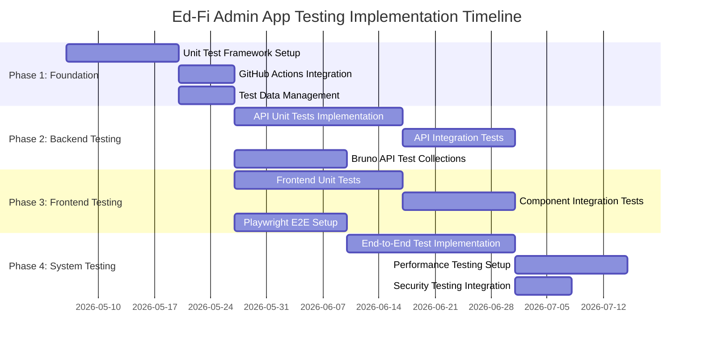

# Testing Implementation Phases

This document outlines the implementation phases for comprehensive testing of Ed-Fi Admin App 4.0, including detailed timelines, technologies, and deliverables.

## Phase Overview



## Phase 1: Foundation Setup (3 weeks)

### 1.1 Unit Test Framework Enhancement

**Frontend Testing Stack:**
- **Jest** - Primary test runner (already in place)
- **React Testing Library** - Component testing
- **MSW (Mock Service Worker)** - API mocking
- **@testing-library/user-event** - User interaction testing

**Backend Testing Stack:**
- **Jest** - Test runner for Node.js/TypeScript code
- **Supertest** - HTTP assertion testing
- **TestContainers** - Database integration testing
- **Factory patterns** - Test data generation

**Deliverables:**
- Updated Jest configuration for both FE and BE
- Test utility libraries setup
- Mock data factories implementation
- Base test classes and helpers

### 1.2 GitHub Actions CI/CD Integration

**Workflow Enhancements:**
- Parallel test execution by component
- Test result reporting with coverage
- Artifact management for test reports
- Environment-specific test runs

**Deliverables:**
- Enhanced GitHub Actions workflows
- Test result dashboard integration
- Coverage reporting automation
- Environment provisioning automation

### 1.3 Test Data Management Strategy

**Components:**
- **Database seeding scripts** - Consistent test data setup
- **Test fixtures** - Reusable test data sets
- **Data cleanup utilities** - Test isolation
- **Environment snapshots** - Quick environment reset

**Deliverables:**
- Test data management framework
- Database migration scripts for testing
- Docker compose test environment
- Data isolation strategies

## Phase 2: Backend Testing Implementation (7 weeks)

### 2.1 API Unit Tests (3 weeks)

**Coverage Areas:**
- **Controllers** - HTTP request handling
- **Services** - Business logic layer
- **Repositories** - Data access layer
- **Utilities** - Helper functions
- **Middleware** - Authentication, validation, error handling

**Implementation Strategy:**
```typescript
// Example unit test structure
describe('VendorService', () => {
  describe('createVendor', () => {
    it('should create vendor with valid data', async () => {
      // Arrange
      const mockVendorData = vendorFactory.build();
      mockRepository.save.mockResolvedValue(mockVendorData);
      
      // Act
      const result = await vendorService.createVendor(mockVendorData);
      
      // Assert
      expect(result).toEqual(mockVendorData);
      expect(mockRepository.save).toHaveBeenCalledWith(mockVendorData);
    });
  });
});
```

**Testing Tools:**
- **Jest** for test execution
- **TypeORM testing utilities** for database mocking
- **Factory-bot patterns** for test data generation

**Target Coverage:** 80% branch coverage minimum

### 2.2 API Integration Tests (2 weeks)

**Database Integration:**
- **PostgreSQL TestContainers** for real database testing
- **Transaction rollback** for test isolation
- **Migration testing** for schema changes
- **Multi-tenant database testing**

**External Service Integration:**
- **Keycloak authentication** testing
- **ODS/API integration** testing
- **Starting Blocks metadata** integration

**Implementation Example:**
```typescript
describe('Vendor API Integration', () => {
  beforeAll(async () => {
    await testDb.start();
    await runMigrations();
  });
  
  beforeEach(async () => {
    await seedTestData();
  });
  
  it('should create vendor and persist to database', async () => {
    const response = await request(app)
      .post('/api/vendors')
      .send(vendorData)
      .expect(201);
      
    const savedVendor = await db.vendor.findById(response.body.id);
    expect(savedVendor).toMatchObject(vendorData);
  });
});
```

### 2.3 Bruno API Test Collections (2 weeks)

**Bruno Integration Benefits:**
- **Version-controlled API tests** - Tests stored with codebase
- **Environment management** - Multiple deployment targets
- **Script automation** - Pre/post request scripting
- **Team collaboration** - Shareable collections

**Collection Structure:**
```
bruno/
├── environments/
│   ├── local.bru
│   ├── staging.bru
│   └── production.bru
├── auth/
│   ├── keycloak-auth.bru
│   └── machine-user-auth.bru
├── admin-api-v1/
│   ├── vendors/
│   ├── applications/
│   ├── claimsets/
│   └── ods-instances/
└── admin-api-v2/
    └── [future endpoints]
```

**Implementation Features:**
- **Automated authentication** flows
- **Data-driven tests** with CSV/JSON
- **Response validation** with JSON Schema
- **Test chaining** for complex scenarios

## Phase 3: Frontend Testing Implementation (7 weeks)

### 3.1 Frontend Unit Tests (3 weeks)

**Component Testing Strategy:**
- **Isolated component tests** - Individual component behavior
- **Hook testing** - Custom React hooks
- **Utility function tests** - Pure functions
- **State management tests** - Jotai atoms and stores

**Implementation Example:**
```typescript
// Component test
describe('VendorForm', () => {
  it('should submit valid vendor data', async () => {
    const mockOnSubmit = jest.fn();
    const user = userEvent.setup();
    
    render(<VendorForm onSubmit={mockOnSubmit} />);
    
    await user.type(screen.getByLabelText(/vendor name/i), 'Test Vendor');
    await user.click(screen.getByRole('button', { name: /save/i }));
    
    expect(mockOnSubmit).toHaveBeenCalledWith({
      name: 'Test Vendor'
    });
  });
});

// Hook test
describe('useVendors', () => {
  it('should fetch and return vendors list', async () => {
    server.use(
      http.get('/api/vendors', () => {
        return HttpResponse.json([vendorFactory.build()]);
      })
    );
    
    const { result } = renderHook(() => useVendors());
    
    await waitFor(() => {
      expect(result.current.data).toHaveLength(1);
    });
  });
});
```

**Testing Tools:**
- **React Testing Library** - Component testing
- **MSW** - API mocking
- **@testing-library/jest-dom** - Custom matchers
- **@testing-library/user-event** - User interactions

### 3.2 Component Integration Tests (2 weeks)

**Page-Level Testing:**
- **Full page component tests** - Complete user flows
- **Form validation testing** - Error handling scenarios
- **Navigation testing** - Route-based functionality
- **State persistence testing** - Local storage, sessions

### 3.3 Playwright E2E Setup (2 weeks)

**Playwright MCP Integration:**
- **Cross-browser testing** - Chrome, Firefox, Safari
- **Mobile viewport testing** - Responsive design validation
- **Accessibility testing** - ARIA compliance
- **Visual regression testing** - Screenshot comparisons

**E2E Test Structure:**
```typescript
// Example E2E test
test.describe('Vendor Management', () => {
  test.beforeEach(async ({ page }) => {
    await authenticateUser(page, 'admin@example.com');
    await page.goto('/environments/test/vendors');
  });
  
  test('should create new vendor', async ({ page }) => {
    await page.click('[data-testid="add-vendor"]');
    await page.fill('[data-testid="vendor-name"]', 'Test Vendor');
    await page.click('[data-testid="save-vendor"]');
    
    await expect(page.locator('[data-testid="vendor-list"]'))
      .toContainText('Test Vendor');
  });
  
  test('should validate required fields', async ({ page }) => {
    await page.click('[data-testid="add-vendor"]');
    await page.click('[data-testid="save-vendor"]');
    
    await expect(page.locator('[data-testid="error-message"]'))
      .toBeVisible();
  });
});
```

## Phase 4: System Testing Implementation (6 weeks)

### 4.1 End-to-End Test Implementation (3 weeks)

**Multi-Application Testing:**
- **Admin App ↔ Admin API** integration
- **Admin API ↔ ODS/API** integration  
- **Full authentication flows** with Keycloak
- **Multi-tenant scenarios**

### 4.2 Performance Testing Setup (2 weeks)

**Load Testing Strategy:**
- **JMeter/Artillery** for API load testing
- **Lighthouse CI** for frontend performance
- **Database performance** monitoring
- **Memory usage** profiling

### 4.3 Security Testing Integration (1 week)

**Security Test Automation:**
- **OWASP ZAP** integration
- **Dependency vulnerability** scanning
- **Authentication bypass** testing
- **Input validation** testing

## Coverage Targets

| Test Level | Frontend Target | Backend Target |
|------------|----------------|----------------|
| Unit Tests | 85% | 80% |
| Integration Tests | 70% | 75% |
| E2E Tests | 90% user flows | 80% API endpoints |

## Continuous Integration Strategy

### GitHub Actions Workflow Updates

**Test Execution Strategy:**
- **Parallel test execution** by package
- **Fast feedback loops** (< 10 minutes for basic tests)
- **Comprehensive test runs** on release branches
- **Performance regression detection**

**Quality Gates:**
- All tests must pass before merge
- Coverage thresholds must be met
- Security scans must pass
- Performance baselines must be maintained

## Tools and Technologies Summary

| Category | Tools | Purpose |
|----------|-------|---------|
| **Unit Testing** | Jest, React Testing Library, Supertest | Component and function testing |
| **Integration Testing** | TestContainers, MSW | Database and API integration |
| **E2E Testing** | Playwright, Bruno | Full application workflows |
| **Performance Testing** | Lighthouse, JMeter, Artillery | Load and performance validation |
| **Security Testing** | OWASP ZAP, CodeQL, Trivy | Vulnerability detection |
| **CI/CD** | GitHub Actions, Docker | Automated testing pipeline |

## Success Metrics

- **Test Execution Time:** < 15 minutes for full test suite
- **Test Reliability:** < 1% flaky test rate
- **Coverage Achievement:** Meet all coverage targets
- **Defect Detection:** 80% of bugs caught by automated tests
- **Development Velocity:** Tests enable faster development cycles

This implementation plan provides a comprehensive foundation for testing the Ed-Fi Admin App 4.0 across all layers and use cases.
