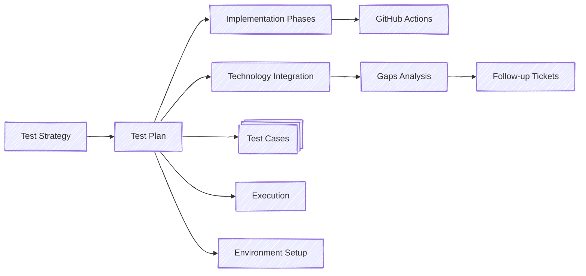

# Admin Console Platform Testing

Testing for Admin App 4 starts with a [Test Strategy](./STRATEGY.md) that
describes the aims and general approaches for testing the Admin App web
application and other components it depends on - Admin API 2. This document also
summarizes the features and functionality, and includes detailed diagrams of the
various components.

From this strategy, we devise concrete implementation plans that include detailed phases,
modern testing technologies, and comprehensive automation approaches.

## 📋 Testing Documentation

### Core Documentation
- **[Test Strategy](./STRATEGY.md)** - Overall testing approach and philosophy
- **[Implementation Phases](./IMPLEMENTATION_PHASES.md)** - Detailed phased approach with timelines
- **[Technology Integration](./TECHNOLOGY_INTEGRATION.md)** - Bruno, Playwright MCP, and modern tools
- **[GitHub Actions Workflows](./GITHUB_ACTIONS_WORKFLOWS.md)** - CI/CD testing automation
- **[Environment Setup](./ENVIRONMENT.md)** - Testing environment configuration
- **[Execution Guidelines](./EXECUTION.md)** - Test execution procedures

### Analysis & Planning
- **[Gaps Analysis & Tickets](./GAPS_ANALYSIS_AND_TICKETS.md)** - Comprehensive gaps and follow-up actions
- **[E2E Test Plan](./E2E-TEST-PLAN.md)** - End-to-end testing strategy

### Component-Specific Plans
- **[Admin App v4](./adminapp/FUNCTIONAL.md)** - Frontend functional test cases (Gherkin scenarios)
- **[Admin API v2](./api/README.md)** - Backend API testing approach

## 🚀 Quick Start

### For Developers
1. **Unit Testing**: Run `npm run test:fe` or `npm run test:api`
2. **Integration Testing**: Run `npm run test:integration` 
3. **E2E Testing**: Run `npm run test:e2e`
4. **API Testing**: Run `npm run bruno:test:local`

### For QA Engineers
1. **Manual Testing**: Follow scenarios in [FUNCTIONAL.md](./adminapp/FUNCTIONAL.md)
2. **Automated Testing**: Use Playwright test suites
3. **API Testing**: Execute Bruno collections
4. **Environment Setup**: Use Docker compose configurations

### For DevOps Engineers
1. **CI/CD Setup**: Follow [GitHub Actions guide](./GITHUB_ACTIONS_WORKFLOWS.md)
2. **Environment Management**: Configure test environments per [ENVIRONMENT.md](./ENVIRONMENT.md)
3. **Performance Testing**: Implement load testing scripts

## 📊 Testing Coverage Overview

| Testing Level | Tool | Target Coverage | Status |
|---------------|------|----------------|---------|
| **Unit Tests** | Jest | FE: 85%, BE: 80% | 🔄 In Progress |
| **Integration Tests** | Jest + TestContainers | 75% | 📋 Planned |
| **E2E Tests** | Playwright | 90% user flows | 📋 Planned |
| **API Tests** | Bruno | 80% endpoints | 📋 Planned |
| **Performance Tests** | Artillery + Lighthouse | Benchmarks | 📋 Planned |
| **Security Tests** | OWASP ZAP | 100% critical | 📋 Planned |
| **Accessibility Tests** | axe-core | WCAG 2.1 AA | 📋 Planned |

## 🎯 Current Priorities

Based on the [gaps analysis](./GAPS_ANALYSIS_AND_TICKETS.md), the immediate priorities are:

### Phase 1: Foundation (Weeks 1-4)
- **Backend**: Enhanced unit testing framework (BE-001)
- **Frontend**: React Testing Library setup (FE-001) 
- **Infrastructure**: GitHub Actions integration (INFRA-001)

### Phase 2: Integration (Weeks 5-8)
- **API Testing**: Bruno test collections (BE-004)
- **Database Testing**: Integration test suite (BE-005)
- **Frontend Integration**: Page-level testing (FE-004)

### Phase 3: E2E Automation (Weeks 9-12)
- **E2E Framework**: Playwright setup and implementation (E2E-001, E2E-002)
- **Visual Testing**: Regression testing (E2E-003)
- **Accessibility**: Automated a11y testing (ACCESSIBILITY-001)

## 🔧 Technology Stack

### Testing Frameworks
- **Jest** - Unit and integration testing
- **React Testing Library** - Component testing
- **Playwright** - E2E testing with MCP support
- **Bruno** - API testing collections

### Supporting Tools
- **TestContainers** - Database integration testing
- **MSW** - API mocking for frontend tests
- **Artillery** - Load testing
- **Lighthouse CI** - Performance testing
- **axe-core** - Accessibility testing
- **OWASP ZAP** - Security testing

### CI/CD Integration
- **GitHub Actions** - Automated testing workflows
- **Docker** - Consistent test environments
- **Codecov** - Coverage reporting
- **Artifact storage** - Test results and reports

## 📈 Success Metrics

### Quality Gates
- ✅ All tests pass before merge
- ✅ Coverage thresholds maintained
- ✅ Security scans pass
- ✅ Performance benchmarks met
- ✅ Accessibility compliance verified

### KPIs
- **Test Execution Time**: < 15 minutes for full suite
- **Test Reliability**: < 1% flaky test rate  
- **Defect Detection**: 80% of bugs caught by automated tests
- **Coverage Targets**: Meet all coverage requirements

## 🎭 Test Environment Support

The testing framework supports multiple environments:

- **Local Development** - Developer workstation testing
- **Docker Compose** - Containerized integration testing  
- **GitHub Actions** - CI/CD automated testing
- **Staging/Production** - Release validation testing

Each environment has specific configurations and test suites optimized for that context.

## 📞 Support & Contributing

### Getting Help
- Review the [Implementation Phases](./IMPLEMENTATION_PHASES.md) for detailed setup
- Check [Technology Integration](./TECHNOLOGY_INTEGRATION.md) for tool-specific guidance
- Follow [GitHub Actions Workflows](./GITHUB_ACTIONS_WORKFLOWS.md) for CI/CD setup

### Contributing to Tests
1. Follow the patterns established in existing test suites
2. Ensure all new features include appropriate test coverage
3. Update relevant documentation when adding new test approaches
4. Follow the ticket structure outlined in [Gaps Analysis](./GAPS_ANALYSIS_AND_TICKETS.md)

This comprehensive testing approach ensures the Ed-Fi Admin App meets the highest standards of quality, performance, and reliability.
