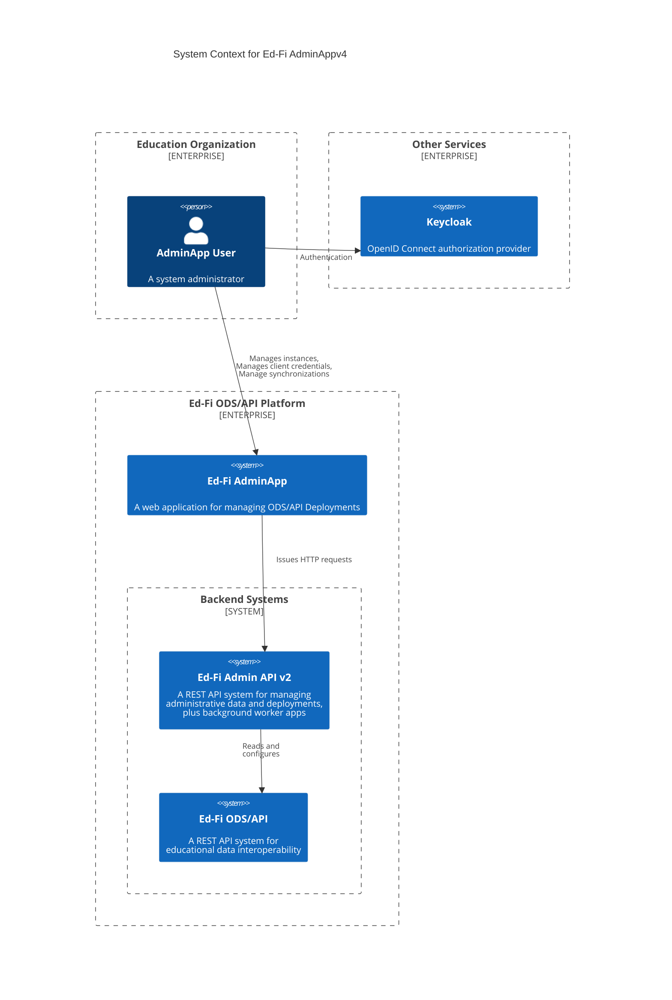

# Ed-Fi Admin App 4.0 Testing Strategy

## Introduction

This document outlines the test strategy for release of Admin App 4.0,
including the related applications required to support the Admin App
functionality. The goal is to ensure the quality, reliability, and performance
of the Admin API and its interactions with the Admin App and associated
worker applications.

> [!TIP]
> Also see: [Admin App 4.0 Test Plan](./EXECUTION.md) for implementation and
> execution planning.

## Test Basis

The following C4 Context diagram depicts the systems and relationships covered by this testing strategy. Below it are sub-sections summarizing the functionality for each application. This work is based on the functional requirements and technical designs found in the [AdminApp v4](https://github.com/Ed-Fi-Closed/AdminApp-v4/tree/develop/docs/design) and in Jira work items (private / staff and contractors only).

### Ed-Fi Applications

#### ODS/API

The ODS/API is a REST API application for system-to-system exchange of
educational data. The administrative tooling described below exists to support
deployment and operation of the ODS/API.

Testing with the ODS/API will be limited to the integration points with the
system described in this document. The following ODS/API versions need to be
tested with this solution: 7.1, 7.2, and 7.3.

#### Admin App

The AdminApp is a web-based user interface. In version 4.0 includes the functionality:

* Management ODS/API ODSs, Ed-Orgs, Vendors, Applications and Claimsets
  * Supported by _Admnin API_ below.
* Management Accounts, Environments, Teams, Users, Team memberships, Roles, Ownerships and Sync queue.
  * Supported by _Admnin APP_.

#### Admin API

Admin API is a REST API application that will serve as the Backend-for-frontend
(BFF) supporting Admin App. In other words, the Admin App will retrieve
all necessary data from Admin API.

| Resource                            | Verb   | Notes                                                   |
| ----------------------------------- | ------ | ------------------------------------------------------- |
| ResourceClaims                      | GET    | Retrieve a list or by id from all resource claims       |
| ResourceClaimsActions               | GET    | Retrieve a list of actions                              |
| ResourceClaimsActionsAuthStrategies | GET    | Retrieve a list of actions auth strategies              |
| Vendors                             | GET, POST, PUT, DELETE | Vendor actions                          |
| Profiles                            | GET, POST, PUT, DELETE | Profiles actions                        |
| OdsInstances                        | GET, POST, PUT, DELETE | Ods Instances actions                   |
| OdsInstanceDerivatives              | GET, POST, PUT, DELETE | Ods Instance Derivations actions        |
| OdsInstanceContexts                 | GET, POST, PUT, DELETE | Ods Instance Contexts actions           |
| ClaimSets                           | GET, POST, PUT, DELETE | Claim Sets actions                      |
| AuthorizationStrategies             | GET, POST, PUT, DELETE | Authorization Strategies actions        |
| Applications                        | GET, POST, PUT, DELETE | Applications actions                    |
| Apiclients                          | GET, POST, PUT, DELETE | Api clients actions                     |

### Supporting Tools and Concepts

#### Multi-tenancy

The ODS/API and Admin API support multi-tenancy through database segregation.
That is, a single runtime installation of the application can access tenant
information stored in separate databases. These database instances can be stored
on different database servers, potentially with different credentials.

At present there is no unified "tenancy database" that provides tenant
definitions and database connectivity. Instead, each application's `appSettings`
file contains a list of tenants along with connection string information for the
`EdFi_Admin` and `EdFi_Security` databases. As with other app settings values,
environment variables can override the file contents.

The ODS/API ties client credentials to a tenant; thus multi-tenancy is an
implied part of the data authorization scheme. In this release of Admin API,
multi-tenancy is an administrative feature, not an authorization feature.

> [!TIP]
> Due to limitations in the current database design, an Admin API client can
> be created in any of the tenants. However, since this is not a security
> feature of the Admin API, that client can access _all_ tenants. This may be
> changed in a future release of Admin API, when/if the Alliance introduces
> tenant-specific users / clients.

#### Authentication and Authorization

Keycloak is a third-party, open source, application that serves as an Open ID
Connect compatible _identity provider_ (IdP). Admin App users will
authenticate with Keycloak, receiving a JSON Web Token (JWT) on successful
sign-in. Admin API also has a legacy, internal, authentication system. That
system is being kept for backwards compatibility with automation scripts that
work directly with the Admin API. Admin App v4.0 _requires_ use of Keycloak
for authentication.

> [!NOTE]
> This test strategy will only cover the integration points between the Ed-Fi
> system and Keycloak; for example, we will not perform detailed functional or
> usability testing of Keycloak.

##### Resource Authorization

Resource authorization will be based on the _scope_ claim.

* Legacy client credentials for system integration with Admin API will also
  continue to use `edfi_admin_api/full_access`.

#### Database Management Systems

These systems will support both PostgreSQL running on
"bare metal", in a VM or as a Docker container. These three configurations are
functionally equivalent, and most testing will occur within Docker containers.

While other recent versions of the applications will likely work out of the box,
the Ed-Fi Alliance's testing process will only include the following versions:

- PostgreSQL 16

## Testing Approach

The Ed-Fi Alliance will provide both static and dynamic testing of the Admin
App and related applications. Static testing includes both human and
automated review of work products. Dynamic testing will include both functional
and non-functional testing approaches, as described in more detail in the
sections below.

The development team building the Ed-Fi Admin App operates on two week
sprints, with small work items that can be integrated into the `main` branch of
code in a matter of days. Frequent integration of code helps to avoid errors and
provides opportunities for continuous static testing and continuous operation of
automated dynamic tests. Code integration occurs through GitHub using [Pull
Requests](https://docs.github.com/en/pull-requests). No developer is able to
merge code into the `main` branch, from whence releases are created, without
passing through the pull request review process.

### Static Testing

Static testing first occurs through peer review of design documents, application
source code, and test cases. In written documents, this peer review process
promotes:

- Clarity and consistency in functional descriptions and translation to design.
- Identification of gaps in documentation or design plans.
- Consistent use of terminology.
- Adherence to [Ed-Fi coding
  standards](https://docs.ed-fi.org/community/sdlc/code-contribution-guidelines/coding-standards/).

In addition, the Alliance uses the following tools to automate static testing at
the level of source code:

1. [SonarJS](https://github.com/SonarSource/SonarJS), which analyzes
   JavaScript and TypeScript code for known vulnerabilities, bugs, security
   hotspots ,and code smells.
   1. The application source code can be configured to tune default rules to comply 
      with Ed-Fi JavaScript/TypeScript coding standards.
   2. All warnings are treated _as errors_ to maintain a high standard of code quality.
   3. Code that contains errors (including "warnings") does not pass the review process, 
      ensuring only clean and secure code is merged.
2. [GitHub CodeQL](https://codeql.github.com/) provides advanced semantic
   analysis that searches for potential security vulnerabilities in a code base.
3. [Github
   dependency-review-action](https://github.com/actions/dependency-review-action)
   detects new .NET package dependency vulnerabilities during the pull review
   process, and [GitHub
   Dependabot](https://docs.github.com/en/code-security/dependabot/working-with-dependabot)
   detects runs nightly to detect vulnerabilities in the packages that are
   already in use.
4. [Trivy](https://trivy.dev/) detects vulnerabilities in OS packages in Docker
   images.

These review processes, except for Dependabot, occur for every pull request.

In addition, periodic manual reviews will analyze code coverage results, which
will help identify:

- Priority areas for enhancing code coverage.
- Opportunities to refactor code to lower the code's [CRAP score]
  (<https://blog.ndepend.com/crap-metric-thing-tells-risk-code/>) (a combination
  of cyclomatic complexity and code coverage).

## Functional Testing

Our functional testing approach includes the following levels of testing,
described in more detail below:

- Unit
- Integration
- System
- System Integration

### Unit Testing

Isolated code-level tests without external dependencies.

- Automation: Fully automated and integrated with the source code.
- Tools: Jest (for JavaScript/TypeScript), NUnit (for .NET/C#)
- Coverage: Minimum 80% branch coverage.
  - Typical exceptions in the 20% include:
    - HTTP handlers ("controller")
    - ORM layer ("repository")
    - Minimize business logic in these layers so that business logic can be fully tested.
  - This value is not set as a hard-gate on pull requests. The product needs to reach 80% by the time it is ready for release.
- Scope:
  - Admin API (NUnit for .NET, Jest for Node/TypeScript portions)
  - Admin App (Jest for React/Angular/TypeScript code)
- Out of Scope:
  - Legacy code not migrated to supported frameworks

> [!NOTE]
> Unit tests in the Admin App web application code are implemented 
> using Jest and may be expanded in future releases.

### Integration Testing

Code-level tests that include integration with external resources (e.g., 
database servers).

- Automation: Automated where feasible.
- Tools: Jest (with integration test setup for Node/TypeScript), NUnit (for .NET/C#)
- Coverage: Not determined
- Scope:
  - Admin API
  - Admin App (where applicable)
- Out of Scope:
  - Worker processes (to be determined)

### System Testing

Tests that interact with the entire installed application. Also known as
end-to-end or E2E tests.

- Automation: Automated when possible.
- Tools: Postman, Playwright, PowerShell, etc.
- Coverage: to be determined

> [!NOTE]
> Calculating coverage means we need to identify test cases and then
> determine what percentage of them are covered by the Postman tests. This
> is a manual process.

- Scope:
  - Admin API
  - Admin App

For both _System_ and _System Integration_ tests: manual testing may be
required for more complex scenarios, with a goal to increase automation over
time.

### System Integration Testing

Full spectrum (true E2E) tests covering interactions between the multiple
applications.

- Automation: to be determined
- Tools: to be determined
- Scope: all applications in the ecosystem.

## Non-Functional Testing

### Security Testing

Identify vulnerabilities and ensure the system is secure against attacks. The
[Static Analysis](#static-testing) section describes automated testing applied
to source code and Docker images, using CodeQL, the dependency review action,
and Trivy.

- Automation: mix of manual and automated
- Tools:
  - System testing, e.g. with missing or invalid credentials
  - (Potentially) [Zap](https://www.zaproxy.org/)
  - Independent penetration testing
- Scope:
  - Admin App

### Performance Testing

Ensure the systems perform well under average and peak loads. Peak load is not
expected to be substantially different than "average" load, due to the low user
count for a given installation. A high load situation would probably represent
an active attack on the software.

Production deployments should utilize a reverse proxy web server for optimal
performance and security. The two web-based applications need to be tested under
similar conditions.

Each application needs to be assessed separately.

For meaningful statistics, all test procedures need to run multiple times:
ideally thirty times when fully automated and not cost prohibitive, with a
minimum of five executions (thirty is the "magic number" for normal distribution
statistics). Record the results of each run and provide summary statistics
including: mean, standard deviation, and percentiles (25%, 50%, 75%, 90%).

The applications need to be running in a standardized environment with low
overhead, for example in one or more virtual machines in a cloud environment.
Virtual machines used for this testing need fixed resource allocations; for
example, do not use burst-mode VPCUs that have unpredictable performance.

#### Admin App Performance

- Automation: manual.
- Application type: web site.
- Expected load: 1 user.
- Peak load: 2 users with 2000 instances in a single / multi tenant.
- Key performance characteristics:
  - **Page speed**: Web pages should load "quickly". Because of the limited
    usage of the application, there is no benchmark requirement for page speed
    at this time. This should pass the "eyeball" test.
- Tools: [Microsoft Edge performance tool](https://learn.microsoft.com/en-us/microsoft-edge/devtools-guide-chromium/evaluate-performance/).

### Usability Testing

- Automation: manual.
- Objective: Ensure the application is user-friendly and meets the needs of its
  users.
- Methods: User interviews and [heuristic evaluations](https://www.nngroup.com/articles/how-to-conduct-a-heuristic-evaluation/).
- Scope:
  - Admin App
- Out of Scope:
  - Admin API
- Tools: [10 Usability Heuristics for User Interface Design](https://www.nngroup.com/articles/ten-usability-heuristics/).

### Compatibility Testing

- Automation: manual.
- Objective: Ensure the application works across different devices, browsers,
  and operating systems.
- Types: Cross-browser testing, simulated cross-device testing (use developer
  tools in the browser to assess compatibility on tablet and current phone
  devices).
- Requirement: the web site must be fully functional in the two most common
  browsers used in Windows and Mac OS X. Mobile, Tablet devices and Responsive usability is
  nice-to-have, but not required.
- Scope:
  - Admin App
- Out of Scope:
  - Admin API
- Tools:
  - Windows: Microsoft Edge, Google Chrome
  - Mac OS X: Safari, Google Chrome

### Accessibility Testing

- Automation: automated.
- Objective: Ensure the application is accessible to users with disabilities.
- Standards: WCAG (Web Content Accessibility Guidelines).
- Requirement: there is no fixed requirement beyond assessing and understanding
  the accessibility level and looking for opportunities to improve.
- Scope:
  - Admin App
- Out of Scope:
  - Admin API
- Tools:
  [Lighthouse](https://learn.microsoft.com/en-us/microsoft-edge/devtools-guide-chromium/accessibility/lighthouse).

### Operational Usability

- Automation: manual.
- Objective: Ensure the integrated system is sufficiently usable from an operational perspective.
- Heuristics:
  - Operationally stable running in Docker Desktop in a local environment.
  - Able to deploy and operate in a cloud environment with relative ease.
  - Provides appropriate logging to help system administrators detect and
    remediate runtime problems.
  - Messages should be logged at an appropriate level (DEBUG, INFO, WARNING,
    ERROR, FATAL/CRITICAL). For example, client errors are logged with DEBUG or
    INFO, while system errors are logged with WARNING or higher.
- Scope:
  - Admin App
  - Admin API
- Tools: user reporting with similar tools as the usability heuristics testing.

## Implementation

### Test Environment Management

- Objective: Ensure consistent and reliable test environments.
- Tools: services should run as Docker containers on virtual machines or within
  managed container services on a cloud provider.

### Test Case Management and Reporting

- Work Item Tickets: Enter comments on individual work item tickets for unit and
  integration tests.
- System and Integration Tests: Record test plans and execution results in a
  document or spreadsheet for better tracking and visibility.

### Test Data Management

- Objective: Ensure the availability of relevant and realistic test data.
- Tools: database backup / restore procedures.

## Test Case Development

The scenarios defined for AdminApp are based on the current application configuration. 
If any changes occur, they will be updated later and can be reviewed in this file [Functional Test](./adminapp/FUNCTIONAL.md) in Gherkin format.

## Conclusion

This test strategy aims to ensure comprehensive coverage and high-quality
delivery of the Admin API to support the Admin App. Continuous improvement
and feedback will be incorporated to enhance the testing process.
