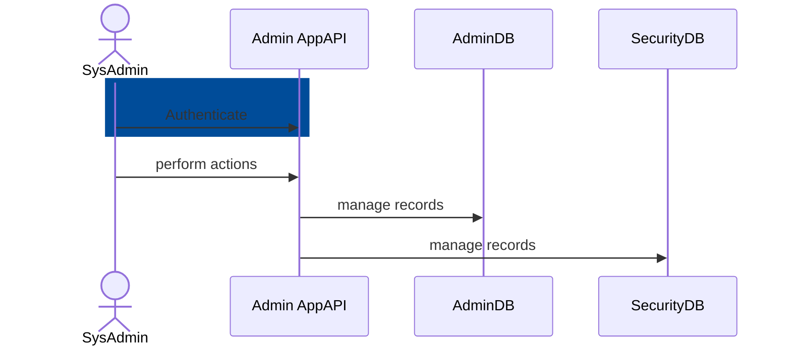
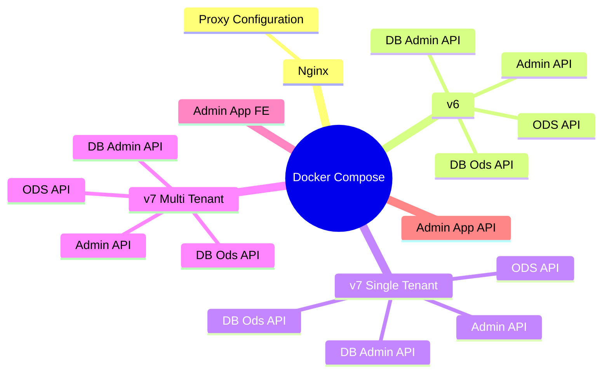

# Admin Console 1.0 Test Plan: Admin App API 

## Context

For the purposes of this test plan, Admin App API will be considered an isolated
system. That is, interactions with Admin App will be tested in the context of those other
applications' test plans. 

### Self-Hosted Identity Provider Mode

## Functional Testing

### Static Analysis

The Alliance uses Sonar-dotnet, GitHub CodeQL, GitHub dependency-review-action,
GitHub Dependabot, and Trivy to automate static testing and detect
vulnerabilities in the source code and Docker images. All warnings are treated
as errors, ensuring thorough security analysis and compliance with the Ed-Fi C#
Coding Standard.

### Unit

Admin App API will have unit tests covering all business logic.
As a JavaScript/TypeScript application, the test project will utilize the following tools:

* Jest as the test framework.
* ts-jest or Babel for TypeScript support and transpilation.
* Built-in mocking utilities from Jest for mocking dependencies.
* Additional assertion utilities as needed.

Unit tests should not interact with Admin API or with the relational database
system.

These tests will run on every pull request in GitHub.

### Integration

These tests cover
basic interaction with the relational database server, and they run
automatically on all pull requests in GitHub. A failing test prevents merge of
the modified code.

#### Integration Test Cases - Happy Path

> [!WARNING]
> To be documented elsewhere? Need to create or pull from existing test suite
> and possibly identify other tests cases. We might not be able to implement
> all documented test cases. Need to establish the expected coverage level.

#### Integration Test Cases - Negative

> [!WARNING]
> To be documented elsewhere? Need to pull or create from existing test suite
> and possibly identify other tests cases.

### System

System tests for Admin App API are written in Postman. These tests connect to the application
fully-functional databases, and they run
automatically on all pull requests in GitHub. A failing test prevents merge of
the modified code.

#### System Test Cases - Happy Path

> [!WARNING]
> Consider the needs of both auth mechanisms. May need to create a smaller
> test suite with Keycloak integration. These tests now run without keycloak authentication.

| | App | Status | Validation Schema |
|---|---|---|---|
| GET  | `\api\healthcheck` | 200  | Yes |
| GET  | `\api\secret\{secretId}` | 200  | Yes |

| | Admin API Resources v1.x  | Status | Validation Schema |
|---|---|---|---|
| GET  | `\api\teams\{teamId}\edfi-tenants\{edfiTenantId}\admin-api\v1\vendors` | 200  | Yes |
| POST  | `\api\teams\{teamId}\edfi-tenants\{edfiTenantId}\admin-api\v1\vendors` | 201  | Yes |
| GET  | `\api\teams\{teamId}\edfi-tenants\{edfiTenantId}\admin-api\v1\vendors\{vendorId}` | 200  | Yes |
| PUT  | `\api\teams\{teamId}\edfi-tenants\{edfiTenantId}\admin-api\v1\vendors\{vendorId}` | 204  | Yes |
| DELETE | `\api\teams\{teamId}\edfi-tenants\{edfiTenantId}\admin-api\v1\vendors\{vendorId}` | 201  | Yes |
| GET  | `\api\teams\{teamId}\edfi-tenants\{edfiTenantId}\admin-api\v1\vendors\{vendorId}\applications` | 200  | Yes |
| GET  | `\api\teams\{teamId}\edfi-tenants\{edfiTenantId}\admin-api\v1\applications` | 200  | Yes |
| POST  | `\api\teams\{teamId}\edfi-tenants\{edfiTenantId}\admin-api\v1\applications` | 201  | Yes |
| PUT  | `\api\teams\{teamId}\edfi-tenants\{edfiTenantId}\admin-api\v1\applications\{applicationId}` | 204  | Yes |
| DELETE | `\api\teams\{teamId}\edfi-tenants\{edfiTenantId}\admin-api\v1\applications\{applicationId}` | 201  | Yes |
| PUT  | `\api\teams\{teamId}\edfi-tenants\{edfiTenantId}\admin-api\v1\applications\{applicationId}` | 204  | Yes |
| GET  | `\api\teams\{teamId}\edfi-tenants\{edfiTenantId}\admin-api\v1\applications\{applicationId}\reset-credential` | 200  | Yes |
| GET  | `\api\teams\{teamId}\edfi-tenants\{edfiTenantId}\admin-api\v1\claimsets` | 200  | Yes |
| POST  | `\api\teams\{teamId}\edfi-tenants\{edfiTenantId}\admin-api\v1\claimsets` | 201  | Yes |
| GET  | `\api\teams\{teamId}\edfi-tenants\{edfiTenantId}\admin-api\v1\claimsets\export` | 200  | Yes |
| GET  | `\api\teams\{teamId}\edfi-tenants\{edfiTenantId}\admin-api\v1\claimsets\{claimsetId}` | 200  | Yes |
| PUT  | `\api\teams\{teamId}\edfi-tenants\{edfiTenantId}\admin-api\v1\claimsets\{claimsetId}` | 204  | Yes |
| DELETE | `\api\teams\{teamId}\edfi-tenants\{edfiTenantId}\admin-api\v1\claimsets\{claimsetId}` | 201  | Yes |

| | Admin API Resources v2.x  | Status | Validation Schema |
|---|---|---|---|
| GET  | `\api\teams\{teamId}\edfi-tenants\{edfiTenantId}\admin-api\v2\vendors\{vendorId}` | 200  | Yes |
| PUT  | `\api\teams\{teamId}\edfi-tenants\{edfiTenantId}\admin-api\v2\vendors\{vendorId}` | 204  | Yes |
| DELETE | `\api\teams\{teamId}\edfi-tenants\{edfiTenantId}\admin-api\v2\vendors\{vendorId}` | 201  | Yes |
| GET  | `\api\teams\{teamId}\edfi-tenants\{edfiTenantId}\admin-api\v2\vendors\{vendorId}\applications` | 200  | Yes |
| GET  | `\api\teams\{teamId}\edfi-tenants\{edfiTenantId}\admin-api\v2\applications` | 200  | Yes |
| POST  | `\api\teams\{teamId}\edfi-tenants\{edfiTenantId}\admin-api\v2\applications` | 201  | Yes |
| PUT  | `\api\teams\{teamId}\edfi-tenants\{edfiTenantId}\admin-api\v2\applications\{applicationId}` | 204  | Yes |
| DELETE | `\api\teams\{teamId}\edfi-tenants\{edfiTenantId}\admin-api\v2\applications\{applicationId}` | 201  | Yes |
| PUT  | `\api\teams\{teamId}\edfi-tenants\{edfiTenantId}\admin-api\v2\applications\{applicationId}` | 204  | Yes |
| GET  | `\api\teams\{teamId}\edfi-tenants\{edfiTenantId}\admin-api\v2\applications\{applicationId}\reset-credential` | 200  | Yes |
| GET  | `\api\teams\{teamId}\edfi-tenants\{edfiTenantId}\admin-api\v2\claimsets` | 200  | Yes |
| POST  | `\api\teams\{teamId}\edfi-tenants\{edfiTenantId}\admin-api\v2\claimsets` | 201  | Yes |
| POST  | `\api\teams\{teamId}\edfi-tenants\{edfiTenantId}\admin-api\v2\claimsets\export` | 201  | Yes |
| GET  | `\api\teams\{teamId}\edfi-tenants\{edfiTenantId}\admin-api\v2\claimsets\export\{exportId}` | 200  | Yes |
| GET  | `\api\teams\{teamId}\edfi-tenants\{edfiTenantId}\admin-api\v2\claimsets\{claimsetId}` | 200  | Yes |
| PUT  | `\api\teams\{teamId}\edfi-tenants\{edfiTenantId}\admin-api\v2\claimsets\{claimsetId}` | 204  | Yes |
| DELETE | `\api\teams\{teamId}\edfi-tenants\{edfiTenantId}\admin-api\v2\claimsets\{claimsetId}` | 201  | Yes |
| POST | `\api\teams\{teamId}\edfi-tenants\{edfiTenantId}\admin-api\v2\claimsets\copy` | 201  | Yes |
| POST | `\api\teams\{teamId}\edfi-tenants\{edfiTenantId}\admin-api\v2\claimsets\import` | 201  | Yes |
| GET | `\api\teams\{teamId}\edfi-tenants\{edfiTenantId}\admin-api\v2\profiles` | 200  | Yes |
| POST | `\api\teams\{teamId}\edfi-tenants\{edfiTenantId}\admin-api\v2\profiles` | 201  | Yes |
| GET | `\api\teams\{teamId}\edfi-tenants\{edfiTenantId}\admin-api\v2\profiles\{profileId}` | 200  | Yes |
| POST | `\api\teams\{teamId}\edfi-tenants\{edfiTenantId}\admin-api\v2\profiles\{profileId}` | 201  | Yes |
| DELETE | `\api\teams\{teamId}\edfi-tenants\{edfiTenantId}\admin-api\v2\profiles\{profileId}` | 201  | Yes |

| | Auth  | Status | Validation Schema |
|---|---|---|---|
| GET  | `\api\auth\login\{oidcId}` | 200  | Yes |
| GET  | `\api\auth\callback\{oidcId}` | 200  | Yes |
| GET  | `\api\auth\me` | 200  | Yes |
| GET  | `\api\auth\my-teams` | 200  | Yes |
| GET  | `\api\auth\cache\{teamId}` | 200  | Yes |
| GET  | `\api\auth\logout` | 201  | Yes |

| | EdfiTenant Global  | Status | Validation Schema |
|---|---|---|---|
| GET |`\api\sb-environments\{sbEnvironmentId}\edfi-tenants`| 200  | Yes |
| POST |`\api\sb-environments\{sbEnvironmentId}\edfi-tenants`| 201  | Yes |
| GET |`\api\sb-environments\{sbEnvironmentId}\edfi-tenants\{edfiTenantId}`| 200  | Yes |
| DELETE |`\api\sb-environments\{sbEnvironmentId}\edfi-tenants\{edfiTenantId}`| 201  | Yes |
| PUT |`\api\sb-environments\{sbEnvironmentId}\edfi-tenants\{edfiTenantId}\refresh-admin-api`| 204  | Yes |
| PUT |`\api\sb-environments\{sbEnvironmentId}\edfi-tenants\{edfiTenantId}\check-admin-api`| 204  | Yes |
| PUT |`\api\sb-environments\{sbEnvironmentId}\edfi-tenants\{edfiTenantId}\update-admin-api`| 204  | Yes |
| PUT |`\api\sb-environments\{sbEnvironmentId}\edfi-tenants\{edfiTenantId}\admin-api-v2-keygen`| 204  | Yes |
| PUT |`\api\sb-environments\{sbEnvironmentId}\edfi-tenants\{edfiTenantId}\register-admin-api`| 204  | Yes |

| | EdfiTenant  | Status | Validation Schema |
|---|---|---|---|
| GET |`\api\teams\{teamId}\sb-environments\{sbEnvironmentId}\edfi-tenants`| 200  | Yes |
| POST |`\api\teams\{teamId}\sb-environments\{sbEnvironmentId}\edfi-tenants`| 201  | Yes |
| GET |`\api\teams\{teamId}\sb-environments\{sbEnvironmentId}\edfi-tenants\{edfiTenantId}`| 200  | Yes |
| DELETE |`\api\teams\{teamId}\sb-environments\{sbEnvironmentId}\edfi-tenants\{edfiTenantId}`| 201  | Yes |

| | Global - Edorg  | Status | Validation Schema |
|---|---|---|---|
| GET |`\api\edfi-teams\{edfiTenantId}\edorgs`| 200  | Yes |
| GET |`\api\edfi-teams\{edfiTenantId}\edorgs\{edorgId}`| 200  | Yes |

| | Edorg  | Status | Validation Schema |
|---|---|---|---|
| GET |`\api\teams\{teamId}\edfi-tenants\{edfiTenantId}\edorgs`| 200  | Yes |
| POST |`\api\teams\{teamId}\edfi-tenants\{edfiTenantId}\edorgs`| 201  | Yes |
| GET |`\api\teams\{teamId}\edfi-tenants\{edfiTenantId}\edorgs\{edorgsId}`| 200  | Yes |
| DELETE |`\api\teams\{teamId}\edfi-tenants\{edfiTenantId}\edorgs\{edorgsId}`| 201  | Yes |

| | IntegrationApp - Team  | Status | Validation Schema |
|---|---|---|---|
| GET |`\api\teams\{teamId}\integration-providers\{integrationProviderId}\integration-apps`| 200  | Yes |
| GET |`\api\teams\{teamId}\integration-providers\{integrationProviderId}\integration-apps\{integrationAppId}`| 200  | Yes |
| PUT |`\api\teams\{teamId}\integration-providers\{integrationProviderId}\integration-apps\{integrationAppId}\reset-credentials`| 201  | Yes |

| | IntegrationProvider - Global  | Status | Validation Schema |
|---|---|---|---|
| POST |`\api\integration-providers`| 201  | Yes |
| GET |`\api\integration-providers`| 200  | Yes |
| PUT |`\api\integration-providers\{id}`| 201  | Yes |
| DELETE |`\api\integration-providers\{id}`| 201  | Yes |

| | IntegrationProvider - Team  | Status | Validation Schema |
|---|---|---|---|
| GET |`\api\teams\{teamId}\integration-providers`| 200  | Yes |
| GET |`\api\teams\{teamId}\integration-providers\{integrationProviderId}`| 200  | Yes |

| | Global - Ods  | Status | Validation Schema |
|---|---|---|---|
| GET |`\api\edfi-teams\{edfiTenantId}\odss`| 200  | Yes |
| GET |`\api\edfi-teams\{edfiTenantId}\edorgs\{odssId}`| 200  | Yes |

| | Ods  | Status | Validation Schema |
|---|---|---|---|
| GET |`\api\teams\{teamId}\edfi-tenants\{edfiTenantId}\odss`| 200  | Yes |
| POST |`\api\teams\{teamId}\edfi-tenants\{edfiTenantId}\odss`| 201  | Yes |
| GET |`\api\teams\{teamId}\edfi-tenants\{edfiTenantId}\odss\{odsId}`| 200  | Yes |
| DELETE |`\api\teams\{teamId}\edfi-tenants\{edfiTenantId}\odss\{odsId}`| 201  | Yes |
| GET |`\api\teams\{teamId}\edfi-tenants\{edfiTenantId}\odss\{odsId}\row-count`| 200  | Yes |

| | Ownership - Global  | Status | Validation Schema |
|---|---|---|---|
| POST |`\api\ownerships`| 201  | Yes |
| GET |`\api\ownerships`| 200  | Yes |
| GET |`\api\ownerships\{ownershipID}`| 200  | Yes |
| PUT |`\api\ownerships\{ownershipID}`| 201  | Yes |
| DELETE |`\api\ownerships\{ownershipID}`| 201  | Yes |

| | Ownership  | Status | Validation Schema |
|---|---|---|---|
| GET |`\api\teams\{teamId}\ownerships`| 200  | Yes |
| GET |`\api\teams\{teamId}\ownerships\{ownershipsId}`| 200  | Yes |

| | Role - Global  | Status | Validation Schema |
|---|---|---|---|
| POST |`\api\roles`| 201  | Yes |
| GET |`\api\roles`| 200  | Yes |
| GET |`\api\roles\{roleId}`| 200  | Yes |
| PUT |`\api\roles\{roleId}`| 201  | Yes |
| DELETE |`\api\roles\{roleId}`| 201  | Yes |

| | Role - Global  | Status | Validation Schema |
|---|---|---|---|
| POST |`\api\teams\{teamID}\roles`| 201  | Yes |
| GET |`\api\teams\{teamID}\roles`| 200  | Yes |
| GET |`\api\teams\{teamID}\roles\{roleId}`| 200  | Yes |
| PUT |`\api\teams\{teamID}\roles\{roleId}`| 201  | Yes |
| DELETE |`\api\teams\{teamID}\roles\{roleId}`| 201  | Yes |

| | SbEnvironment - Global  | Status | Validation Schema |
|---|---|---|---|
| POST |`\api\sb-environments`| 201  | Yes |
| GET |`\api\sb-environments`| 200  | Yes |
| POST |`\api\sb-environments\checkEdFiVersionAndTenantMode`| 201  | Yes |
| GET |`\api\sb-environments\{sbEnvironmentId}`| 200  | Yes |
| PUT |`\api\sb-environments\{sbEnvironmentId}`| 201  | Yes |
| DELETE |`\api\sb-environments\{sbEnvironmentId}`| 201  | Yes |
| PUT |`\api\sb-environments\{sbEnvironmentId}\meta-arn`| 201  | Yes |
| PUT |`\api\sb-environments\{sbEnvironmentId}\reload-tenants`| 201  | Yes |
| PUT |`\api\sb-environments\{sbEnvironmentId}\refresh-resources`| 201  | Yes |

| | SbEnvironment | Status | Validation Schema |
|---|---|---|---|
| GET |`\api\teams\{teamId}\sb-environments`| 200  | Yes |
| GET |`\api\teams\{teamId}\sb-environments\{sbEnvironmentId}`| 200  | Yes |
| GET |`\api\teams\{teamId}\sb-environments\{sbEnvironmentId}\ods-templates`| 200  | Yes |

| | Sb Sync Queue | Status | Validation Schema |
|---|---|---|---|
| GET |`\api\sb-sync-queues\faceted-values`| 200  | Yes |
| GET |`\api\sb-sync-queues`| 200  | Yes |
| POST |`\api\sb-sync-queues`| 201  | Yes |
| GET |`\api\sb-sync-queues\{sbSyncQueueId}`| 200  | Yes |

| | Team Global | Status | Validation Schema |
|---|---|---|---|
| POST |`\api\teams`| 201  | Yes |
| GET |`\api\teams`| 200  | Yes |
| GET |`\api\teams\{teamId}`| 200  | Yes |
| PUT |`\api\teams\{teamId}`| 201  | Yes |
| DELETE |`\api\teams\{teamId}`| 201  | Yes |
| GET |`\api\teams\{teamId}\env-nav`| 200  | Yes |

| | User - Global | Status | Validation Schema |
|---|---|---|---|
| POST |`\api\users`| 201  | Yes |
| GET |`\api\users`| 200  | Yes |
| GET |`\api\users\{userId}`| 200  | Yes |
| PUT |`\api\users\{userId}`| 201  | Yes |
| DELETE |`\api\users\{userId}`| 201  | Yes |

| | User | Status | Validation Schema |
|---|---|---|---|
| GET |`\api\teams\{teamId}\users`| 200  | Yes |
| GET |`\api\teams\{teamId}\users\{userId}`| 200  | Yes |

| | UserTeamMembership - Global | Status | Validation Schema |
|---|---|---|---|
| POST |`\api\user-team-memberships`| 201  | Yes |
| GET |`\api\user-team-memberships`| 200  | Yes |
| GET |`\api\user-team-memberships\{userTeamMembershipId}`| 200  | Yes |
| PUT |`\api\user-team-memberships\{userTeamMembershipId}`| 201  | Yes |
| DELETE |`\api\user-team-memberships\{userTeamMembershipId}`| 201  | Yes |

| | UserTeamMembership | Status | Validation Schema |
|---|---|---|---|
| POST |`\api\teams\{teamId}\user-team-memberships`| 201  | Yes |
| GET |`\api\teams\{teamId}\user-team-memberships`| 200  | Yes |
| GET |`\api\teams\{teamId}\user-team-memberships\{userTeamMembershipId}`| 200  | Yes |
| PUT |`\api\teams\{teamId}\user-team-memberships\{userTeamMembershipId}`| 201  | Yes |
| DELETE |`\api\teams\{teamId}\user-team-memberships\{userTeamMembershipId}`| 201  | Yes |

#### System Test Cases - Negative

| | App | Status | Validation Schema |
|---|---|---|---|
| GET  | `\api\healthcheck` | 400  | Invalid Path |
| GET  | `\api\secret\{secretId}` | 400  | Invalid Path |

| | Admin API Resources v1.x  | Status | Validation Schema |
|---|---|---|---|
| GET  | `\api\teams\{teamId}\edfi-tenants\{edfiTenantId}\admin-api\v1\vendors` | 400  | Invalid Path |
| POST  | `\api\teams\{teamId}\edfi-tenants\{edfiTenantId}\admin-api\v1\vendors` | 400  | Invalid Body |
| GET  | `\api\teams\{teamId}\edfi-tenants\{edfiTenantId}\admin-api\v1\vendors\{vendorId}` | 400  | Invalid Path |
| PUT  | `\api\teams\{teamId}\edfi-tenants\{edfiTenantId}\admin-api\v1\vendors\{vendorId}` | 400  | Invalid Body |
| DELETE | `\api\teams\{teamId}\edfi-tenants\{edfiTenantId}\admin-api\v1\vendors\{vendorId}` | 400  | Invalid Body |
| GET  | `\api\teams\{teamId}\edfi-tenants\{edfiTenantId}\admin-api\v1\vendors\{vendorId}\applications` | 400  | Invalid Path |
| GET  | `\api\teams\{teamId}\edfi-tenants\{edfiTenantId}\admin-api\v1\applications` | 400  | Invalid Path |
| POST  | `\api\teams\{teamId}\edfi-tenants\{edfiTenantId}\admin-api\v1\applications` | 400  | Invalid Body |
| PUT  | `\api\teams\{teamId}\edfi-tenants\{edfiTenantId}\admin-api\v1\applications\{applicationId}` | 400  | Invalid Body |
| DELETE | `\api\teams\{teamId}\edfi-tenants\{edfiTenantId}\admin-api\v1\applications\{applicationId}` | 400  | Invalid Body |
| PUT  | `\api\teams\{teamId}\edfi-tenants\{edfiTenantId}\admin-api\v1\applications\{applicationId}` | 400  | Invalid Body |
| GET  | `\api\teams\{teamId}\edfi-tenants\{edfiTenantId}\admin-api\v1\applications\{applicationId}\reset-credential` | 400  | Invalid Path |
| GET  | `\api\teams\{teamId}\edfi-tenants\{edfiTenantId}\admin-api\v1\claimsets` | 400  | Invalid Path |
| POST  | `\api\teams\{teamId}\edfi-tenants\{edfiTenantId}\admin-api\v1\claimsets` | 400  | Invalid Body |
| GET  | `\api\teams\{teamId}\edfi-tenants\{edfiTenantId}\admin-api\v1\claimsets\export` | 400  | Invalid Path |
| GET  | `\api\teams\{teamId}\edfi-tenants\{edfiTenantId}\admin-api\v1\claimsets\{claimsetId}` | 400  | Invalid Path |
| PUT  | `\api\teams\{teamId}\edfi-tenants\{edfiTenantId}\admin-api\v1\claimsets\{claimsetId}` | 400  | Invalid Body |
| DELETE | `\api\teams\{teamId}\edfi-tenants\{edfiTenantId}\admin-api\v1\claimsets\{claimsetId}` | 400  | Invalid Body |

| | Admin API Resources v2.x  | Status | Validation Schema |
|---|---|---|---|
| GET  | `\api\teams\{teamId}\edfi-tenants\{edfiTenantId}\admin-api\v2\vendors\{vendorId}` | 400  | Invalid Path |
| PUT  | `\api\teams\{teamId}\edfi-tenants\{edfiTenantId}\admin-api\v2\vendors\{vendorId}` | 400  | Invalid Body |
| DELETE | `\api\teams\{teamId}\edfi-tenants\{edfiTenantId}\admin-api\v2\vendors\{vendorId}` | 400  | Invalid Body |
| GET  | `\api\teams\{teamId}\edfi-tenants\{edfiTenantId}\admin-api\v2\vendors\{vendorId}\applications` | 400  | Invalid Path |
| GET  | `\api\teams\{teamId}\edfi-tenants\{edfiTenantId}\admin-api\v2\applications` | 400  | Invalid Path |
| POST  | `\api\teams\{teamId}\edfi-tenants\{edfiTenantId}\admin-api\v2\applications` | 400  | Invalid Body |
| PUT  | `\api\teams\{teamId}\edfi-tenants\{edfiTenantId}\admin-api\v2\applications\{applicationId}` | 400  | Invalid Body |
| DELETE | `\api\teams\{teamId}\edfi-tenants\{edfiTenantId}\admin-api\v2\applications\{applicationId}` | 400  | Invalid Body |
| PUT  | `\api\teams\{teamId}\edfi-tenants\{edfiTenantId}\admin-api\v2\applications\{applicationId}` | 400  | Invalid Body |
| GET  | `\api\teams\{teamId}\edfi-tenants\{edfiTenantId}\admin-api\v2\applications\{applicationId}\reset-credential` | 400  | Invalid Path |
| GET  | `\api\teams\{teamId}\edfi-tenants\{edfiTenantId}\admin-api\v2\claimsets` | 400  | Invalid Path |
| POST  | `\api\teams\{teamId}\edfi-tenants\{edfiTenantId}\admin-api\v2\claimsets` | 400  | Invalid Body |
| POST  | `\api\teams\{teamId}\edfi-tenants\{edfiTenantId}\admin-api\v2\claimsets\export` | 400  | Invalid Body |
| GET  | `\api\teams\{teamId}\edfi-tenants\{edfiTenantId}\admin-api\v2\claimsets\export\{exportId}` | 400  | Invalid Path |
| GET  | `\api\teams\{teamId}\edfi-tenants\{edfiTenantId}\admin-api\v2\claimsets\{claimsetId}` | 400  | Invalid Path |
| PUT  | `\api\teams\{teamId}\edfi-tenants\{edfiTenantId}\admin-api\v2\claimsets\{claimsetId}` | 400  | Invalid Body |
| DELETE | `\api\teams\{teamId}\edfi-tenants\{edfiTenantId}\admin-api\v2\claimsets\{claimsetId}` | 400  | Invalid Body |
| POST | `\api\teams\{teamId}\edfi-tenants\{edfiTenantId}\admin-api\v2\claimsets\copy` | 400  | Invalid Body |
| POST | `\api\teams\{teamId}\edfi-tenants\{edfiTenantId}\admin-api\v2\claimsets\import` | 400  | Invalid Body |
| GET | `\api\teams\{teamId}\edfi-tenants\{edfiTenantId}\admin-api\v2\profiles` | 400  | Invalid Path |
| POST | `\api\teams\{teamId}\edfi-tenants\{edfiTenantId}\admin-api\v2\profiles` | 400  | Invalid Body |
| GET | `\api\teams\{teamId}\edfi-tenants\{edfiTenantId}\admin-api\v2\profiles\{profileId}` | 400  | Invalid Path |
| POST | `\api\teams\{teamId}\edfi-tenants\{edfiTenantId}\admin-api\v2\profiles\{profileId}` | 400  | Invalid Body |
| DELETE | `\api\teams\{teamId}\edfi-tenants\{edfiTenantId}\admin-api\v2\profiles\{profileId}` | 400  | Invalid Body |

| | Auth  | Status | Validation Schema |
|---|---|---|---|
| GET  | `\api\auth\login\{oidcId}` | 400  | Invalid Path |
| GET  | `\api\auth\callback\{oidcId}` | 400  | Invalid Path |
| GET  | `\api\auth\me` | 400  | Invalid Path |
| GET  | `\api\auth\my-teams` | 400  | Invalid Path |
| GET  | `\api\auth\cache\{teamId}` | 400  | Invalid Path |
| GET  | `\api\auth\logout` | 400  | Invalid Body |

| | EdfiTenant Global  | Status | Validation Schema |
|---|---|---|---|
| GET |`\api\sb-environments\{sbEnvironmentId}\edfi-tenants`| 400  | Invalid Path |
| POST |`\api\sb-environments\{sbEnvironmentId}\edfi-tenants`| 400  | Invalid Body |
| GET |`\api\sb-environments\{sbEnvironmentId}\edfi-tenants\{edfiTenantId}`| 400  | Invalid Path |
| DELETE |`\api\sb-environments\{sbEnvironmentId}\edfi-tenants\{edfiTenantId}`| 400  | Invalid Body |
| PUT |`\api\sb-environments\{sbEnvironmentId}\edfi-tenants\{edfiTenantId}\refresh-admin-api`| 400  | Invalid Body |
| PUT |`\api\sb-environments\{sbEnvironmentId}\edfi-tenants\{edfiTenantId}\check-admin-api`| 400  | Invalid Body |
| PUT |`\api\sb-environments\{sbEnvironmentId}\edfi-tenants\{edfiTenantId}\update-admin-api`| 400  | Invalid Body |
| PUT |`\api\sb-environments\{sbEnvironmentId}\edfi-tenants\{edfiTenantId}\admin-api-v2-keygen`| 400  | Invalid Body |
| PUT |`\api\sb-environments\{sbEnvironmentId}\edfi-tenants\{edfiTenantId}\register-admin-api`| 400  | Invalid Body |

| | EdfiTenant  | Status | Validation Schema |
|---|---|---|---|
| GET |`\api\teams\{teamId}\sb-environments\{sbEnvironmentId}\edfi-tenants`| 400  | Invalid Path |
| POST |`\api\teams\{teamId}\sb-environments\{sbEnvironmentId}\edfi-tenants`| 400  | Invalid Body |
| GET |`\api\teams\{teamId}\sb-environments\{sbEnvironmentId}\edfi-tenants\{edfiTenantId}`| 400  | Invalid Path |
| DELETE |`\api\teams\{teamId}\sb-environments\{sbEnvironmentId}\edfi-tenants\{edfiTenantId}`| 400  | Invalid Body |

| | Global - Edorg  | Status | Validation Schema |
|---|---|---|---|
| GET |`\api\edfi-teams\{edfiTenantId}\edorgs`| 400  | Invalid Path |
| GET |`\api\edfi-teams\{edfiTenantId}\edorgs\{edorgId}`| 400  | Invalid Path |

| | Edorg  | Status | Validation Schema |
|---|---|---|---|
| GET |`\api\teams\{teamId}\edfi-tenants\{edfiTenantId}\edorgs`| 400  | Invalid Path |
| POST |`\api\teams\{teamId}\edfi-tenants\{edfiTenantId}\edorgs`| 400  | Invalid Body |
| GET |`\api\teams\{teamId}\edfi-tenants\{edfiTenantId}\edorgs\{edorgsId}`| 400  | Invalid Path |
| DELETE |`\api\teams\{teamId}\edfi-tenants\{edfiTenantId}\edorgs\{edorgsId}`| 400  | Invalid Body |

| | IntegrationApp - Team  | Status | Validation Schema |
|---|---|---|---|
| GET |`\api\teams\{teamId}\integration-providers\{integrationProviderId}\integration-apps`| 400  | Invalid Path |
| GET |`\api\teams\{teamId}\integration-providers\{integrationProviderId}\integration-apps\{integrationAppId}`| 400  | Invalid Path |
| PUT |`\api\teams\{teamId}\integration-providers\{integrationProviderId}\integration-apps\{integrationAppId}\reset-credentials`| 400  | Invalid Body |

| | IntegrationProvider - Global  | Status | Validation Schema |
|---|---|---|---|
| POST |`\api\integration-providers`| 400  | Invalid Body |
| GET |`\api\integration-providers`| 400  | Invalid Path |
| PUT |`\api\integration-providers\{id}`| 400  | Invalid Body |
| DELETE |`\api\integration-providers\{id}`| 400  | Invalid Body |

| | IntegrationProvider - Team  | Status | Validation Schema |
|---|---|---|---|
| GET |`\api\teams\{teamId}\integration-providers`| 400  | Invalid Path |
| GET |`\api\teams\{teamId}\integration-providers\{integrationProviderId}`| 400  | Invalid Path |

| | Global - Ods  | Status | Validation Schema |
|---|---|---|---|
| GET |`\api\edfi-teams\{edfiTenantId}\odss`| 400  | Invalid Path |
| GET |`\api\edfi-teams\{edfiTenantId}\edorgs\{odssId}`| 400  | Invalid Path |

| | Ods  | Status | Validation Schema |
|---|---|---|---|
| GET |`\api\teams\{teamId}\edfi-tenants\{edfiTenantId}\odss`| 400  | Invalid Path |
| POST |`\api\teams\{teamId}\edfi-tenants\{edfiTenantId}\odss`| 400  | Invalid Body |
| GET |`\api\teams\{teamId}\edfi-tenants\{edfiTenantId}\odss\{odsId}`| 400  | Invalid Path |
| DELETE |`\api\teams\{teamId}\edfi-tenants\{edfiTenantId}\odss\{odsId}`| 400  | Invalid Body |
| GET |`\api\teams\{teamId}\edfi-tenants\{edfiTenantId}\odss\{odsId}\row-count`| 400  | Invalid Path |

| | Ownership - Global  | Status | Validation Schema |
|---|---|---|---|
| POST |`\api\ownerships`| 400  | Invalid Body |
| GET |`\api\ownerships`| 400  | Invalid Path |
| GET |`\api\ownerships\{ownershipID}`| 400  | Invalid Path |
| PUT |`\api\ownerships\{ownershipID}`| 400  | Invalid Body |
| DELETE |`\api\ownerships\{ownershipID}`| 400  | Invalid Body |

| | Ownership  | Status | Validation Schema |
|---|---|---|---|
| GET |`\api\teams\{teamId}\ownerships`| 400  | Invalid Path |
| GET |`\api\teams\{teamId}\ownerships\{ownershipsId}`| 400  | Invalid Path |

| | Role - Global  | Status | Validation Schema |
|---|---|---|---|
| POST |`\api\roles`| 400  | Invalid Body |
| GET |`\api\roles`| 400  | Invalid Path |
| GET |`\api\roles\{roleId}`| 400  | Invalid Path |
| PUT |`\api\roles\{roleId}`| 400  | Invalid Body |
| DELETE |`\api\roles\{roleId}`| 400  | Invalid Body |

| | Role - Global  | Status | Validation Schema |
|---|---|---|---|
| POST |`\api\teams\{teamID}\roles`| 400  | Invalid Body |
| GET |`\api\teams\{teamID}\roles`| 400  | Invalid Path |
| GET |`\api\teams\{teamID}\roles\{roleId}`| 400  | Invalid Path |
| PUT |`\api\teams\{teamID}\roles\{roleId}`| 400  | Invalid Body |
| DELETE |`\api\teams\{teamID}\roles\{roleId}`| 400  | Invalid Body |

| | SbEnvironment - Global  | Status | Validation Schema |
|---|---|---|---|
| POST |`\api\sb-environments`| 400  | Invalid Body |
| GET |`\api\sb-environments`| 400  | Invalid Path |
| POST |`\api\sb-environments\checkEdFiVersionAndTenantMode`| 400  | Invalid Body |
| GET |`\api\sb-environments\{sbEnvironmentId}`| 400  | Invalid Path |
| PUT |`\api\sb-environments\{sbEnvironmentId}`| 400  | Invalid Body |
| DELETE |`\api\sb-environments\{sbEnvironmentId}`| 400  | Invalid Body |
| PUT |`\api\sb-environments\{sbEnvironmentId}\meta-arn`| 400  | Invalid Body |
| PUT |`\api\sb-environments\{sbEnvironmentId}\reload-tenants`| 400  | Invalid Body |
| PUT |`\api\sb-environments\{sbEnvironmentId}\refresh-resources`| 400  | Invalid Body |

| | SbEnvironment | Status | Validation Schema |
|---|---|---|---|
| GET |`\api\teams\{teamId}\sb-environments`| 400  | Invalid Path |
| GET |`\api\teams\{teamId}\sb-environments\{sbEnvironmentId}`| 400  | Invalid Path |
| GET |`\api\teams\{teamId}\sb-environments\{sbEnvironmentId}\ods-templates`| 400  | Invalid Path |

| | Sb Sync Queue | Status | Validation Schema |
|---|---|---|---|
| GET |`\api\sb-sync-queues\faceted-values`| 400  | Invalid Path |
| GET |`\api\sb-sync-queues`| 400  | Invalid Path |
| POST |`\api\sb-sync-queues`| 400  | Invalid Body |
| GET |`\api\sb-sync-queues\{sbSyncQueueId}`| 400  | Invalid Path |

| | Team Global | Status | Validation Schema |
|---|---|---|---|
| POST |`\api\teams`| 400  | Invalid Body |
| GET |`\api\teams`| 400  | Invalid Path |
| GET |`\api\teams\{teamId}`| 400  | Invalid Path |
| PUT |`\api\teams\{teamId}`| 400  | Invalid Body |
| DELETE |`\api\teams\{teamId}`| 400  | Invalid Body |
| GET |`\api\teams\{teamId}\env-nav`| 400  | Invalid Path |

| | User - Global | Status | Validation Schema |
|---|---|---|---|
| POST |`\api\users`| 400  | Invalid Body |
| GET |`\api\users`| 400  | Invalid Path |
| GET |`\api\users\{userId}`| 400  | Invalid Path |
| PUT |`\api\users\{userId}`| 400  | Invalid Body |
| DELETE |`\api\users\{userId}`| 400  | Invalid Body |

| | User | Status | Validation Schema |
|---|---|---|---|
| GET |`\api\teams\{teamId}\users`| 400  | Invalid Path |
| GET |`\api\teams\{teamId}\users\{userId}`| 400  | Invalid Path |

| | UserTeamMembership - Global | Status | Validation Schema |
|---|---|---|---|
| POST |`\api\user-team-memberships`| 400  | Invalid Body |
| GET |`\api\user-team-memberships`| 400  | Invalid Path |
| GET |`\api\user-team-memberships\{userTeamMembershipId}`| 400  | Invalid Path |
| PUT |`\api\user-team-memberships\{userTeamMembershipId}`| 400  | Invalid Body |
| DELETE |`\api\user-team-memberships\{userTeamMembershipId}`| 400  | Invalid Body |

| | UserTeamMembership | Status | Validation Schema |
|---|---|---|---|
| POST |`\api\teams\{teamId}\user-team-memberships`| 400  | Invalid Body |
| GET |`\api\teams\{teamId}\user-team-memberships`| 400  | Invalid Path |
| GET |`\api\teams\{teamId}\user-team-memberships\{userTeamMembershipId}`| 400  | Invalid Path |
| PUT |`\api\teams\{teamId}\user-team-memberships\{userTeamMembershipId}`| 400  | Invalid Body |
| DELETE |`\api\teams\{teamId}\user-team-memberships\{userTeamMembershipId}`| 400  | Invalid Body |

#### System Test Execution

Currently the entire testing environment is created in Docker.

## Non-Functional Testing

### Performance Testing

API performance will be tested using the Locust toolkit (Python-based). It is
not necessary to perform heavy load testing of all endpoints. Locust provides
a random distribution of executions against defined endpoints.

#### Performance Test Cases

The testing will focus on those endpoints with the most business logic, for
example:

1. `GET /api/teams/{teamId}/users`
2. `GET /api/auth/me`
3. `GET /api/teams/{teamId}/sb-environments/{sbEnvironmentId}`
4. `GET /api/edfi-tenants/{edfiTenantId/odss}`
5. `PUT /api/sb-environments/{sbEnvironmentId}/edfi-tenants/{edfiTenantId}/admin-api-v2-keygen`
6. `GET /api/teams/{teamId}/edfi-tenants/{edfiTenantId}/admin-api/v1/claimsets/export`
7. `GET /api/teams/{teamId}/edfi-tenants/{edfiTenantId}/admin-api/v2/claimsets/export`
8. `GET /api/teams/{teamId}/edfi-tenants/{edfiTenantId}/admin-api/v1/claimsets/import`
9. `GET /api/teams/{teamId}/edfi-tenants/{edfiTenantId}/admin-api/v2/claimsets/import`
10. `POST /api/teams/{teamId}/edfi-tenants/{edfiTenantId}/admin-api/v1/applications`
11. `POST /api/teams/{teamId}/edfi-tenants/{edfiTenantId}/admin-api/v2/applications`

##### Performance Test Execution

Utilize the same scripts / Docker environment used for supporting System
testing. Details of how to execute Locust, for how long to run tests, etc., are
to be determined once someone begins working on this performance testing.

### Operational Usability Testing

Heuristics worksheet to be developed.

Performed by the support team rather than the development team, in coordination
with Ed-Fi Customer Success.

#### Operational Test Cases

1. Unable to connect to destination database. The database server must be
   running for Admin App API to work and provide information to the worker. Try
   running the worker from the container host OS or in an alternate Docker
   network, so that it can (a) access Admin API but (b) cannot access the RDBMS.
2. Keycloak is down - cannot lookup for signature verification.
4. Admin App Api cannot start due to missing configuration.
5. It is not possible to consume any endpoint due to a misconfiguration of the tenants.
